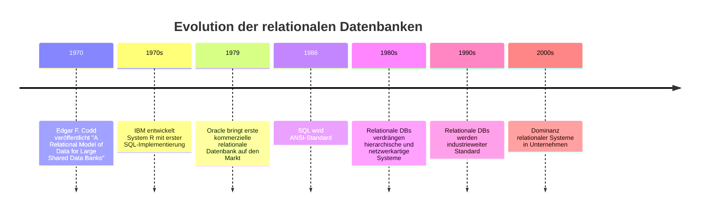
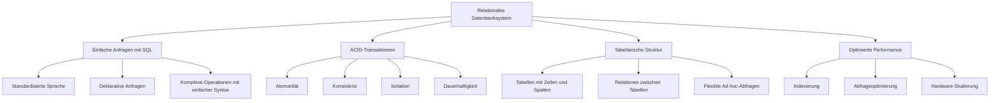
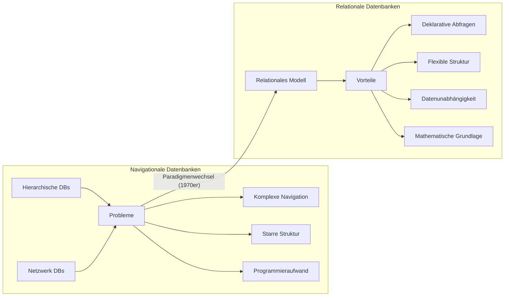
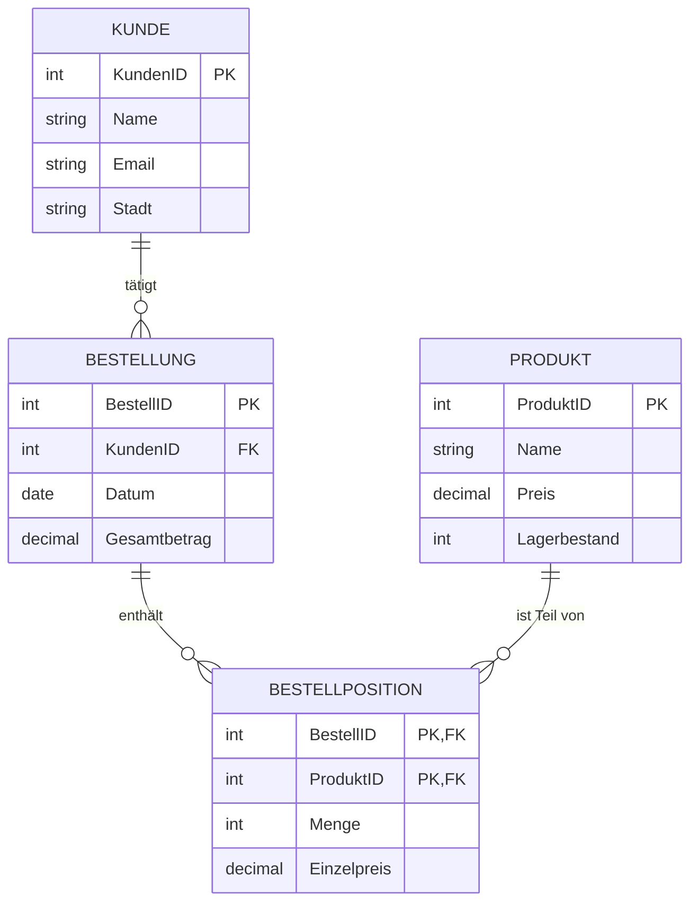

# Visuelle Darstellung relationaler Datenbanken

## Timeline der relationalen Datenbankentwicklung

## Vorteile des relationalen Datenbankmodells

## Paradigmenwechsel: Von navigational zu relational

## Datenmodellierung im relationalen Modell

Das relationale Modell organisiert Daten in Tabellen mit definierten Beziehungen und ermöglicht durch SQL flexible, deklarative Abfragen. Dank ACID-Garantien und strukturierter Datenorganisation wurde es zum dominierenden Datenbankparadigma für mehrere Jahrzehnte.
