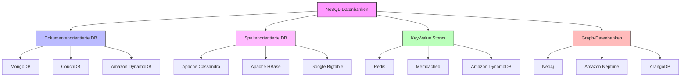
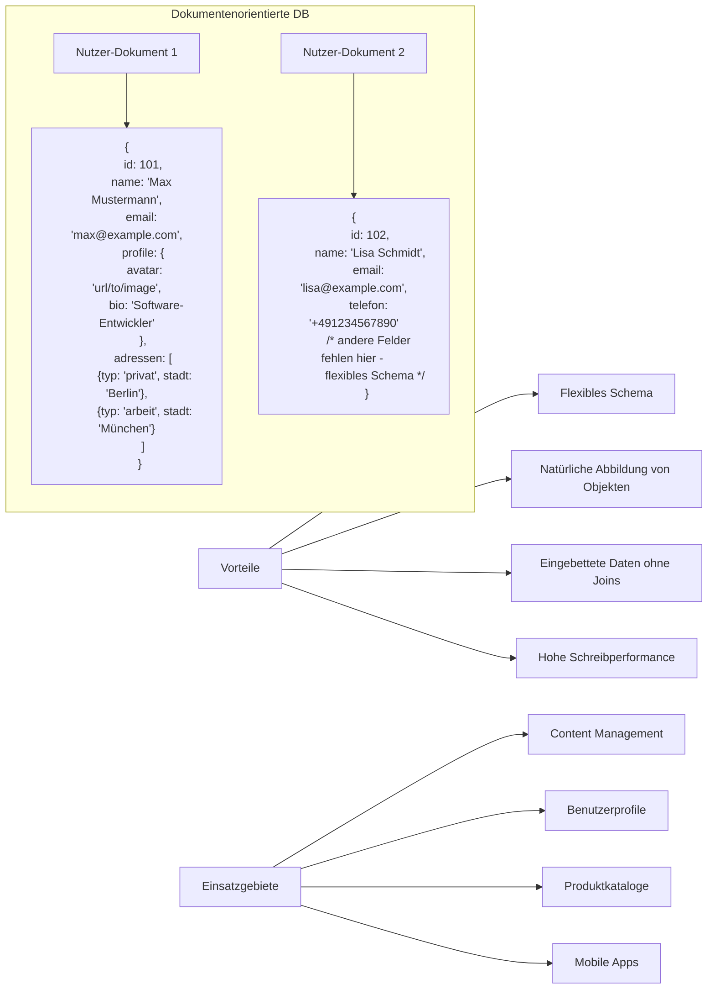
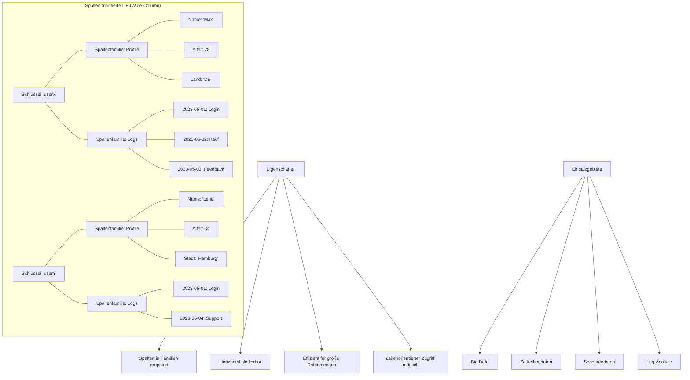
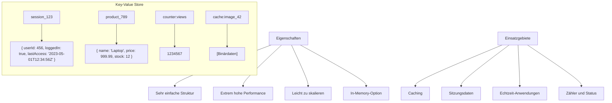
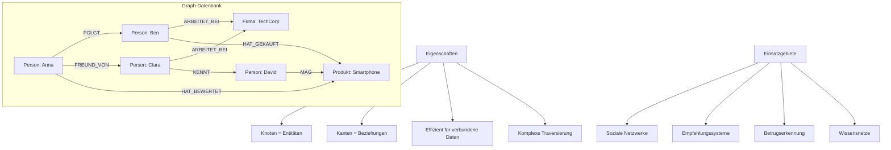

# Visuelle Darstellung alternativer Datenbankmodelle (NoSQL)

## NoSQL-Datenbanktypen im Überblick



## Dokumentenorientierte Datenbanken



## Spaltenorientierte Datenbanken (Wide-Column Stores)



## Key-Value Stores



## Graph-Datenbanken



## NoSQL vs. Relationale Datenbanken: Eigenschaften

```mermaid
classDiagram
    class "Relationale DB" {
        + Strukturiertes Schema
        + ACID-Transaktionen
        + Normalisierte Daten
        + SQL-Abfragesprache
        + Vertikale Skalierung
        + Tabellen & Joins
    }
    
    class "NoSQL DB" {
        + Flexibles/Schema-frei
        + BASE (Eventual Consistency)
        + Denormalisierte Daten
        + Eigene Abfragesprachen
        + Horizontale Skalierung
        + Verschiedene Datenmodelle
    }
    
    "Relationale DB" <|--|> "NoSQL DB" : unterschiedliche Paradigmen
```

Diese Visualisierungen zeigen die unterschiedlichen Ansätze der NoSQL-Datenbankmodelle im Vergleich zu relationalen Datenbanken. Jedes Modell ist für bestimmte Anwendungsfälle optimiert und bietet spezifische Vor- und Nachteile.
