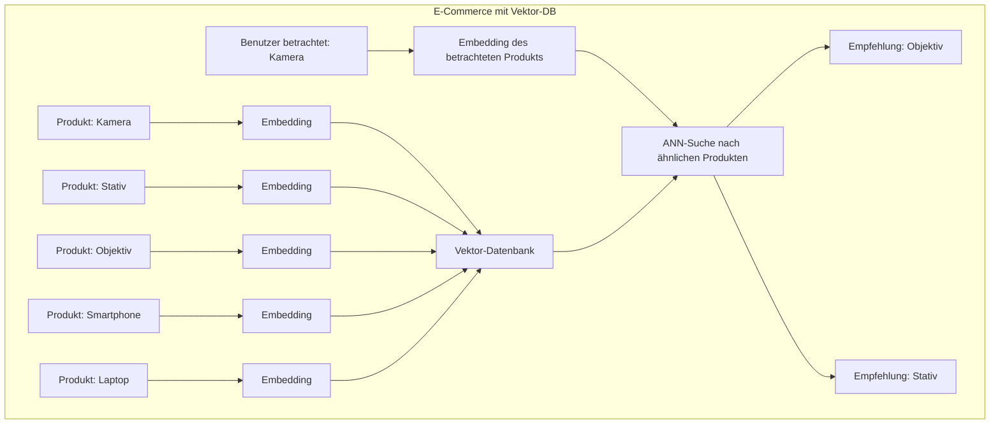
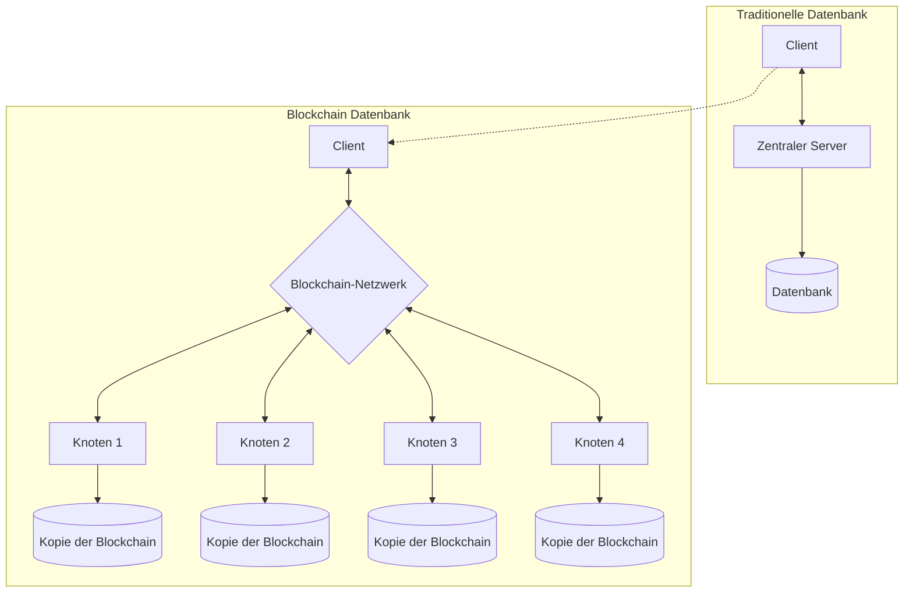
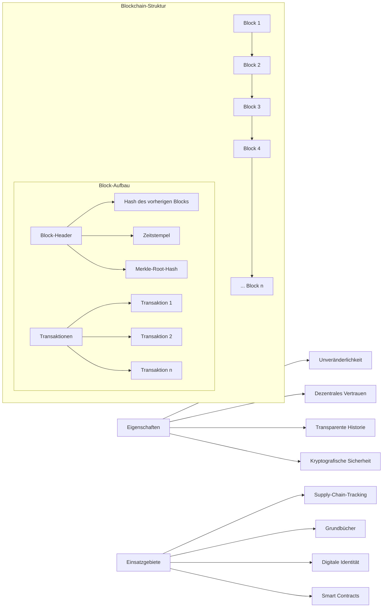

# Visuelle Darstellung neuerer Datenbankentwicklungen

## Vektor-Datenbanken für KI und Ähnlichkeitssuche

```mermaid
flowchart LR
    subgraph "Vektor-Datenbank Funktionsweise"
        direction TB
        Input[Eingabedaten] --> Embedding[Embedding-Modell]
        Embedding --> Vektoren[Hochdimensionale Vektoren]
        Vektoren --> Indexierung["Indizierung (ANN)"]
        
        Query[Suchanfrage] --> QueryEmbed[Embedding der Anfrage]
        QueryEmbed --> ÄhnlichkeitsSuche[Ähnlichkeitsberechnung]
        Indexierung --> ÄhnlichkeitsSuche
        ÄhnlichkeitsSuche --> Ergebnisse[Ähnlichste Dokumente]
    end
    
    Vorteile[Vorteile] --> V1[Semantische Suche]
    Vorteile --> V2[Effizient für KI-Anwendungen]
    Vorteile --> V3[Ähnlichkeitsbasierte Abfragen]
    Vorteile --> V4[Multimodale Daten (Text, Bild, Audio)]
    
    Anwendungen[Einsatzgebiete] --> A1[Empfehlungssysteme]
    Anwendungen --> A2[Chatbots & LLMs]
    Anwendungen --> A3[Bildersuche]
    Anwendungen --> A4[Betrugserkennung]
```

## Vektorähnlichkeitssuche im Vergleich zur traditionellen Suche

```mermaid
flowchart TB
    subgraph "Traditionelle Suche"
        TS1[Textsuche] --> TS2[Exakte Übereinstimmung/Keyword]
        TS2 --> TS3["Ergebnisse (basierend auf Wortübereinstimmung)"]
    end
    
    subgraph "Vektor-basierte Suche"
        VS1[Textsuche] --> VS2[Text-zu-Vektor Embedding]
        VS2 --> VS3[Ähnlichkeitsberechnung (z.B. Kosinus-Distanz)]
        VS3 --> VS4["Ergebnisse (basierend auf semantischer Ähnlichkeit)"]
    end
    
    Beispiel1["Traditionell: 'Klimawandel'"] --> TS1
    Beispiel2["Vektor: 'Klimawandel'"] --> VS1
    
    TS3 --> Trad["Findet nur: 'Klimawandel', 'Klimawandels', ..."]
    VS4 --> Vekt["Findet auch: 'Globale Erwärmung', 'CO₂-Emissionen', 'Treibhauseffekt', ..."]
```

## Anwendungsbeispiel: Vektor-DB in einem Empfehlungssystem



## Blockchain-basierte Datenbanken



## Struktur einer Blockchain-Datenbank



## Vergleich: Moderne Datenbankkonzepte

```mermaid
classDiagram
    class "Traditionelle DB" {
        + Zentralisiert
        + CRUD-Operationen
        + Datenzustand fokussiert
        + Hohe Performance
        + Change/Update möglich
    }
    
    class "Vektor-DB" {
        + Ähnlichkeitssuche
        + Hochdimensionale Daten
        + KI-Integration
        + Semantisches Verständnis
        + Multimodale Fähigkeiten
    }
    
    class "Blockchain-DB" {
        + Dezentralisiert
        + Append-only Transaktionen
        + Unveränderliche Historie
        + Konsensmechanismen
        + Kryptografisch gesichert
    }
    
    "Traditionelle DB" -- "Vektor-DB" : ergänzt
    "Traditionelle DB" -- "Blockchain-DB" : kontrastiert
```

Diese Visualisierungen zeigen die neuesten Entwicklungen in der Datenbanklandschaft: Vektor-Datenbanken, die speziell für KI-Anwendungen und Ähnlichkeitssuche optimiert sind, sowie Blockchain-basierte Datenbanken, die durch Dezentralisierung und Unveränderlichkeit neue Sicherheits- und Vertrauensmodelle einführen. Beide Technologien erweitern das Spektrum moderner Datenbanklösungen für spezifische Herausforderungen.
