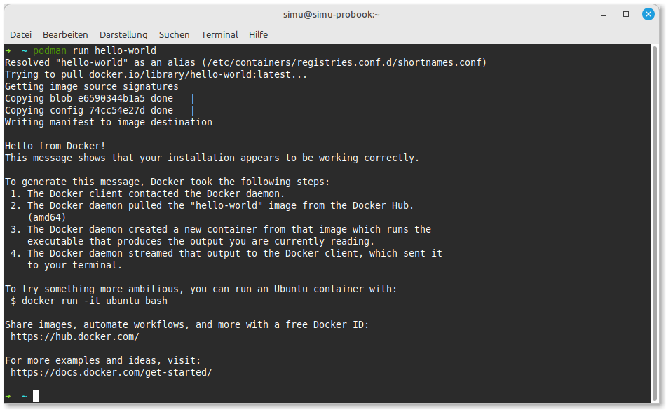

# Installation einer Container-Runtime

## Podman Installation (empfohlen)

Für die Ausführung unserer PostgreSQL-Datenbank benötigen wir eine Container-Technologie. Podman ist die empfohlene Container-Runtime, da sie ohne Root-Rechte auskommt, sicherheitsorientiert ist und in Unternehmensumgebungen bevorzugt wird.

### Windows
Podman ist über [Podman Desktop](https://podman-desktop.io/) verfügbar:
1. Lade das Windows-Installationsprogramm von der [Podman Desktop-Website](https://podman-desktop.io/downloads) herunter.
2. Führe das Installationsprogramm aus und folge den Anweisungen.

### macOS
Podman kann über Homebrew installiert werden:
```bash
brew install podman
podman machine init
podman machine start
```

### Linux (Ubuntu/Debian)
```bash
sudo apt-get update
sudo apt-get -y install podman
```

### Linux (Fedora/RHEL)
```bash
sudo dnf -y install podman
```

:::{seealso} Docker als Alternative

Falls Podman auf deinem System nicht verfügbar sein sollte, kannst du alternativ Docker verwenden. Die Befehle und Funktionen sind vergleichbar, allerdings benötigt Docker in der Regel Root-Rechte.

**Docker Kurzanleitung**

- Windows/macOS: [Docker Desktop](https://www.docker.com/products/docker-desktop/) herunterladen und installieren
- Linux (Ubuntu): 
  ```bash
  sudo apt-get update
  sudo apt-get install docker.io
  sudo usermod -aG docker $USER
  ```
:::

## Überprüfung der Installation

Nach der Installation solltest du überprüfen, ob Podman korrekt funktioniert:

```bash
podman --version
podman run hello-world
```

Wenn alles korrekt installiert wurde, solltest du die Versionsnummer sehen und der Test-Container sollte erfolgreich starten.



Im nächsten Schritt werden wir den PostgreSQL-Container für den Unterricht starten.
