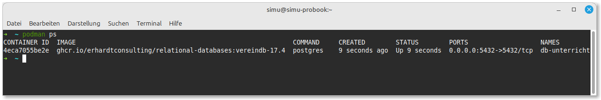

# Starten des PostgreSQL-Containers

Nachdem du Podman installiert hast, kannst du den PostgreSQL-Container für den Unterricht starten. Wir verwenden einen speziell vorbereiteten Container, der bereits alle notwendigen Datenbank-Schemata und Beispieldaten enthält.

## Container herunterladen (Pull)

Zuerst müssen wir das Container-Image aus der GitHub Container Registry (GHCR) herunterladen:

```bash
podman pull ghcr.io/erhardtconsulting/relational-databases:vereindb-17.4
```

## Container starten

Jetzt können wir den Container starten und dabei den PostgreSQL-Port (5432) freigeben, damit wir von DBeaver aus darauf zugreifen können.

### Einfacher Start (ohne persistente Daten)

```bash
podman run -d --name db-unterricht -p 5432:5432 ghcr.io/erhardtconsulting/relational-databases:vereindb-17.4
```

### Start mit persistenten Daten

Wenn du möchtest, dass deine Datenbankänderungen auch nach dem Neustart des Containers erhalten bleiben, solltest du ein Volume für die Datenbank einrichten:

```bash
# Zunächst erstellen wir ein Volume
podman volume create pgdata

# Dann starten wir den Container mit dem gemounteten Volume
podman run -d --name db-unterricht -p 5432:5432 -v pgdata:/var/lib/postgresql/data ghcr.io/erhardtconsulting/relational-databases:vereindb-17.4
```

> **Hinweis für Docker-Nutzer**: Falls du Docker anstelle von Podman verwendest, funktionieren die gleichen Befehle, ersetze einfach `podman` durch `docker` in allen Kommandos.

## Überprüfung des laufenden Containers

Um zu überprüfen, ob der Container erfolgreich gestartet wurde:

```bash
podman ps
```

Du solltest eine Ausgabe ähnlich dieser sehen:

```
CONTAINER ID   IMAGE                                                          COMMAND                  CREATED          STATUS          PORTS                    NAMES
a1b2c3d4e5f6   ghcr.io/erhardtconsulting/relational-databases:vereindb-17.4   "docker-entrypoint.s…"   10 seconds ago   Up 9 seconds    0.0.0.0:5432->5432/tcp   db-unterricht
```



## Zugangsdaten für die Datenbank

Der Container ist mit folgenden Standardzugangsdaten konfiguriert:

- **Host**: localhost
- **Port**: 5432
- **Datenbank**: verein
- **Benutzername**: postgres
- **Passwort**: postgres

Diese Zugangsdaten werden wir im nächsten Schritt verwenden, um eine Verbindung mit DBeaver herzustellen.

## Container stoppen und starten

Wenn du deinen Computer neu startest oder den Container beenden möchtest:

```bash
# Stoppen
podman stop db-unterricht

# Später wieder starten
podman start db-unterricht
```

Im nächsten Abschnitt richten wir die Verbindung in DBeaver ein.
