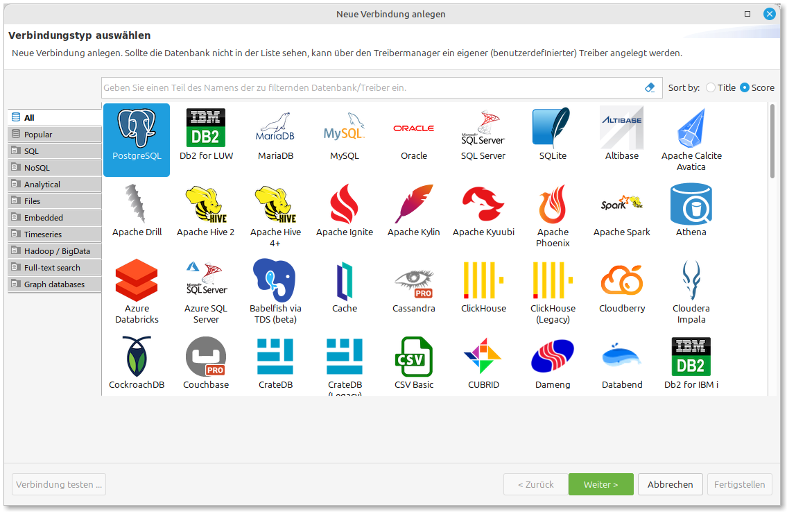
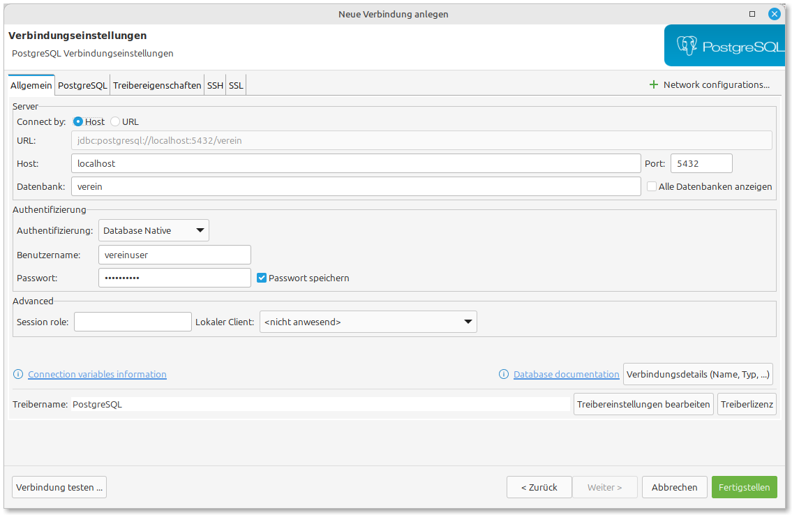
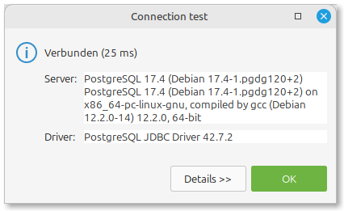
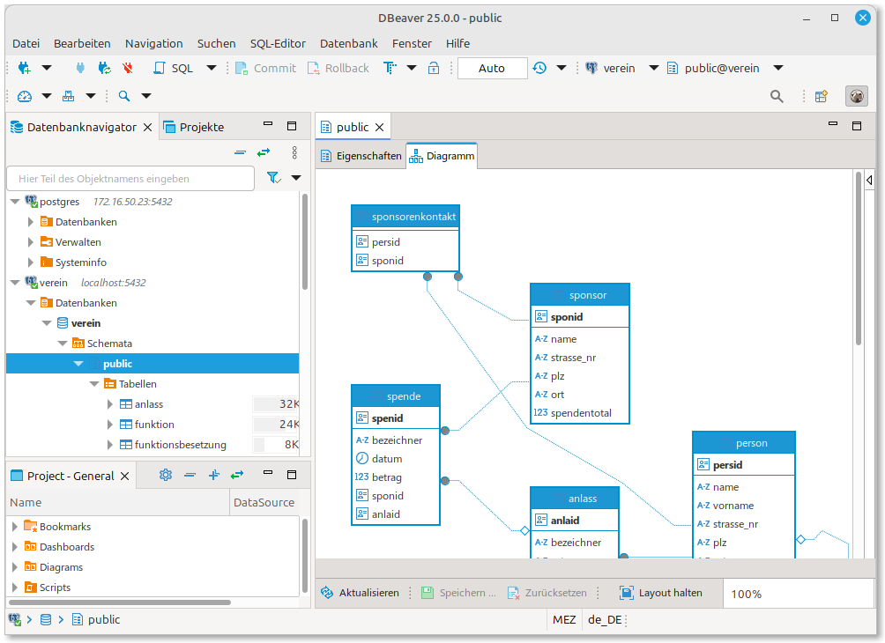
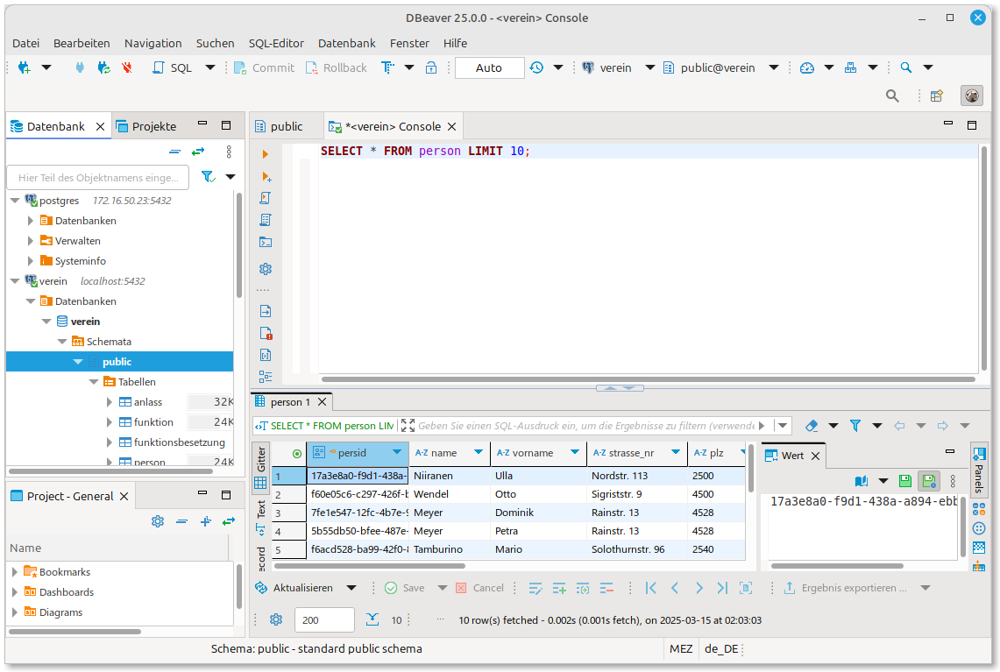
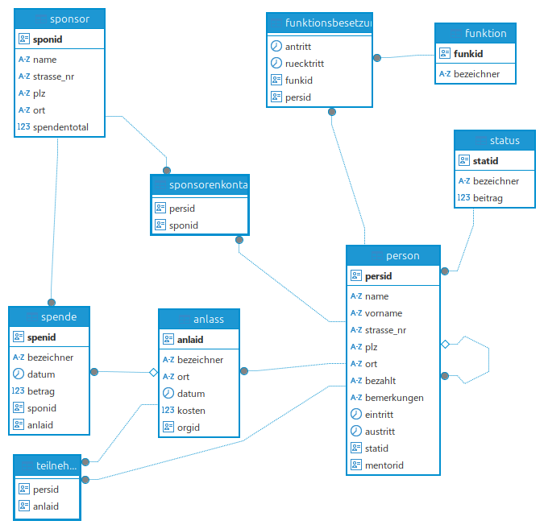

# Verbindung mit DBeaver einrichten

Nachdem der PostgreSQL-Container erfolgreich gestartet wurde, können wir nun eine Verbindung in DBeaver einrichten, um mit der Datenbank zu arbeiten.

## Neue Datenbankverbindung erstellen

1. Starte DBeaver, falls es noch nicht läuft.
2. Klicke in der Symbolleiste auf das Icon "Neue Verbindung" oder wähle im Menü "Datenbank" → "Neue Verbindung".
3. Wähle im Verbindungsauswahl-Dialog "PostgreSQL" aus und klicke auf "Weiter".



## Verbindungsparameter konfigurieren

1. Gib die folgenden Verbindungsparameter ein:

   - **Server Host**: localhost
   - **Port**: 5432
   - **Datenbank**: verein
   - **Benutzername**: vereinuser
   - **Passwort**: vereinuser



2. Klicke auf "Test Connection", um zu überprüfen, ob die Verbindung funktioniert.

3. Wenn der Test erfolgreich ist, solltest du eine Bestätigungsmeldung sehen:



4. Klicke auf "Fertig", um die Verbindung zu speichern.

:::{seealso} Datenbank-Administrator

Der `vereinuser` hat nur Zugriff auf die Datenbank `verein` und somit nur eingeschränkte Rechte. Möchtest du die Datenbank administrieren, benötigst du den Administrator.

**Administrator Login**

- **Benutzername**: postgres
- **Passwort**: hftm_admin
:::

## Verbindung verwenden

Nach der Einrichtung sollte die neue Verbindung im DBeaver-Navigator angezeigt werden:

1. Erweitere die Verbindung, um die verfügbaren Datenbanken zu sehen.
2. Navigiere zu "verein" → "Schemas" → "public" → "Tabellen".
3. Hier findest du alle Tabellen der Vereinsdatenbank, die im Container enthalten sind.



## SQL-Abfragen ausführen

1. Rechtsklicke auf die Verbindung und wähle "SQL Editor", dann "SQL Konsole öffnen".
2. Ein neues SQL-Fenster wird geöffnet, in dem du SQL-Befehle ausführen kannst.
3. Gib zum Testen eine einfache Abfrage ein, zum Beispiel:

```sql
SELECT * FROM person LIMIT 10;
```

4. Klicke auf das "Ausführen"-Symbol oder drücke Strg+Enter (Cmd+Enter auf macOS), um die Abfrage auszuführen.



5. Die Ergebnisse werden im unteren Bereich des Editors angezeigt.

## Schema-Struktur anzeigen

Mit DBeaver kannst du auch die Schema-Struktur visualisieren:

1. Wähle die Datenbank aus.
2. Rechtsklick auf das "public"-Schema und "Schema anzeigen".
3. DBeaver generiert ein ER-Diagramm mit allen Tabellen und ihren Beziehungen.



## Fehlerbehebung

Wenn du keine Verbindung zur Datenbank herstellen kannst, überprüfe bitte Folgendes:

1. Läuft der Container noch? Überprüfe dies mit `podman ps`.
2. Wurde der Port 5432 korrekt freigegeben? Überprüfe die Ausgabe des Container-Starts.
3. Blockiert möglicherweise eine Firewall den Zugriff?
4. Wenn bereits ein anderer PostgreSQL-Server auf deinem System läuft, könnte es Portkonflikte geben. In diesem Fall ändere den externen Port beim Container-Start (z.B. `-p 5433:5432`).

## Weitere Schritte

Mit der erfolgreich eingerichteten Verbindung kannst du nun:

- SQL-Abfragen ausführen
- Datenbank-Tabellen bearbeiten
- Datenbank-Objekte verwalten
- Daten importieren und exportieren

Die Datenbank enthält bereits Beispiel-Daten für einen Sportverein, mit denen du in den nächsten Kapiteln arbeiten wirst.
