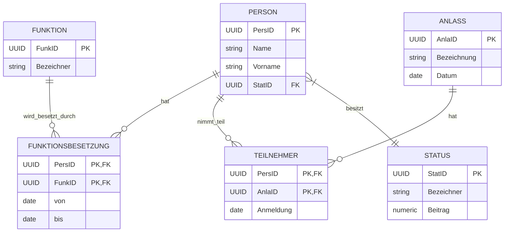

# Beziehungen in Datenbanken

## Warum Beziehungen wichtig sind

Die meisten realen Datenbankanwendungen erfordern mehr als nur eine einzelne Tabelle. Die wahre Stärke des relationalen Modells liegt in der Fähigkeit, Beziehungen zwischen verschiedenen Entitäten (und damit zwischen verschiedenen Tabellen) herzustellen und effizient abzufragen. Diese Beziehungen spiegeln die tatsächlichen Verbindungen zwischen realen Objekten, Personen, Konzepten oder Ereignissen wider.

Stellen wir uns eine Vereinsdatenbank vor: Ein Verein hat Mitglieder, organisiert Veranstaltungen und verwaltet Sponsoren. In der realen Welt stehen diese Entitäten in verschiedenen Beziehungen zueinander:

- Ein Mitglied kann an mehreren Veranstaltungen teilnehmen
- Eine Veranstaltung hat mehrere Teilnehmer
- Ein Sponsor kann mehrere Spenden tätigen
- Ein Mitglied kann verschiedene Funktionen im Verein übernehmen

Diese Beziehungen müssen in der Datenbankstruktur abgebildet werden, um die Realität korrekt zu modellieren, Abfragen über mehrere Entitäten hinweg zu ermöglichen und die Datenintegrität zu wahren.

## Das Entity-Relationship-Modell

Bevor wir in die technische Implementierung von Beziehungen eintauchen, ist es hilfreich, ein konzeptionelles Modell zu verwenden, um die Struktur unserer Datenbank zu visualisieren und zu planen. Das **Entity-Relationship-Modell** (ER-Modell) ist ein weit verbreiteter Ansatz, um Datenstrukturen grafisch darzustellen.

Das ER-Modell besteht aus drei Hauptkomponenten:

1. **Entitäten** (Entities): Repräsentieren reale oder abstrakte Objekte (z.B. Person, Veranstaltung)
2. **Attribute**: Eigenschaften der Entitäten (z.B. Name, Datum)
3. **Beziehungen** (Relationships): Verbindungen zwischen Entitäten

### ER-Diagramm

Ein ER-Diagramm visualisiert diese Komponenten mit standardisierten Symbolen:

- Rechtecke repräsentieren Entitäten
- Ovale (oder Listen innerhalb der Entitäten) repräsentieren Attribute
- Rauten oder Linien repräsentieren Beziehungen
- Primärschlüssel werden unterstrichen oder speziell markiert
- Die Kardinalität der Beziehungen wird mit speziellen Symbolen oder Notationen dargestellt

Hier ist ein vereinfachtes ER-Diagramm für einen Teil unserer Verein-Datenbank:



Dieses Diagramm zeigt, wie die verschiedenen Entitäten unserer Vereinsdatenbank miteinander in Beziehung stehen. Mit diesem visuellen Modell können wir nun die verschiedenen Arten von Beziehungen genauer untersuchen.

## Beziehungstypen

In relationalen Datenbanken unterscheiden wir hauptsächlich drei Arten von Beziehungen:

1. **1:1** (Eins-zu-Eins)
2. **1:n** (Eins-zu-Viele)
3. **n:m** (Viele-zu-Viele)

Die Kenntnis dieser Beziehungstypen und ihrer Implementierung ist entscheidend für ein effektives Datenbankdesign.

### 1:1 Beziehung (Eins-zu-Eins)

In einer 1:1-Beziehung steht jede Entität der ersten Menge mit genau einer Entität der zweiten Menge in Beziehung (und umgekehrt).

**Beispiel aus dem Alltag:**
- Eine Person hat genau einen Personalausweis
- Ein Personalausweis gehört genau einer Person

**Beispiel aus der Vereinsdatenbank:**
- Ein Mitglied hat maximal eine Mitgliedskarte
- Eine Mitgliedskarte gehört genau einem Mitglied

**SQL-Implementierung:**
Eine 1:1-Beziehung kann auf verschiedene Weise implementiert werden. Die gängigste Methode ist, einen Fremdschlüssel in einer der beiden Tabellen zu platzieren und einen UNIQUE-Constraint hinzuzufügen:

```sql
CREATE TABLE Person (
    PersID UUID PRIMARY KEY,
    Name VARCHAR(20) NOT NULL,
    Vorname VARCHAR(15) NOT NULL,
    ...
);

CREATE TABLE Mitgliedskarte (
    KartenID UUID PRIMARY KEY,
    PersID UUID UNIQUE NOT NULL,
    Ausstellungsdatum DATE NOT NULL,
    Ablaufdatum DATE NOT NULL,
    CONSTRAINT fk_Mitgliedskarte_PersID FOREIGN KEY(PersID) REFERENCES Person(PersID)
);
```

Der `UNIQUE`-Constraint für den Fremdschlüssel `PersID` in der Tabelle `Mitgliedskarte` stellt sicher, dass jedes Mitglied nur eine Karte haben kann.

**Hinweis zur Implementierung:**
Bei 1:1-Beziehungen stellt sich oft die Frage, in welcher Tabelle der Fremdschlüssel platziert werden sollte. Hier sind einige Überlegungen:

- Platziere den Fremdschlüssel in der Tabelle, bei der die Beziehung optional sein kann (NULL-Werte erlaubt)
- Wenn eine der Entitäten häufiger abgefragt wird, halte diese Tabelle frei von Fremdschlüsseln
- Wenn eine der Entitäten erst später hinzugefügt wird (z.B. die Mitgliedskarte wird erst nach der Registrierung erstellt), platziere den Fremdschlüssel in dieser Tabelle

### 1:n Beziehung (Eins-zu-Viele)

In einer 1:n-Beziehung kann eine Entität der ersten Menge mit mehreren Entitäten der zweiten Menge in Beziehung stehen, aber jede Entität der zweiten Menge ist mit genau einer Entität der ersten Menge verbunden.

**Beispiel aus dem Alltag:**
- Eine Abteilung hat mehrere Mitarbeiter
- Ein Mitarbeiter gehört zu genau einer Abteilung

**Beispiel aus der Vereinsdatenbank:**
- Ein Status (z.B. "Aktivmitglied") kann mehreren Personen zugeordnet sein
- Eine Person hat genau einen Status

**SQL-Implementierung:**
Eine 1:n-Beziehung wird implementiert, indem ein Fremdschlüssel in der "Viele"-Tabelle (n-Seite) platziert wird, der auf den Primärschlüssel der "Eins"-Tabelle (1-Seite) verweist:

```sql
CREATE TABLE Status (
    StatID UUID PRIMARY KEY,
    Bezeichner VARCHAR(20) NOT NULL,
    Beitrag NUMERIC
);

CREATE TABLE Person (
    PersID UUID PRIMARY KEY,
    StatID UUID NOT NULL,
    Name VARCHAR(20) NOT NULL,
    Vorname VARCHAR(15) NOT NULL,
    ...
    CONSTRAINT fk_Person_StatID FOREIGN KEY (StatID) REFERENCES Status (StatID)
);
```

In diesem Beispiel verweist der Fremdschlüssel `StatID` in der Tabelle `Person` auf den Primärschlüssel der Tabelle `Status`. Eine Person hat genau einen Status, aber ein Status kann mehreren Personen zugeordnet sein.

### n:m Beziehung (Viele-zu-Viele)

In einer n:m-Beziehung kann eine Entität der ersten Menge mit mehreren Entitäten der zweiten Menge in Beziehung stehen, und umgekehrt kann auch jede Entität der zweiten Menge mit mehreren Entitäten der ersten Menge verbunden sein.

**Beispiel aus dem Alltag:**
- Ein Student besucht mehrere Kurse
- Ein Kurs wird von mehreren Studenten besucht

**Beispiel aus der Vereinsdatenbank:**
- Eine Person kann an mehreren Anlässen teilnehmen
- An einem Anlass können mehrere Personen teilnehmen

**SQL-Implementierung:**
Eine n:m-Beziehung kann nicht direkt mit Fremdschlüsseln in den Haupttabellen implementiert werden. Stattdessen wird eine **Zwischentabelle** (auch Verbindungstabelle oder Junction-Tabelle genannt) erstellt:

```sql
CREATE TABLE Person (
    PersID UUID PRIMARY KEY,
    Name VARCHAR(20) NOT NULL,
    Vorname VARCHAR(15) NOT NULL,
    ...
);

CREATE TABLE Anlass (
    AnlaID UUID PRIMARY KEY,
    Bezeichnung VARCHAR(30) NOT NULL,
    Datum DATE NOT NULL,
    ...
);

CREATE TABLE Teilnehmer (
    PersID UUID REFERENCES Person(PersID),
    AnlaID UUID REFERENCES Anlass(AnlaID),
    Anmeldung DATE,
    PRIMARY KEY (PersID, AnlaID)
);
```

Die Zwischentabelle `Teilnehmer` enthält Fremdschlüssel zu beiden beteiligten Haupttabellen. Diese Fremdschlüssel bilden zusammen den Primärschlüssel der Zwischentabelle (zusammengesetzter Primärschlüssel).

Die Zwischentabelle kann auch zusätzliche Attribute enthalten, die spezifisch für die Beziehung sind, wie in diesem Fall das Anmeldedatum.

## Selbstreferenzierende Beziehungen

Eine spezielle Art von Beziehung ist die **selbstreferenzierende Beziehung**, bei der eine Entität mit sich selbst in Beziehung steht.

**Beispiel aus dem Alltag:**
- Ein Mitarbeiter hat einen Vorgesetzten (der selbst ein Mitarbeiter ist)
- Eine Person ist mit einer anderen Person verheiratet

**Beispiel aus der Vereinsdatenbank:**
- Ein Mitglied kann Mentor für andere Mitglieder sein

**SQL-Implementierung:**
Eine selbstreferenzierende Beziehung wird implementiert, indem ein Fremdschlüssel in derselben Tabelle platziert wird, der auf den Primärschlüssel derselben Tabelle verweist:

```sql
CREATE TABLE Person (
    PersID UUID PRIMARY KEY,
    Name VARCHAR(20) NOT NULL,
    Vorname VARCHAR(15) NOT NULL,
    ...
    MentorID UUID,
    CONSTRAINT fk_Person_PersID FOREIGN KEY (MentorID) REFERENCES Person (PersID),
);
```

In diesem Beispiel verweist der Fremdschlüssel `MentorID` auf den Primärschlüssel `PersID` derselben Tabelle. Ein Mitglied kann Mentor für mehrere andere Mitglieder sein (1:n-Beziehung).

## Kardinalität und Teilnahme

Neben dem grundlegenden Beziehungstyp (1:1, 1:n, n:m) gibt es weitere Aspekte, die die Natur einer Beziehung genauer beschreiben:

### Kardinalität

Die **Kardinalität** gibt an, wie viele Instanzen einer Entität mit wie vielen Instanzen einer anderen Entität in Beziehung stehen können. Die Notation hierfür kann je nach Modellierungsansatz variieren:

- **Min-Max-Notation**: Gibt Minimum und Maximum an, z.B. (0,1), (1,1), (0,n), (1,n)
- **Crow's Foot Notation**: Verwendet visuelle Symbole wie ○ (null), | (eins), ≡ (viele)
- **UML-Notation**: Verwendet Zahlen oder * für "viele", z.B. 0..1, 1..*, 0..*

### Teilnahme (Optionalität)

Die **Teilnahme** (oder Optionalität) gibt an, ob eine Entität an einer Beziehung teilnehmen muss (obligatorisch) oder nicht (optional):

- **Obligatorisch**: Jede Instanz der Entität muss an der Beziehung teilnehmen
- **Optional**: Eine Instanz der Entität kann, muss aber nicht an der Beziehung teilnehmen

In SQL wird eine obligatorische Teilnahme durch einen `NOT NULL`-Constraint für den Fremdschlüssel erzwungen:

```sql
CREATE TABLE Person (
    PersID UUID PRIMARY KEY,
    ...
    StatID UUID NOT NULL REFERENCES Status(StatID)  -- Obligatorische Teilnahme
);
```

Eine optionale Teilnahme erlaubt `NULL`-Werte für den Fremdschlüssel:

```sql
CREATE TABLE Person (
    PersID UUID PRIMARY KEY,
    ...
    MentorID UUID REFERENCES Person(PersID)  -- Optionale Teilnahme (NULL erlaubt)
);
```

## Referenzielle Integrität

Ein wichtiger Aspekt bei der Implementierung von Beziehungen ist die Sicherstellung der **referenziellen Integrität**. Dies bedeutet, dass Fremdschlüssel nur auf existierende Primärschlüsselwerte verweisen dürfen.

In PostgreSQL (und anderen relationalen Datenbanksystemen) können wir festlegen, was passieren soll, wenn ein referenzierter Primärschlüssel gelöscht oder aktualisiert wird:

```sql
CREATE TABLE Person (
    PersID UUID PRIMARY KEY,
    ...
    StatID UUID REFERENCES Status(StatID) ON DELETE RESTRICT ON UPDATE CASCADE
);
```

Die gängigsten Optionen sind:

- `RESTRICT`: Verhindert das Löschen/Aktualisieren, wenn es referenzierende Zeilen gibt
- `CASCADE`: Löscht/Aktualisiert automatisch die referenzierenden Zeilen
- `SET NULL`: Setzt den Fremdschlüssel auf NULL
- `SET DEFAULT`: Setzt den Fremdschlüssel auf seinen Standardwert

Die Wahl der richtigen Option hängt von den Geschäftsregeln und dem gewünschten Verhalten der Anwendung ab.

## Fazit

Beziehungen sind ein grundlegendes Konzept in relationalen Datenbanken. Sie ermöglichen es uns, komplexe Zusammenhänge zwischen verschiedenen Entitäten zu modellieren und abzufragen. Ein tiefes Verständnis der verschiedenen Beziehungstypen und ihrer Implementierung ist entscheidend für ein effektives Datenbankdesign.

Im nächsten Abschnitt werden wir untersuchen, welche Probleme auftreten können, wenn Datenbanken nicht gut strukturiert sind, und wie der Prozess der Normalisierung dazu beitragen kann, diese Probleme zu lösen.
