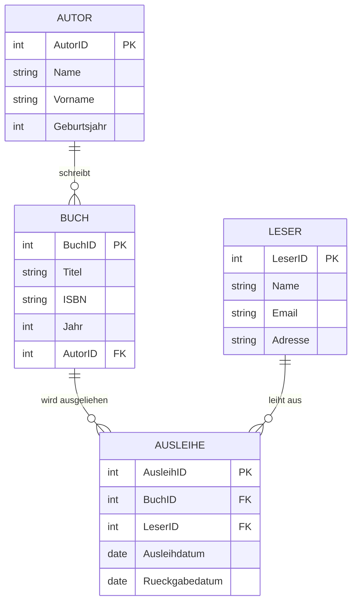

# Data Definition Language (DDL)

## Bedeutung und Anwendung der DDL

Als Datenbankentwickler wirst du nicht nur mit bestehenden Datenbankstrukturen arbeiten, sondern häufig auch selbst Datenbanken entwerfen und erstellen müssen. Die Data Definition Language (DDL) ist der Teil von SQL, der dir ermöglicht, Datenbankstrukturen zu definieren, zu ändern und zu löschen. Mit DDL-Statements setzt du deine Datenbankmodelle in die Praxis um – es ist der Bauplan, nach dem dein Datenbankmanagement-System (DBMS) die physische Speicherung der Daten organisiert.

In der Praxis wirst du DDL in folgenden Szenarien einsetzen:

- Bei der initialen Erstellung einer Datenbank für ein neues Projekt
- Wenn du ein konzeptionelles Datenmodell (ER-Diagramm) in eine reale Datenbankstruktur überführst
- Für die Anpassung bestehender Datenbankstrukturen an neue Anforderungen
- Bei der Migration von Daten zwischen verschiedenen Datenbanksystemen
- Zur Optimierung der Datenbankleistung durch Indizes und andere Strukturen

Eine solide Kenntnis der DDL ist also entscheidend, um die konzeptionelle Datenmodellierung mit der konkreten Implementierung zu verbinden. Die richtigen DDL-Statements sorgen für Integrität, Effizienz und Wartbarkeit deiner Datenbank.

## Grundkonzepte der Data Definition Language

Die Data Definition Language ist ein Teilbereich von SQL, der Befehle zur Definition und Verwaltung von Datenbankstrukturen umfasst. Im Gegensatz zur Data Manipulation Language (DML), die sich mit den Daten selbst beschäftigt, geht es bei DDL um die Strukturen, in denen die Daten gespeichert werden.

### Die wichtigsten DDL-Befehle

1. **CREATE** - Erstellt neue Datenbankobjekte wie Tabellen, Indizes, Views oder ganze Datenbanken
2. **ALTER** - Ändert die Struktur bestehender Datenbankobjekte
3. **DROP** - Löscht Datenbankobjekte
4. **TRUNCATE** - Entfernt alle Daten aus einer Tabelle, ohne die Struktur zu löschen
5. **COMMENT** - Fügt Kommentare zu Datenbankobjekten hinzu
6. **RENAME** - Benennt ein Datenbankobjekt um

### Schlüsselkonzepte in der DDL

#### Tabellen und Spalten

Tabellen sind die grundlegenden Strukturen in relationalen Datenbanken. Mit dem `CREATE TABLE`-Befehl definierst du eine neue Tabelle und ihre Spalten. Jede Spalte bekommt einen Namen, einen Datentyp und optional weitere Einschränkungen.

```sql
CREATE TABLE Person (
    PersID      UUID NOT NULL,
    Name        VARCHAR(50) NOT NULL,
    Vorname     VARCHAR(50) NOT NULL,
    Strasse_Nr  VARCHAR(50) NOT NULL,
    PLZ         CHAR(4) NOT NULL,
    Ort         VARCHAR(50) NOT NULL,
    bezahlt     CHAR(1) NOT NULL DEFAULT 'N',
    Bemerkungen VARCHAR(100),
    Eintritt    DATE,
    Austritt    DATE,
    StatID      UUID NOT NULL,
    MentorID    UUID
);
```

#### Constraints (Einschränkungen)

Constraints sind Regeln, die für die Daten in einer Tabelle gelten müssen. Sie sorgen für Datenintegrität und helfen, die Konsistenz der Daten sicherzustellen.

Die wichtigsten Arten von Constraints sind:

- **PRIMARY KEY** - Definiert den Primärschlüssel einer Tabelle
- **FOREIGN KEY** - Stellt die referentielle Integrität zwischen zwei Tabellen sicher
- **NOT NULL** - Verhindert, dass eine Spalte NULL-Werte enthalten kann
- **UNIQUE** - Stellt sicher, dass jeder Wert in einer Spalte eindeutig ist
- **CHECK** - Definiert eine Bedingung, die für jede Zeile erfüllt sein muss
- **DEFAULT** - Setzt einen Standardwert für eine Spalte

```sql
CREATE TABLE Person (
    PersID      UUID NOT NULL,
    -- weitere Spalten...
    CONSTRAINT pk_Person_PersID PRIMARY KEY (PersID),
    CONSTRAINT fk_Person_MentorID FOREIGN KEY (MentorID) REFERENCES Person (PersID),
    CONSTRAINT fk_Person_StatID FOREIGN KEY (StatID) REFERENCES Status (StatID),
    CONSTRAINT ck_Person_bezahlt CHECK (bezahlt = 'N' OR bezahlt = 'J'),
    CONSTRAINT ck_Person_Austritt CHECK (Austritt IS NULL OR (Eintritt <= Austritt))
);
```

#### Alteration von Tabellen

Mit dem `ALTER TABLE`-Befehl kannst du bestehende Tabellen verändern. Du kannst Spalten hinzufügen, ändern oder entfernen, Constraints ergänzen oder löschen und andere Struktureigenschaften anpassen.

```sql
-- Spalte hinzufügen
ALTER TABLE Person ADD COLUMN Email VARCHAR(100);

-- Constraint hinzufügen
ALTER TABLE Person ADD CONSTRAINT ck_Person_Email CHECK (Email LIKE '%@%');

-- Spaltentyp ändern (mit Vorsicht anzuwenden!)
ALTER TABLE Person ALTER COLUMN PLZ TYPE VARCHAR(5);
```

#### Löschen von Objekten

Mit `DROP`-Befehlen kannst du Datenbankobjekte vollständig löschen. Dabei ist Vorsicht geboten, da gelöschte Daten in der Regel nicht wiederhergestellt werden können.

```sql
-- Tabelle löschen
DROP TABLE Person;

-- Tabelle mit allen abhängigen Objekten löschen
DROP TABLE Person CASCADE;
```

Die `CASCADE`-Option ist besonders wichtig zu verstehen: Sie löscht nicht nur die Tabelle selbst, sondern auch alle Objekte, die von dieser Tabelle abhängen, wie Foreign Key Constraints in anderen Tabellen.

## Praktische Anwendung der DDL

### Beispiel: Erstellung einer Bibliotheksdatenbank

Nehmen wir an, du möchtest eine einfache Bibliotheksdatenbank erstellen. Beginnen wir mit einem ER-Diagramm:



Nun können wir die entsprechenden DDL-Statements erstellen:

```sql
-- Autor-Tabelle
CREATE TABLE Autor (
    AutorID     SERIAL PRIMARY KEY,
    Name        VARCHAR(50) NOT NULL,
    Vorname     VARCHAR(50) NOT NULL,
    Geburtsjahr INTEGER CHECK (Geburtsjahr > 0 AND Geburtsjahr <= EXTRACT(YEAR FROM CURRENT_DATE))
);

-- Leser-Tabelle
CREATE TABLE Leser (
    LeserID     SERIAL PRIMARY KEY,
    Name        VARCHAR(100) NOT NULL,
    Email       VARCHAR(100) NOT NULL UNIQUE CHECK (Email LIKE '%@%'),
    Adresse     VARCHAR(200)
);

-- Buch-Tabelle
CREATE TABLE Buch (
    BuchID      SERIAL PRIMARY KEY,
    Titel       VARCHAR(200) NOT NULL,
    ISBN        VARCHAR(20) UNIQUE,
    Jahr        INTEGER CHECK (Jahr > 0 AND Jahr <= EXTRACT(YEAR FROM CURRENT_DATE)),
    AutorID     INTEGER NOT NULL REFERENCES Autor(AutorID) ON DELETE RESTRICT
);

-- Ausleihe-Tabelle
CREATE TABLE Ausleihe (
    AusleihID       SERIAL PRIMARY KEY,
    BuchID          INTEGER NOT NULL REFERENCES Buch(BuchID) ON DELETE RESTRICT,
    LeserID         INTEGER NOT NULL REFERENCES Leser(LeserID) ON DELETE RESTRICT,
    Ausleihdatum    DATE NOT NULL DEFAULT CURRENT_DATE,
    Rueckgabedatum  DATE CHECK (Rueckgabedatum IS NULL OR Rueckgabedatum >= Ausleihdatum)
);
```

Beachte die verschiedenen Constraint-Typen:
- `PRIMARY KEY` für die eindeutige Identifikation jeder Zeile
- `REFERENCES` für Foreign Keys zur Sicherstellung der referentiellen Integrität
- `UNIQUE` für Felder, die keine Duplikate enthalten dürfen
- `CHECK` für benutzerdefinierte Einschränkungen
- `DEFAULT` für Standardwerte

### Implementierung von Beziehungen

Besonders wichtig sind die verschiedenen Arten, wie du Beziehungen zwischen Tabellen implementieren kannst:

1. **1:1-Beziehung**: Ein Foreign Key mit UNIQUE-Constraint in einer der Tabellen
2. **1:n-Beziehung**: Ein einfacher Foreign Key in der "n"-Tabelle
3. **n:m-Beziehung**: Eine Verbindungstabelle mit Foreign Keys zu beiden Haupttabellen

Beispiel für eine n:m-Beziehung zwischen Autoren und Büchern:

```sql
CREATE TABLE Autor (
    AutorID     SERIAL PRIMARY KEY,
    Name        VARCHAR(50) NOT NULL,
    Vorname     VARCHAR(50) NOT NULL
);

CREATE TABLE Buch (
    BuchID      SERIAL PRIMARY KEY,
    Titel       VARCHAR(200) NOT NULL,
    ISBN        VARCHAR(20) UNIQUE,
    Jahr        INTEGER
);

-- Verbindungstabelle für n:m-Beziehung
CREATE TABLE Autor_Buch (
    AutorID     INTEGER REFERENCES Autor(AutorID) ON DELETE CASCADE,
    BuchID      INTEGER REFERENCES Buch(BuchID) ON DELETE CASCADE,
    PRIMARY KEY (AutorID, BuchID)  -- Zusammengesetzter Primärschlüssel
);
```

### Änderung bestehender Strukturen

Nehmen wir an, du möchtest die Bibliotheksdatenbank später erweitern:

```sql
-- Kategorie-Tabelle hinzufügen
CREATE TABLE Kategorie (
    KategorieID SERIAL PRIMARY KEY,
    Name        VARCHAR(50) NOT NULL UNIQUE,
    Beschreibung TEXT
);

-- Bestehende Buch-Tabelle um Kategorie erweitern
ALTER TABLE Buch 
ADD COLUMN KategorieID INTEGER REFERENCES Kategorie(KategorieID);

-- Index für schnellere Suche nach Titel erstellen
CREATE INDEX idx_buch_titel ON Buch(Titel);
```

## Herausforderungen und Lösungsansätze

### Was passiert bei Änderungen an bestehenden Datenstrukturen?

Die Änderung bestehender Strukturen, insbesondere in produktiven Datenbanken mit vielen Daten, kann herausfordernd sein. Hier sind einige Strategien:

1. **Datentyp-Änderungen**: Sei vorsichtig, da bestehende Daten möglicherweise nicht zum neuen Typ konvertiert werden können. PostgreSQL bietet mit `USING`-Klauseln Flexibilität:

```sql
-- Konvertierung eines TEXT-Felds in ein INTEGER-Feld
ALTER TABLE Buch ALTER COLUMN Jahr TYPE INTEGER USING Jahr::integer;
```

2. **Nicht-NULL-Constraints hinzufügen**: Wenn du ein NOT NULL-Constraint zu einer bestehenden Spalte hinzufügen möchtest, musst du sicherstellen, dass keine NULL-Werte vorhanden sind:

```sql
-- Zuerst NULL-Werte ersetzen
UPDATE Buch SET Jahr = 2000 WHERE Jahr IS NULL;
-- Dann Constraint hinzufügen
ALTER TABLE Buch ALTER COLUMN Jahr SET NOT NULL;
```

3. **Datenbankmigration**: Bei grösseren Änderungen ist oft ein schrittweiser Ansatz sinnvoll:
   - Neue Tabelle mit gewünschter Struktur erstellen
   - Daten von der alten in die neue Tabelle kopieren und transformieren
   - Anwendungscode auf die neue Tabelle umstellen
   - Alte Tabelle löschen, wenn sie nicht mehr benötigt wird

### Wie kann ich Datenbankschemata zwischen Umgebungen übertragen?

In professionellen Entwicklungsumgebungen arbeitest du mit verschiedenen Umgebungen (Entwicklung, Test, Produktion). Hier sind Strategien zur Übertragung von Schemas:

1. **SQL-Skripte**: Speichere alle DDL-Statements in Skriptdateien, die versioniert werden können
2. **Migrations-Tools**: Tools wie Flyway oder Liquibase verwalten Datenbankänderungen
3. **Schema-Dumps**: PostgreSQL bietet `pg_dump --schema-only` zum Extrahieren von Schemas

```bash
# Schema extrahieren
pg_dump --schema-only -d bibliothek > schema.sql

# Schema auf eine andere Datenbank anwenden
psql -d neue_bibliothek -f schema.sql
```

### Was sind gängige Best Practices für DDL?

1. **Namenskonventionen**: Verwende konsistente Namenskonventionen für Tabellen, Spalten und Constraints
   ```sql
   -- Beispiel für Namenskonventionen
   CREATE TABLE tbl_buch (
       pk_buch_id SERIAL PRIMARY KEY,
       txt_titel VARCHAR(200) NOT NULL,
       fk_autor_id INTEGER REFERENCES tbl_autor(pk_autor_id),
       CONSTRAINT ck_buch_jahr CHECK (num_jahr > 0)
   );
   ```

2. **Kommentare**: Dokumentiere deine Datenstruktur mit Kommentaren
   ```sql
   COMMENT ON TABLE Buch IS 'Enthält alle Bücher in der Bibliothek';
   COMMENT ON COLUMN Buch.ISBN IS 'International Standard Book Number (13-stellig)';
   ```

3. **Transaktionen**: Führe zusammengehörige DDL-Statements in Transaktionen aus
   ```sql
   BEGIN;
   CREATE TABLE Verlag (VerlagID SERIAL PRIMARY KEY, Name VARCHAR(100) NOT NULL);
   ALTER TABLE Buch ADD COLUMN VerlagID INTEGER REFERENCES Verlag(VerlagID);
   COMMIT;
   ```

4. **Idempotente Skripte**: Schreibe Skripte, die mehrfach ausgeführt werden können, ohne Fehler zu verursachen
   ```sql
   -- Tabelle nur erstellen, wenn sie nicht existiert
   CREATE TABLE IF NOT EXISTS Verlag (
       VerlagID SERIAL PRIMARY KEY,
       Name VARCHAR(100) NOT NULL
   );
   
   -- Spalte nur hinzufügen, wenn sie nicht existiert
   DO $$
   BEGIN
       IF NOT EXISTS (
           SELECT FROM information_schema.columns 
           WHERE table_name = 'buch' AND column_name = 'verlagid'
       ) THEN
           ALTER TABLE Buch ADD COLUMN VerlagID INTEGER REFERENCES Verlag(VerlagID);
       END IF;
   END $$;
   ```

5. **Datenmodellierung vor Implementierung**: Erstelle zuerst ein ER-Diagramm und validiere es, bevor du mit der DDL-Implementierung beginnst

## Zusammenfassung

Die Data Definition Language ist ein fundamentaler Bestandteil von SQL, der dir ermöglicht, das Datenbank-Modell in die Praxis umzusetzen. Mit DDL-Befehlen definierst du die Struktur deiner Datenbank, setzt Regeln für die Datenintegrität und legst die Basis für effiziente Datenspeicherung und -abfrage.

Die wichtigsten Punkte:
- DDL umfasst Befehle wie CREATE, ALTER, DROP zur Definition von Datenbankstrukturen
- Constraints sorgen für Datenintegrität und Konsistenz
- Beziehungen zwischen Tabellen werden durch Foreign Keys implementiert
- Strukturänderungen an bestehenden Datenbanken erfordern besondere Sorgfalt
- Best Practices wie Namenskonventionen und Dokumentation erleichtern die Wartung

Nachdem du die Grundlagen der DDL verstanden hast, kannst du im nächsten Kapitel lernen, wie du mit JOIN-Operationen Daten aus mehreren Tabellen kombinieren kannst, um komplexe Abfragen zu erstellen.
