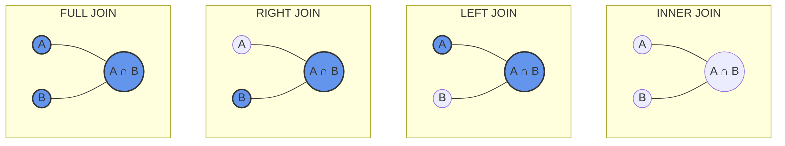
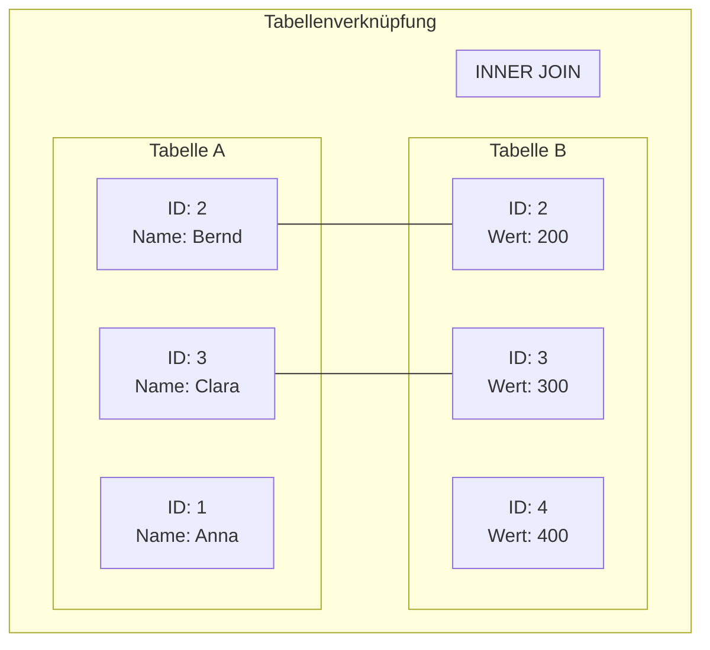

# Table Joins

## Bedeutung von Joins

In relationalen Datenbanken wird die Normalisierung von Daten angestrebt, um Redundanzen zu vermeiden und Inkonsistenzen zu verhindern. Die Daten werden dabei auf mehrere Tabellen verteilt – eine Notwendigkeit für ein gut strukturiertes Datenbankdesign. Diese Aufteilung führt jedoch zu einer neuen Herausforderung: Wie kannst du die verteilt gespeicherten Informationen wieder zusammenführen, wenn du sie für Abfragen oder Berichte benötigst?

Hier kommen JOIN-Operationen ins Spiel. Sie sind das zentrale Werkzeug, um Daten aus verschiedenen Tabellen auf sinnvolle Weise zu kombinieren. Die Beherrschung von JOIN-Operationen ist entscheidend für deine Arbeit mit relationalen Datenbanken aus mehreren Gründen:

- **Datenintegration**: Joins ermöglichen es dir, zusammengehörige Daten aus normalisierten Tabellen wieder zu verknüpfen.
- **Datenanalyse**: Komplexe Geschäftsfragen erfordern oft Informationen aus mehreren Tabellen.
- **Berichte und Dashboards**: Aussagekräftige Reports basieren häufig auf Daten aus verschiedenen Entitäten.
- **Datenqualitätsprüfung**: Mit Joins kannst du überprüfen, ob die referentielle Integrität eingehalten wird.
- **Performance-Optimierung**: Richtig eingesetzte Joins sind effizienter als mehrere separate Abfragen.

Im Kontext unserer Vereinsdatenbank könnte eine einfache Frage sein: "Welche Personen haben welche Funktionen im Verein?" Um diese Frage zu beantworten, benötigst du Daten aus mindestens zwei Tabellen: `Person` und `Funktion`. JOIN-Operationen ermöglichen es dir, diese Informationen in einer einzigen Abfrage zusammenzuführen.

## Grundkonzepte von Table Joins

Ein JOIN ist eine Operation in SQL, die es ermöglicht, Zeilen aus zwei oder mehr Tabellen basierend auf einer gemeinsamen Spalte zu kombinieren. Die Verknüpfung erfolgt typischerweise über Fremdschlüssel-Beziehungen, obwohl auch andere Bedingungen verwendet werden können.

### Die grundlegenden Join-Typen

SQL bietet verschiedene Arten von Joins, die jeweils unterschiedliche Ergebnismengen erzeugen:

1. **INNER JOIN**: Gibt nur die Zeilen zurück, bei denen es in beiden Tabellen übereinstimmende Werte gibt.
2. **LEFT JOIN** (oder LEFT OUTER JOIN): Gibt alle Zeilen aus der linken Tabelle und die übereinstimmenden Zeilen aus der rechten Tabelle zurück. Wenn es keine Übereinstimmung gibt, werden NULL-Werte für die Spalten der rechten Tabelle angezeigt.
3. **RIGHT JOIN** (oder RIGHT OUTER JOIN): Das Gegenstück zum LEFT JOIN – gibt alle Zeilen aus der rechten Tabelle und die übereinstimmenden Zeilen aus der linken Tabelle zurück.
4. **FULL JOIN** (oder FULL OUTER JOIN): Kombiniert die Ergebnisse von LEFT und RIGHT JOIN – gibt alle Zeilen aus beiden Tabellen zurück, unabhängig davon, ob es eine Übereinstimmung gibt oder nicht.
5. **CROSS JOIN**: Erzeugt ein kartesisches Produkt – jede Zeile aus der ersten Tabelle wird mit jeder Zeile aus der zweiten Tabelle kombiniert.

### Visuelle Darstellung von Joins

Joins werden oft mit Venn-Diagrammen visualisiert, um die verschiedenen Überschneidungsmöglichkeiten zu verdeutlichen:



Das folgende Beispiel zeigt eine schematische Darstellung verschiedener JOIN-Typen anhand zweier Tabellen:



### Grundlegende Syntax von Joins

Die allgemeine Syntax für einen JOIN sieht wie folgt aus:

```sql
SELECT spalten
FROM tabelle1
[JOIN_TYPE] JOIN tabelle2
ON tabelle1.spalte = tabelle2.spalte;
```

Dabei steht `[JOIN_TYPE]` für den gewünschten Join-Typ (INNER, LEFT, RIGHT, FULL), `tabelle1` und `tabelle2` sind die zu verknüpfenden Tabellen, und die `ON`-Klausel definiert die Bedingung für die Verknüpfung.

## Praktische Anwendung von Joins

Lassen wir uns die praktische Anwendung von Joins anhand der Vereinsdatenbank betrachten. Denke daran, dass die Datenbank Tabellen wie `Person`, `Funktion`, `Funktionsbesetzung`, `Anlass`, `Teilnehmer` und weitere enthält.

### Beispiel 1: INNER JOIN

Stellen wir uns vor, wir möchten eine Liste aller Personen mit ihren Funktionen erstellen:

```sql
SELECT 
    p.Name,
    p.Vorname,
    f.Bezeichner AS Funktion,
    fb.Antritt,
    fb.Ruecktritt
FROM 
    Person p
INNER JOIN 
    Funktionsbesetzung fb ON p.PersID = fb.PersID
INNER JOIN 
    Funktion f ON fb.FunkID = f.FunkID
ORDER BY 
    p.Name, p.Vorname, fb.Antritt;
```

Diese Abfrage verknüpft drei Tabellen:
1. `Person`: Enthält Grunddaten zu den Vereinsmitgliedern
2. `Funktionsbesetzung`: Enthält die Zuordnung von Personen zu Funktionen
3. `Funktion`: Enthält die Bezeichner der verschiedenen Funktionen

Das Ergebnis zeigt nur Personen, die tatsächlich eine Funktion haben. Personen ohne Funktion erscheinen nicht in der Ergebnisliste.

### Beispiel 2: LEFT JOIN

Was aber, wenn wir alle Personen sehen möchten, auch diejenigen ohne Funktion? Hier kommt der LEFT JOIN ins Spiel:

```sql
SELECT 
    p.Name,
    p.Vorname,
    f.Bezeichner AS Funktion,
    fb.Antritt,
    fb.Ruecktritt
FROM 
    Person p
LEFT JOIN 
    Funktionsbesetzung fb ON p.PersID = fb.PersID
LEFT JOIN 
    Funktion f ON fb.FunkID = f.FunkID
ORDER BY 
    p.Name, p.Vorname, fb.Antritt;
```

In diesem Fall enthält das Ergebnis alle Personen, unabhängig davon, ob sie eine Funktion haben oder nicht. Bei Personen ohne Funktion werden NULL-Werte für die Spalten aus den Tabellen `Funktionsbesetzung` und `Funktion` angezeigt.

### Beispiel 3: Kombination mehrerer Tabellen

Komplexere Anfragen erfordern oft die Verknüpfung mehrerer Tabellen. Angenommen, wir möchten wissen, welche Personen an welchen Anlässen teilgenommen haben und wer diese Anlässe organisiert hat:

```sql
SELECT 
    a.Bezeichner AS Anlass,
    a.Datum,
    a.Ort,
    t.PersID AS TeilnehmerID,
    p_t.Name AS TeilnehmerName,
    p_t.Vorname AS TeilnehmerVorname,
    p_o.Name AS OrganisatorName,
    p_o.Vorname AS OrganisatorVorname
FROM 
    Anlass a
INNER JOIN 
    Teilnehmer t ON a.AnlaID = t.AnlaID
INNER JOIN 
    Person p_t ON t.PersID = p_t.PersID
INNER JOIN 
    Person p_o ON a.OrgID = p_o.PersID
ORDER BY 
    a.Datum DESC, p_t.Name, p_t.Vorname;
```

Hier verbinden wir vier Tabellen, wobei die Tabelle `Person` zweimal verwendet wird – einmal für die Teilnehmer und einmal für die Organisatoren.

### Beispiel 4: RIGHT JOIN

RIGHT JOINs werden weniger häufig verwendet, da sie oft durch umgestellte LEFT JOINs ersetzt werden können. Ein Beispiel könnte sein, wenn wir alle Funktionen sehen wollen, auch solche, die aktuell nicht besetzt sind:

```sql
SELECT 
    f.Bezeichner AS Funktion,
    p.Name,
    p.Vorname,
    fb.Antritt,
    fb.Ruecktritt
FROM 
    Funktionsbesetzung fb
RIGHT JOIN 
    Funktion f ON fb.FunkID = f.FunkID
LEFT JOIN 
    Person p ON fb.PersID = p.PersID
ORDER BY 
    f.Bezeichner, fb.Antritt;
```

### Beispiel 5: FULL JOIN

FULL JOINs werden verwendet, wenn du sowohl alle Datensätze aus der linken als auch aus der rechten Tabelle benötigst, unabhängig davon, ob es Übereinstimmungen gibt. Ein Beispiel könnte eine Übersicht aller Anlässe und aller Personen sein, mit Markierung der Teilnahmen:

```sql
SELECT 
    a.Bezeichner AS Anlass,
    a.Datum,
    p.Name,
    p.Vorname,
    CASE WHEN t.PersID IS NOT NULL THEN 'Ja' ELSE 'Nein' END AS Teilnahme
FROM 
    Anlass a
FULL JOIN 
    Teilnehmer t ON a.AnlaID = t.AnlaID
FULL JOIN 
    Person p ON t.PersID = p.PersID
ORDER BY 
    a.Datum, p.Name, p.Vorname;
```

Beachte, dass nicht alle Datenbanksysteme den FULL JOIN unterstützen. In PostgreSQL ist er jedoch verfügbar.

### Praktische Tipps für die Verwendung von Joins

1. **Tabellenaliase verwenden**: Bei komplexen Abfragen mit vielen Tabellen erhöht die Verwendung von Aliasen die Lesbarkeit.
   ```sql
   FROM Person p INNER JOIN Funktion f ON ...
   ```

2. **JOIN-Bedingungen sorgfältig formulieren**: Stelle sicher, dass die richtigen Spalten verknüpft werden, besonders bei mehreren Fremdschlüsselbeziehungen zwischen denselben Tabellen.

3. **Auf Datentypen achten**: Die verknüpften Spalten sollten kompatible Datentypen haben, um unerwartete Ergebnisse zu vermeiden.

4. **Mehrstufige Joins logisch aufbauen**: Bei komplexen Abfragen mit vielen Tabellen ist es hilfreich, die Joins schrittweise aufzubauen und zu testen.

5. **Performanceaspekte beachten**: Joins können ressourcenintensiv sein. Indizes auf den Joinfeldern können die Performance erheblich verbessern.

## Fortgeschrittene Konzepte und Herausforderungen

### Umgang mit NULL-Werten in Joins

NULL-Werte können in Joins problematisch sein, da NULL in SQL für "unbekannt" steht und nicht mit sich selbst oder anderen Werten übereinstimmt. Die Behandlung von NULL-Werten erfordert besondere Aufmerksamkeit:

```sql
-- Personen finden, die keine Funktion haben
SELECT 
    p.Name,
    p.Vorname
FROM 
    Person p
LEFT JOIN 
    Funktionsbesetzung fb ON p.PersID = fb.PersID
WHERE 
    fb.PersID IS NULL;
```

Diese Abfrage nutzt die Eigenschaft des LEFT JOIN, NULL-Werte für nicht übereinstimmende Zeilen zu erzeugen, und filtert dann gezielt nach diesen NULL-Werten.

### Selbstreferenzierende Joins

In manchen Fällen musst du eine Tabelle mit sich selbst verbinden, beispielsweise bei hierarchischen Daten. In unserer Vereinsdatenbank gibt es das Feld `MentorID` in der Tabelle `Person`, das auf dieselbe Tabelle verweist:

```sql
-- Personen mit ihren Mentoren anzeigen
SELECT 
    p1.Name AS MitgliedName,
    p1.Vorname AS MitgliedVorname,
    p2.Name AS MentorName,
    p2.Vorname AS MentorVorname
FROM 
    Person p1
LEFT JOIN 
    Person p2 ON p1.MentorID = p2.PersID
ORDER BY 
    p1.Name, p1.Vorname;
```

Hier wird die Tabelle `Person` zweimal verwendet – einmal für die Mitglieder (p1) und einmal für die Mentoren (p2).

### Komplexe Joinbedingungen

Die `ON`-Klausel kann über einfache Gleichheitsbedingungen hinausgehen und komplexere Logik enthalten:

```sql
-- Anlässe finden, bei denen Personen aus demselben Ort teilnehmen
SELECT 
    a.Bezeichner AS Anlass,
    p1.Name AS Person1,
    p2.Name AS Person2,
    p1.Ort
FROM 
    Anlass a
INNER JOIN 
    Teilnehmer t1 ON a.AnlaID = t1.AnlaID
INNER JOIN 
    Person p1 ON t1.PersID = p1.PersID
INNER JOIN 
    Teilnehmer t2 ON a.AnlaID = t2.AnlaID
INNER JOIN 
    Person p2 ON t2.PersID = p2.PersID
WHERE 
    p1.PersID < p2.PersID  -- Verhindert doppelte Paare
    AND p1.Ort = p2.Ort    -- Personen aus demselben Ort
ORDER BY 
    a.Bezeichner, p1.Name, p2.Name;
```

### Alternative Schreibweisen für Joins

Neben der ANSI-SQL-Syntax (mit `JOIN` und `ON`) gibt es eine ältere Syntax, bei der die Joins in der `WHERE`-Klausel definiert werden:

```sql
-- Alte Syntax (nicht empfohlen)
SELECT 
    p.Name,
    p.Vorname,
    f.Bezeichner AS Funktion
FROM 
    Person p,
    Funktionsbesetzung fb,
    Funktion f
WHERE 
    p.PersID = fb.PersID
    AND fb.FunkID = f.FunkID;
```

Diese Syntax wird jedoch nicht empfohlen, da sie weniger lesbar ist und die Gefahr unbeabsichtigter CROSS JOINs besteht, wenn eine Joinbedingung vergessen wird.

### Common Table Expressions (CTEs) mit Joins

Für besonders komplexe Abfragen können Common Table Expressions (CTEs) mit Joins kombiniert werden, um die Lesbarkeit zu verbessern:

```sql
-- Personen finden, die an allen Anlässen teilgenommen haben
WITH PersonenAnzahl AS (
    SELECT 
        p.PersID,
        p.Name,
        p.Vorname,
        COUNT(t.AnlaID) AS AnzahlAnlaesse
    FROM 
        Person p
    INNER JOIN 
        Teilnehmer t ON p.PersID = t.PersID
    GROUP BY 
        p.PersID, p.Name, p.Vorname
),
GesamtAnzahlAnlaesse AS (
    SELECT 
        COUNT(DISTINCT AnlaID) AS Anzahl
    FROM 
        Anlass
)
SELECT 
    pa.Name,
    pa.Vorname
FROM 
    PersonenAnzahl pa,
    GesamtAnzahlAnlaesse gaa
WHERE 
    pa.AnzahlAnlaesse = gaa.Anzahl;
```

## Zusammenfassung

JOIN-Operationen sind ein grundlegendes Konzept in SQL und ermöglichen es dir, Daten aus verschiedenen Tabellen zu kombinieren. Die verschiedenen Join-Typen (INNER, LEFT, RIGHT, FULL) bieten Flexibilität bei der Definition, welche Datensätze in das Ergebnis einbezogen werden sollen.

Die wichtigsten Punkte:
- JOIN-Operationen sind essentiell, um in normalisierten Datenbanken wieder zusammenhängende Daten zu erhalten
- INNER JOIN gibt nur übereinstimmende Datensätze zurück
- OUTER JOINs (LEFT, RIGHT, FULL) schliessen auch nicht übereinstimmende Datensätze ein
- Joins können über mehrere Tabellen hinweg verkettet werden
- Die korrekte Formulierung der Join-Bedingungen ist entscheidend für aussagekräftige Ergebnisse

Die Beherrschung von JOIN-Operationen ist ein entscheidender Schritt, um fortgeschrittene SQL-Abfragen zu schreiben und komplexe Datenanalysen durchzuführen. Im nächsten Kapitel werden wir uns mit Aggregatfunktionen und Gruppierungen beschäftigen, die es dir ermöglichen, zusammengefasste Informationen aus deinen Daten zu gewinnen.
