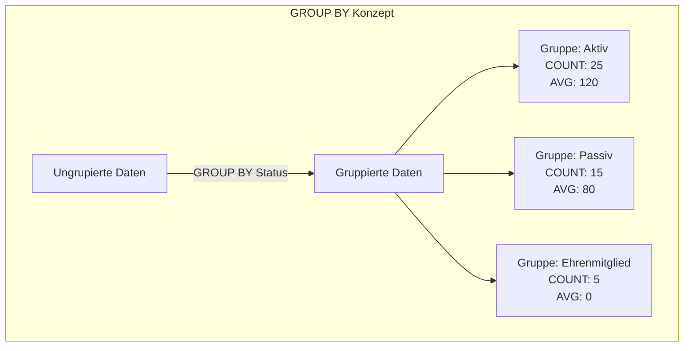
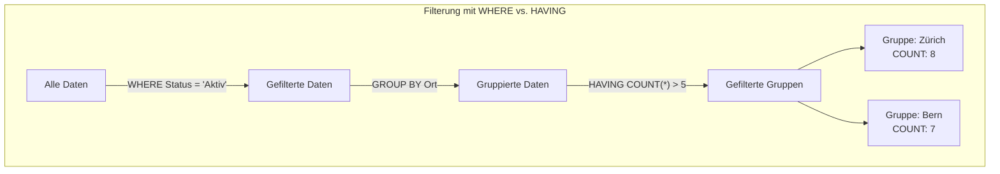

# Aggregatfunktionen und Gruppierung

## Bedeutung von Aggregationen

In der Welt der Datenbanken bist du oft weniger an einzelnen Datensätzen interessiert als an zusammenfassenden Informationen, Trends und statistischen Auswertungen. "Wie viele Mitglieder hat der Verein insgesamt?" "Wie hoch ist die durchschnittliche Spendensumme pro Sponsor?" "Welche Veranstaltung hatte die meisten Teilnehmer?" – Das sind typische Fragen, die du mit Hilfe von Aggregatfunktionen und Gruppierungen beantworten kannst.

Aggregationen sind aus mehreren Gründen entscheidend für die Datenbankarbeit:

- **Datenanalyse**: Sie ermöglichen die Erstellung von Zusammenfassungen und Statistiken für Berichte und Dashboards.
- **Entscheidungsfindung**: Aggregierte Daten liefern wichtige Kennzahlen, die als Grundlage für geschäftliche Entscheidungen dienen.
- **Datenreduktion**: Grosse Datenmengen können zu überschaubaren Ergebnismengen verdichtet werden.
- **Mustererkennung**: Durch Gruppierung und Aggregation können Muster und Trends in den Daten erkannt werden.
- **Performance**: Aggregationen können oft effizienter berechnet werden als die Verarbeitung von Einzeldaten auf Anwendungsebene.

Bei der Entwicklung unserer Vereinsdatenbank möchten wir beispielsweise wissen, wie viele Personen in jeder Funktion tätig sind, wie sich die Mitgliedsbeiträge über verschiedene Status-Kategorien verteilen oder welche Sponsoren die höchsten Spendensummen geleistet haben. Diese Erkenntnisse helfen uns, den Verein besser zu verstehen und zu organisieren.

## Grundkonzepte der Aggregatfunktionen und Gruppierungen

### Aggregatfunktionen

Aggregatfunktionen führen Berechnungen auf einer Menge von Werten durch und geben einen einzelnen Wert zurück. Die wichtigsten Aggregatfunktionen in SQL sind:

- **COUNT()**: Zählt die Anzahl der Zeilen oder Nicht-NULL-Werte
- **SUM()**: Berechnet die Summe der Werte in einer numerischen Spalte
- **AVG()**: Berechnet den Durchschnitt der Werte in einer numerischen Spalte
- **MIN()**: Ermittelt den kleinsten Wert in einer Spalte
- **MAX()**: Ermittelt den grössten Wert in einer Spalte

Zusätzlich gibt es weniger bekannte, aber nützliche Funktionen wie:

- **ARRAY_AGG()**: Aggregiert Werte in ein Array (in PostgreSQL)
- **STRING_AGG()**: Verkettet Textwerte zu einem einzigen String (in PostgreSQL)
- **PERCENTILE_CONT()**: Berechnet kontinuierliche Perzentile (in PostgreSQL)
- **VAR_POP(), STDDEV_POP()**: Berechnen Varianz und Standardabweichung

### GROUP BY-Klausel und ihre Bedeutung

Die GROUP BY-Klausel teilt das Ergebnis einer Abfrage in Gruppen ein und wendet Aggregatfunktionen auf jede Gruppe separat an. Sie ist der Schlüssel zur Analyse von Daten auf verschiedenen Aggregationsebenen.

Die GROUP BY-Klausel wird verwendet, wenn du:
- Daten nach bestimmten Kriterien gruppieren möchtest (z.B. nach Abteilung, Region, Zeitraum)
- Statistische Werte für jede Gruppe berechnen willst (z.B. durchschnittliches Gehalt pro Abteilung)
- Zusammenfassungen auf verschiedenen Ebenen erstellen möchtest



Die obige Darstellung zeigt, wie eine einfache GROUP BY-Klausel Daten nach dem Status gruppiert und für jede Gruppe separate Aggregationswerte berechnet.

### HAVING-Klausel und ihr Zweck

Während die WHERE-Klausel Zeilen vor der Gruppierung filtert, ermöglicht die HAVING-Klausel die Filterung von Gruppen nach der Aggregation. Dies ist besonders nützlich, wenn du nur Gruppen anzeigen möchtest, die bestimmte Aggregationskriterien erfüllen.

Wann wird HAVING verwendet?
- Wenn du Gruppen basierend auf Aggregationsergebnissen filtern möchtest
- Beispiel: "Zeige nur Abteilungen mit mehr als 10 Mitarbeitern"
- Beispiel: "Zeige nur Produkte mit einem durchschnittlichen Verkaufspreis über 100€"



In diesem Beispiel werden zuerst nur aktive Mitglieder mit WHERE gefiltert, dann nach Ort gruppiert, und schliesslich mit HAVING nur die Orte angezeigt, die mehr als 5 aktive Mitglieder haben.

## Praktische Anwendung von Aggregatfunktionen und Gruppierungen

### Grundlegende Aggregationen ohne Gruppierung

Die einfachste Form der Aggregation erfolgt ohne GROUP BY und liefert einen einzelnen Wert für die gesamte Tabelle:

```sql
-- Anzahl der Personen im Verein
SELECT COUNT(*) AS Personenanzahl FROM Person;

-- Durchschnittlicher Mitgliedsbeitrag
SELECT AVG(Beitrag) AS DurchschnittsBeitrag FROM Status;

-- Höchste Spendensumme
SELECT MAX(Spendentotal) AS HoechsteSpendensumme FROM Sponsor;
```

### Einfache Gruppierungen

Mit GROUP BY kannst du Daten nach einer oder mehreren Spalten gruppieren und Aggregatfunktionen auf jede Gruppe anwenden:

```sql
-- Anzahl der Personen pro Status
SELECT 
    s.Bezeichner AS StatusBezeichnung,
    COUNT(p.PersID) AS Personenanzahl
FROM 
    Person p
JOIN 
    Status s ON p.StatID = s.StatID
GROUP BY 
    s.Bezeichner
ORDER BY 
    Personenanzahl DESC;

-- Summe der Spenden pro Sponsor
SELECT 
    s.Name AS SponsorName,
    SUM(sp.Betrag) AS GesamtSpendenbetrag
FROM 
    Spende sp
JOIN 
    Sponsor s ON sp.SponID = s.SponID
GROUP BY 
    s.Name
ORDER BY 
    GesamtSpendenbetrag DESC;
```

### Gruppierung nach mehreren Spalten

Du kannst nach mehreren Spalten gruppieren, um feinere Aggregationsebenen zu erhalten:

```sql
-- Anzahl der Personen pro Status und Ort
SELECT 
    s.Bezeichner AS StatusBezeichnung,
    p.Ort,
    COUNT(p.PersID) AS Personenanzahl
FROM 
    Person p
JOIN 
    Status s ON p.StatID = s.StatID
GROUP BY 
    s.Bezeichner, p.Ort
ORDER BY 
    s.Bezeichner, Personenanzahl DESC;
```

### Filterung mit HAVING

Mit HAVING kannst du Gruppen basierend auf Aggregationsergebnissen filtern:

```sql
-- Orte mit mehr als 3 Personen
SELECT 
    Ort,
    COUNT(*) AS Personenanzahl
FROM 
    Person
GROUP BY 
    Ort
HAVING 
    COUNT(*) > 3
ORDER BY 
    Personenanzahl DESC;

-- Funktionen, die von mindestens 2 Personen besetzt wurden
SELECT 
    f.Bezeichner AS Funktion,
    COUNT(DISTINCT fb.PersID) AS Besetzungen
FROM 
    Funktionsbesetzung fb
JOIN 
    Funktion f ON fb.FunkID = f.FunkID
GROUP BY 
    f.Bezeichner
HAVING 
    COUNT(DISTINCT fb.PersID) >= 2
ORDER BY 
    Besetzungen DESC;
```

### Kombination von Aggregatfunktionen

Du kannst mehrere Aggregatfunktionen in einer Abfrage kombinieren:

```sql
-- Statistik zu Spenden pro Sponsor
SELECT 
    s.Name AS SponsorName,
    COUNT(sp.SpenID) AS AnzahlSpenden,
    SUM(sp.Betrag) AS GesamtSpendenbetrag,
    AVG(sp.Betrag) AS DurchschnittlicheSpende,
    MIN(sp.Betrag) AS KleinsteSpende,
    MAX(sp.Betrag) AS GroessteSpende
FROM 
    Spende sp
JOIN 
    Sponsor s ON sp.SponID = s.SponID
GROUP BY 
    s.Name
ORDER BY 
    GesamtSpendenbetrag DESC;
```

### Aggregation mit Joins

Besonders mächtig wird die Aggregation in Kombination mit Joins, wodurch du Daten aus mehreren Tabellen zusammenführen und aggregieren kannst:

```sql
-- Anzahl der Teilnehmer pro Anlass
SELECT 
    a.Bezeichner AS Anlass,
    a.Datum,
    COUNT(t.PersID) AS TeilnehmerAnzahl
FROM 
    Anlass a
LEFT JOIN 
    Teilnehmer t ON a.AnlaID = t.AnlaID
GROUP BY 
    a.AnlaID, a.Bezeichner, a.Datum
ORDER BY 
    a.Datum DESC;

-- Durchschnittliche Teilnehmerzahl pro Organisator
SELECT 
    p.Name AS OrganisatorName,
    p.Vorname AS OrganisatorVorname,
    COUNT(DISTINCT a.AnlaID) AS AnzahlAnlaesse,
    AVG(COUNT(t.PersID)) OVER (PARTITION BY a.OrgID) AS DurchschnittlicheTeilnehmerAnzahl
FROM 
    Anlass a
JOIN 
    Person p ON a.OrgID = p.PersID
LEFT JOIN 
    Teilnehmer t ON a.AnlaID = t.AnlaID
GROUP BY 
    a.OrgID, p.Name, p.Vorname, a.AnlaID
ORDER BY 
    DurchschnittlicheTeilnehmerAnzahl DESC;
```

### Aliasnamen in GROUP BY

In einigen Datenbanksystemen (wie PostgreSQL) kannst du Spaltenaliase in der GROUP BY-Klausel verwenden, was die Lesbarkeit verbessern kann:

```sql
-- Gruppierung nach Alias (in PostgreSQL möglich)
SELECT 
    EXTRACT(YEAR FROM a.Datum) AS Jahr,
    COUNT(*) AS AnzahlAnlaesse
FROM 
    Anlass a
GROUP BY 
    Jahr
ORDER BY 
    Jahr;
```

### Gruppierung mit Ausdrücken

Du kannst nach Ausdrücken und berechneten Werten gruppieren:

```sql
-- Gruppierung nach Jahr und Monat des Anlassdatums
SELECT 
    EXTRACT(YEAR FROM a.Datum) AS Jahr,
    EXTRACT(MONTH FROM a.Datum) AS Monat,
    COUNT(*) AS AnzahlAnlaesse
FROM 
    Anlass a
GROUP BY 
    EXTRACT(YEAR FROM a.Datum),
    EXTRACT(MONTH FROM a.Datum)
ORDER BY 
    Jahr, Monat;

-- Gruppierung nach PLZ-Bereich (erste zwei Ziffern)
SELECT 
    LEFT(PLZ, 2) AS PLZBereich,
    COUNT(*) AS Personenanzahl
FROM 
    Person
GROUP BY 
    LEFT(PLZ, 2)
ORDER BY 
    PLZBereich;
```

## Fortgeschrittene Konzepte und Herausforderungen

### Unterschied zwischen WHERE und HAVING

Ein häufiges Missverständnis betrifft den Unterschied zwischen WHERE und HAVING. Hier ein Beispiel, das den Unterschied verdeutlicht:

```sql
-- Personen in Orten mit mehr als 3 Personen (richtige Verwendung)
SELECT 
    Ort,
    COUNT(*) AS Personenanzahl
FROM 
    Person
GROUP BY 
    Ort
HAVING 
    COUNT(*) > 3;

-- Falsche Verwendung von WHERE statt HAVING
-- Dies würde einen Fehler erzeugen:
SELECT 
    Ort,
    COUNT(*) AS Personenanzahl
FROM 
    Person
WHERE 
    COUNT(*) > 3  -- Fehler! Aggregatfunktionen nicht in WHERE erlaubt
GROUP BY 
    Ort;
```

Die Reihenfolge der Verarbeitung ist wichtig:
1. FROM-Klausel: Bestimmt die Basisdaten
2. WHERE-Klausel: Filtert einzelne Zeilen vor der Gruppierung
3. GROUP BY-Klausel: Gruppiert die gefilterten Daten
4. HAVING-Klausel: Filtert Gruppen nach der Aggregation
5. SELECT-Klausel: Bestimmt die auszugebenden Spalten
6. ORDER BY-Klausel: Sortiert das Ergebnis

### NULL-Werte in Aggregatfunktionen

Aggregatfunktionen behandeln NULL-Werte unterschiedlich:

- COUNT(*) zählt alle Zeilen, unabhängig von NULL-Werten
- COUNT(spalte) zählt nur Nicht-NULL-Werte in der Spalte
- SUM(), AVG(), MIN(), MAX() ignorieren NULL-Werte

```sql
-- Unterschied zwischen COUNT(*) und COUNT(spalte)
SELECT 
    COUNT(*) AS AlleZeilen,
    COUNT(Austritt) AS ZeilenMitAustrittsdatum
FROM 
    Person;
```

### Das "GROUP BY ALL"-Problem

Ein häufiger Fehler ist, nicht alle nicht-aggregierten Spalten in der GROUP BY-Klausel anzugeben:

```sql
-- Fehler: Name fehlt in GROUP BY
SELECT 
    Ort, 
    Name,  -- Diese Spalte fehlt in der GROUP BY-Klausel
    COUNT(*) AS Anzahl
FROM 
    Person
GROUP BY 
    Ort;

-- Korrektur
SELECT 
    Ort, 
    Name,
    COUNT(*) AS Anzahl
FROM 
    Person
GROUP BY 
    Ort, Name;
```

### GROUPING SETS, ROLLUP und CUBE

Fortgeschrittene Datenbanksysteme wie PostgreSQL bieten zusätzliche Funktionen für komplexe Aggregationen:

```sql
-- GROUPING SETS: Mehrere Gruppierungen in einer Abfrage
SELECT 
    COALESCE(s.Bezeichner, 'Alle Status') AS Status,
    COALESCE(p.Ort, 'Alle Orte') AS Ort,
    COUNT(*) AS Anzahl
FROM 
    Person p
JOIN 
    Status s ON p.StatID = s.StatID
GROUP BY GROUPING SETS (
    (s.Bezeichner, p.Ort),
    (s.Bezeichner),
    (p.Ort),
    ()
)
ORDER BY 
    Status, Ort;

-- ROLLUP: Hierarchische Zusammenfassungen
SELECT 
    EXTRACT(YEAR FROM a.Datum) AS Jahr,
    EXTRACT(MONTH FROM a.Datum) AS Monat,
    COUNT(*) AS AnzahlAnlaesse
FROM 
    Anlass a
GROUP BY ROLLUP (
    EXTRACT(YEAR FROM a.Datum),
    EXTRACT(MONTH FROM a.Datum)
)
ORDER BY 
    Jahr, Monat;

-- CUBE: Alle möglichen Kombinationen von Gruppierungen
SELECT 
    COALESCE(s.Bezeichner, 'Alle Status') AS Status,
    COALESCE(p.Ort, 'Alle Orte') AS Ort,
    COUNT(*) AS Anzahl
FROM 
    Person p
JOIN 
    Status s ON p.StatID = s.StatID
GROUP BY CUBE (
    s.Bezeichner,
    p.Ort
)
ORDER BY 
    Status, Ort;
```

### Fenster-Funktionen für fortgeschrittene Aggregationen

Fenster-Funktionen (Window Functions) bieten eine mächtige Erweiterung zu herkömmlichen Aggregationen:

```sql
-- ROW_NUMBER: Nummerierung innerhalb von Gruppen
SELECT 
    s.Bezeichner AS Status,
    p.Name,
    p.Vorname,
    ROW_NUMBER() OVER (PARTITION BY p.StatID ORDER BY p.Name, p.Vorname) AS Nummer
FROM 
    Person p
JOIN 
    Status s ON p.StatID = s.StatID
ORDER BY 
    Status, Nummer;

-- Kumulative Summe von Spenden pro Sponsor
SELECT 
    s.Name AS SponsorName,
    sp.Datum,
    sp.Betrag,
    SUM(sp.Betrag) OVER (PARTITION BY sp.SponID ORDER BY sp.Datum) AS KumulativeSpendensumme
FROM 
    Spende sp
JOIN 
    Sponsor s ON sp.SponID = s.SponID
ORDER BY 
    SponsorName, sp.Datum;
```

### Common Table Expressions (CTEs) für mehrstufige Aggregationen

Bei komplexen Analysen können Common Table Expressions hilfreich sein, um mehrstufige Aggregationen durchzuführen:

```sql
-- Zwei-Stufen-Aggregation: Durchschnittliche Teilnehmeranzahl pro Anlass-Typ
WITH AnlassTeilnehmer AS (
    SELECT 
        a.Bezeichner AS Anlass,
        -- Annahme: Die ersten 3 Buchstaben definieren den Anlass-Typ
        LEFT(a.Bezeichner, 3) AS AnlassTyp,
        COUNT(t.PersID) AS TeilnehmerAnzahl
    FROM 
        Anlass a
    LEFT JOIN 
        Teilnehmer t ON a.AnlaID = t.AnlaID
    GROUP BY 
        a.AnlaID, a.Bezeichner
)
SELECT 
    AnlassTyp,
    AVG(TeilnehmerAnzahl) AS DurchschnittlicheTeilnehmerAnzahl,
    COUNT(*) AS AnzahlAnlaesse
FROM 
    AnlassTeilnehmer
GROUP BY 
    AnlassTyp
ORDER BY 
    DurchschnittlicheTeilnehmerAnzahl DESC;
```

### Performance-Überlegungen bei Aggregationen

Aggregationen können ressourcenintensiv sein, besonders bei grossen Datensätzen:

1. **Indizes**: Stelle sicher, dass die Spalten in GROUP BY, JOIN und WHERE-Klauseln indiziert sind.
2. **Vorfilterung**: Verwende WHERE, um die Datenmenge vor der Gruppierung zu reduzieren.
3. **Materialisierte Sichten**: Für häufig benötigte Aggregationen können materialisierte Sichten die Performance verbessern.
4. **EXPLAIN ANALYZE**: Nutze diesen Befehl, um den Ausführungsplan zu analysieren und Bottlenecks zu identifizieren.

```sql
-- Performance-Beispiel mit Vorfilterung
EXPLAIN ANALYZE
SELECT 
    p.Ort,
    COUNT(*) AS Personenanzahl
FROM 
    Person p
WHERE 
    p.Eintritt >= '2020-01-01'  -- Vorfilterung
GROUP BY 
    p.Ort;
```

## Zusammenfassung

Aggregatfunktionen und Gruppierungen sind mächtige Werkzeuge in SQL, die es dir ermöglichen, Daten zusammenzufassen, zu analysieren und aussagekräftige Berichte zu erstellen. Die Kombination von JOIN-Operationen, Aggregatfunktionen, GROUP BY und HAVING-Klauseln gibt dir die Flexibilität, komplexe analytische Fragen zu beantworten und fundierte Entscheidungen zu treffen.

Die wichtigsten Punkte:
- Aggregatfunktionen (COUNT, SUM, AVG, MIN, MAX) verdichten mehrere Zeilen zu einem einzelnen Wert
- Die GROUP BY-Klausel erlaubt die Anwendung von Aggregatfunktionen auf Gruppen von Daten
- Die HAVING-Klausel filtert Gruppen basierend auf Aggregationsergebnissen
- Die Kombination von JOINs und Aggregationen ermöglicht komplexe Analysen über mehrere Tabellen hinweg
- Fortgeschrittene Funktionen wie GROUPING SETS, ROLLUP, CUBE und Fenster-Funktionen bieten zusätzliche Möglichkeiten für komplexe Aggregationen

Mit diesem Wissen bist du in der Lage, aussagekräftige Reports und Analysen zu erstellen, die über simple Datenlisten hinausgehen und wertvolle Erkenntnisse aus deinen Datenbanken gewinnen.
