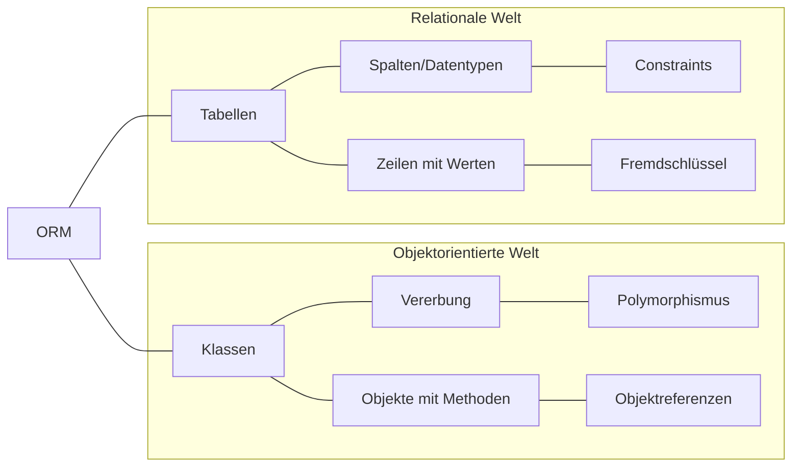
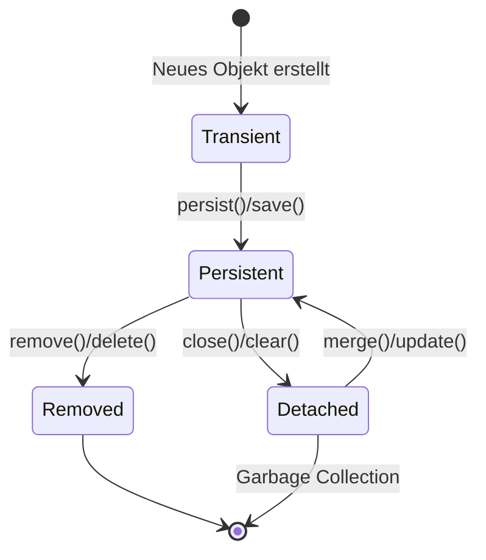

# Grundlagen des Object-Relational Mappings

Object-Relational Mapping (ORM) ist ein Programmierparadigma, das die Lücke zwischen objektorientierter Programmierung und relationalen Datenbanken überbrückt. In diesem Kapitel betrachten wir die grundlegenden Konzepte und Mechanismen, die ORMs verwenden, um eine nahtlose Integration zwischen diesen beiden Welten zu ermöglichen.

## Die konzeptionelle Herausforderung



Die obige Abbildung veranschaulicht den fundamentalen Unterschied zwischen objektorientierter Programmierung und relationalen Datenbanken. Objektorientierte Programmierung basiert auf Klassen, Vererbung und Objektreferenzen, während relationale Datenbanken auf Tabellen, Zeilen und Fremdschlüsselbeziehungen aufbauen. Diese unterschiedlichen Paradigmen führen zu mehreren Herausforderungen:

1. **Strukturelle Unterschiede**: Objekte können komplexe Vererbungshierarchien haben, während Tabellen flach strukturiert sind.
2. **Identitätskonzepte**: In der objektorientierten Welt hat jedes Objekt eine eigene Identität, während in relationalen Datenbanken die Identität durch Primärschlüssel definiert wird.
3. **Beziehungsdarstellung**: Objekte verwenden Referenzen für Beziehungen, relationale Datenbanken nutzen Fremdschlüssel und JOINs.
4. **Datentypen**: Programmiersprachen und Datenbanken haben unterschiedliche Typsysteme.
5. **Verhalten**: Objekte beinhalten sowohl Daten als auch Verhalten (Methoden), während Tabellen nur Daten speichern.

ORMs versuchen, diese Unterschiede zu überbrücken und eine konsistente Programmierumgebung zu schaffen, in der Entwickler hauptsächlich mit Objekten arbeiten können.

## Kernkomponenten eines ORM-Systems

Ein typisches ORM-System besteht aus mehreren Schlüsselkomponenten:

### 1. Entity-Mapping

Das Entity-Mapping bildet Klassen auf Datenbanktabellen ab. In den meisten ORM-Frameworks geschieht dies durch Annotationen oder Konfigurationsdateien.

**Beispiel für Entity-Mapping:**

```java
// Java mit JPA
@Entity
@Table(name = "mitglieder")
public class Mitglied {
    @Id
    private Long id;
    
    @Column(name = "nachname")
    private String nachname;
    
    // Weitere Eigenschaften...
}
```

```python
# Python mit SQLAlchemy
class Mitglied(Base):
    __tablename__ = 'mitglieder'
    
    id = Column(Integer, primary_key=True)
    nachname = Column(String)
    # Weitere Eigenschaften...
```

### 2. Beziehungs-Mapping

ORMs bieten Mechanismen, um verschiedene Arten von Beziehungen zwischen Entitäten abzubilden:

**Beispiele für Beziehungs-Mapping:**

```java
// Java: One-to-Many Beziehung
@Entity
public class Verein {
    // ...
    @OneToMany(mappedBy = "verein")
    private List<Mitglied> mitglieder;
}

@Entity
public class Mitglied {
    // ...
    @ManyToOne
    @JoinColumn(name = "verein_id")
    private Verein verein;
}
```

```python
# Python: Many-to-Many Beziehung
mitglied_veranstaltung = Table(
    'mitglied_veranstaltung',
    Base.metadata,
    Column('mitglied_id', Integer, ForeignKey('mitglieder.id')),
    Column('veranstaltung_id', Integer, ForeignKey('veranstaltungen.id'))
)

class Mitglied(Base):
    # ...
    veranstaltungen = relationship("Veranstaltung", secondary=mitglied_veranstaltung)
```

### 3. Object-Relational-Mapping-Lebenszyklus

ORMs verwalten den Lebenszyklus von Entitäten durch verschiedene Zustände:



1. **Transient**: Ein neues Objekt, das nicht mit einer Datenbankzeile verbunden ist
2. **Persistent**: Ein Objekt, das einer Datenbankzeile zugeordnet ist und vom ORM verwaltet wird
3. **Detached**: Ein Objekt, das einer Datenbankzeile zugeordnet war, aber nicht mehr vom ORM verwaltet wird
4. **Removed**: Ein Objekt, das zum Löschen markiert wurde

### 4. Lazy Loading vs. Eager Loading

Ein wichtiges Konzept in ORMs ist die Ladestrategie für Beziehungen:

- **Lazy Loading**: Beziehungen werden erst geladen, wenn explizit auf sie zugegriffen wird
  ```java
  // Lazy Loading (Standard in den meisten ORM-Frameworks)
  @OneToMany(mappedBy = "verein", fetch = FetchType.LAZY)
  private List<Mitglied> mitglieder;
  ```

- **Eager Loading**: Beziehungen werden sofort geladen, wenn das Hauptobjekt geladen wird

Die Wahl der richtigen Ladestrategie ist entscheidend für die Performance der Anwendung. Lazy Loading reduziert den initialen Ladeaufwand, kann aber zu dem "N+1-Problem" führen, wenn in einer Schleife auf viele beziehungsgebundene Objekte zugegriffen wird.

## Abfragesprachen von ORMs

ORMs bieten in der Regel eigene Abfragesprachen, die objektorientierten Zugriff auf die Datenbank ermöglichen:

Die ORMs bieten verschiedene Abfragesprachen, die objektorientiert sind und eine Alternative zu direktem SQL darstellen:

```java
// JPQL in Java
TypedQuery<Mitglied> query = entityManager.createQuery(
    "SELECT m FROM Mitglied m WHERE m.nachname = :nachname", Mitglied.class);
query.setParameter("nachname", "Müller");
List<Mitglied> results = query.getResultList();
```

```python
# Method Chaining in SQLAlchemy
session.query(Mitglied).filter(Mitglied.nachname == "Müller").all()
```

Diese spezifischen Abfragesprachen ermöglichen es, komplexe Datenbankoperationen in einer objektorientierten Weise auszudrücken, die sich natürlicher in den Programmcode einfügt.

## Fazit

Die Grundlagen des Object-Relational Mappings umfassen Entity-Mapping, Beziehungs-Mapping, den Entitäts-Lebenszyklus und spezielle Abfragesprachen. Diese Konzepte bilden das Fundament für den effizienten Einsatz von ORMs in Anwendungen.

Im nächsten Kapitel werden wir die Vor- und Nachteile von ORMs genauer betrachten und diskutieren, wann ihr Einsatz sinnvoll ist und wann möglicherweise direktes SQL die bessere Alternative darstellt.
