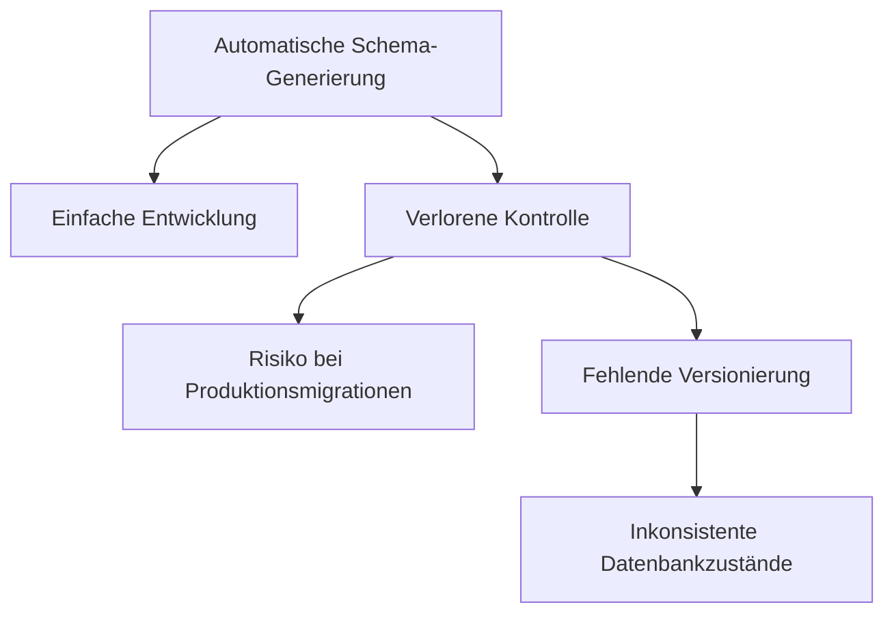
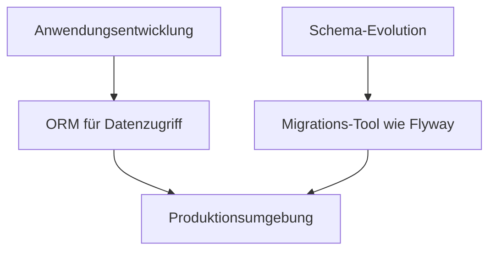

# Vor- und Nachteile von Object-Relational Mapping

In der Softwareentwicklung gibt es selten universelle Lösungen, die für alle Szenarien gleich gut geeignet sind. Dies gilt auch für Object-Relational Mapping (ORM). In diesem Kapitel analysieren wir die Stärken und Schwächen von ORMs und betrachten, in welchen Situationen sie besonders wertvoll sind und wann man besser auf direktes SQL zurückgreifen sollte.

## Vorteile von ORMs

### Produktivitätssteigerung

Einer der offensichtlichsten Vorteile von ORMs ist die erhöhte Entwicklungsgeschwindigkeit. ORMs reduzieren den Boilerplate-Code erheblich, den Entwickler sonst für CRUD-Operationen (Create, Read, Update, Delete) schreiben müssten.

**Ohne ORM:**
```java
// JDBC-Beispiel (vereinfacht)
Connection conn = DriverManager.getConnection(url, user, password);
PreparedStatement stmt = conn.prepareStatement("SELECT * FROM mitglieder WHERE id = ?");
stmt.setLong(1, mitgliedId);
ResultSet rs = stmt.executeQuery();

if (rs.next()) {
    mitglied = new Mitglied();
    mitglied.setId(rs.getLong("id"));
    mitglied.setNachname(rs.getString("nachname"));
    // weitere Eigenschaften setzen...
}
// Ressourcen müssen manuell geschlossen werden
```

**Mit ORM (Hibernate):**
```java
// Gleichwertige Operation mit Hibernate
Mitglied mitglied = entityManager.find(Mitglied.class, mitgliedId);
```

Die Reduzierung der Codemenge führt zu:
- Weniger Fehleranfälligkeit
- Besserer Lesbarkeit
- Schnellerer Entwicklung
- Einfacherer Wartung

### Abstraktion der Datenbank

ORMs bieten eine Abstraktionsschicht, die mehrere Vorteile mit sich bringt:

1. **Datenbankportabilität**: Die Anwendung kann theoretisch mit verschiedenen Datenbanksystemen arbeiten, ohne den Code zu ändern. Das ORM kümmert sich um die spezifischen SQL-Dialekte.

2. **Fokus auf Geschäftslogik**: Entwickler können sich auf die Domänenlogik konzentrieren, ohne sich mit den Details der Datenbankinteraktion befassen zu müssen.

3. **Datenkapselung**: Das ORM kapselt die Datenbankkommunikation und fördert eine sauberere Architekturtrennung.

### Objektorientierter Zugriff

ORMs ermöglichen einen natürlicheren Umgang mit Daten in einer objektorientierten Sprache:

```java
// Navigieren durch Objektbeziehungen
List<Veranstaltung> veranstaltungenVonMitglied = mitglied.getVeranstaltungen();
```

Statt JOINs und Fremdschlüssel manuell zu verwalten, können Entwickler durch Objektreferenzen navigieren, was dem mentalen Modell der objektorientierten Programmierung entspricht.

### Caching und Optimierung

Viele ORM-Frameworks bieten integrierte Caching-Mechanismen:

1. **First-Level Cache**: Innerhalb einer Session/Transaction werden Entitäten nur einmal aus der Datenbank geladen.
2. **Second-Level Cache**: Gemeinsamer Cache für alle Sessions, der die Datenbankzugriffe weiter reduziert.

Diese Caching-Mechanismen können die Anwendungsleistung verbessern, ohne dass zusätzlicher Code geschrieben werden muss.

### Automatische Änderungsverfolgung

ORMs können Änderungen an Entitäten automatisch verfolgen und nur die tatsächlich geänderten Daten an die Datenbank senden:

```java
// Hibernate aktualisiert nur geänderte Attribute
Mitglied mitglied = entityManager.find(Mitglied.class, mitgliedId);
mitglied.setNachname("Neuer Nachname");
// Beim Commit der Transaktion erkennt Hibernate die Änderung automatisch
entityManager.getTransaction().commit();
```

## Nachteile und Herausforderungen von ORMs

### Leistungseinbussen

Einer der Hauptkritikpunkte an ORMs ist die potenzielle Leistungseinbusse im Vergleich zu handoptimiertem SQL:

1. **Ineffiziente Abfragen**: ORMs können bei komplexen Abfragen suboptimalen SQL-Code generieren.

2. **N+1-Problem**: Ein klassisches Problem bei Lazy Loading, wenn in einer Schleife auf Beziehungen zugegriffen wird:

   ```java
   // Eine Abfrage für alle Vereine
   List<Verein> vereine = entityManager.createQuery("SELECT v FROM Verein v").getResultList();
   
   // + N Abfragen für die Mitglieder (eine pro Verein)
   for (Verein verein : vereine) {
       verein.getMitglieder().size(); // Löst separate Datenbankabfrage aus
   }
   ```

3. **Overhead durch Mapping**: Die Umwandlung zwischen Objekten und relationalen Daten verursacht zusätzlichen Rechenaufwand.

### Lernkurve und Komplexität

ORMs sind mächtige Tools, aber sie bringen eine erhebliche Komplexität mit sich:

1. **Steile Lernkurve**: Das vollständige Verständnis eines ORM-Frameworks wie Hibernate erfordert erheblichen Lernaufwand.

2. **Konfigurationskomplexität**: ORMs benötigen oft umfangreiche Konfigurationen.

3. **Magisches Verhalten**: Manchmal scheinen ORMs "magisch" zu funktionieren, was das Debugging erschweren kann, wenn etwas nicht wie erwartet läuft.

### Mangelnde Kontrolle

Ein grundlegender Nachteil ist der Kontrollverlust über die genaue SQL-Ausführung:

1. **Generierte Abfragen**: Der Entwickler hat keine direkte Kontrolle über die genaue SQL-Syntax.

2. **Datenbankspezifische Funktionen**: Spezielle Features einer Datenbank sind möglicherweise nicht über das ORM zugänglich.

3. **Leistungsoptimierung**: Fine-Tuning auf SQL-Ebene ist eingeschränkt oder erfordert Workarounds.

### Schema-Evolution und Versionskontrolle

Ein wichtiger und oft übersehener Nachteil betrifft die Schema-Evolution:

1. **Automatische Schema-Generierung**: Viele ORMs bieten die Möglichkeit, das Datenbankschema automatisch aus den Entity-Klassen zu generieren. In Entwicklungsumgebungen ist dies praktisch, für Produktionsumgebungen jedoch gefährlich, da:
   - Kleine Änderungen am Modell zu unbeabsichtigten Datenbankänderungen führen können
   - Datenbankschemata in der Regel eine sorgfältige Migration erfordern
   - Datenerhaltungsstrategien separat behandelt werden müssen

2. **Mangelnde Versionskontrolle**: Bei automatischer Schema-Generierung ist das Datenbankschema nicht explizit versioniert, was folgende Probleme verursacht:
   - Schwierigkeit bei der Nachverfolgung von Schemaänderungen
   - Herausforderungen bei Teamarbeit und verschiedenen Umgebungen
   - Risiken bei Produktionsbereitstellungen



## Wann sollte man ORMs einsetzen?

ORMs eignen sich besonders gut für:

### 1. CRUD-lastige Anwendungen

Wenn Ihre Anwendung hauptsächlich aus einfachen Create, Read, Update, Delete-Operationen besteht, bieten ORMs erhebliche Vorteile bei minimalem Nachteil.

### 2. Prototyping und schnelle Entwicklung

In den frühen Phasen der Entwicklung, wo Geschwindigkeit wichtiger ist als Optimierung, können ORMs den Entwicklungsprozess erheblich beschleunigen.

### 3. Projekte mit klarem Domänenmodell

Wenn Ihre Anwendung ein gut definiertes Domänenmodell hat, das sich gut in Klassen abbilden lässt, ist ein ORM eine natürliche Wahl.

### 4. Anwendungen mit moderaten Leistungsanforderungen

Für viele Geschäftsanwendungen sind die Leistungseinbussen durch ORMs in der Praxis vernachlässigbar, und die Entwicklungsvorteile überwiegen.

## Wann sollte man direktes SQL bevorzugen?

Es gibt Situationen, in denen direktes SQL besser geeignet ist:

### 1. Hochperformante Systeme

Bei Anwendungen mit äusserst hohen Leistungsanforderungen, wie Hochfrequenzhandelssystemen oder Anwendungen mit sehr hohem Durchsatz, kann direktes SQL notwendig sein, um jede Millisekunde Ausführungszeit zu optimieren.

### 2. Komplexe Abfragen

Für hochkomplexe analytische Abfragen, die mehrere JOINs, Unterabfragen und spezielle Funktionen verwenden, kann händisch optimiertes SQL die bessere Wahl sein:

```sql
-- Komplexe analytische Abfrage, die in reinem SQL lesbarer und effizienter ist
SELECT v.name, COUNT(m.id) as mitglieder_anzahl, 
       AVG(EXTRACT(YEAR FROM AGE(CURRENT_DATE, m.eintrittsdatum))) as durchschnitt 
FROM vereine v 
LEFT JOIN mitglieder m ON v.id = m.verein_id 
WHERE v.gruendungsjahr > 2000 
GROUP BY v.name 
HAVING COUNT(m.id) > 5
```

### 3. Datenbankspezifische Funktionen

Wenn Sie spezielle Datenbankfunktionen nutzen möchten, die nicht direkt vom ORM unterstützt werden, ist direktes SQL oft der einfachere Weg.

### 4. Batchoperationen und Massenaktualisierungen

Für Massenoperationen ist direktes SQL oft effizienter:

```java
// Direktes SQL für Massenupdate
String updateSql = "UPDATE mitglieder SET beitrag = beitrag * 1.05 WHERE beitragskategorie = 'Standard'";
entityManager.createNativeQuery(updateSql).executeUpdate();
```

## Best Practices: Das Beste aus beiden Welten

In der Praxis ist es oft am besten, einen hybriden Ansatz zu verfolgen:

### 1. ORM für CRUD, SQL für Komplexes

- Verwenden Sie das ORM für grundlegende CRUD-Operationen
- Fallen Sie auf direktes SQL zurück für komplexe Abfragen oder Massenoperationen

Die meisten ORM-Frameworks unterstützen native SQL-Abfragen:

```java
// Hibernate erlaubt native SQL-Abfragen
List<Object[]> results = entityManager.createNativeQuery(
    "SELECT m.id, m.nachname, COUNT(v.id) " +
    "FROM mitglieder m " +
    "JOIN mitglied_veranstaltung mv ON m.id = mv.mitglied_id " +
    "JOIN veranstaltungen v ON mv.veranstaltung_id = v.id " +
    "GROUP BY m.id, m.nachname " +
    "HAVING COUNT(v.id) > 3"
).getResultList();
```

### 2. Schema-Versionierung mit spezialisierten Tools

Eine besonders wichtige Best Practice ist die Trennung der Schema-Evolution von der ORM-Konfiguration:

1. **Verwende ORM für den Datenzugriff, nicht für Schema-Änderungen**
   - Die ORM-Konfiguration sollte das bestehende Schema abbilden
   - Schema-Änderungen sollten separat verwaltet werden

2. **Setze auf spezialisierte Migrationswerkzeuge**
   - Tools wie Flyway oder Liquibase bieten eine robuste Versionierung für Datenbankschemata
   - Sie ermöglichen kontrollierte, reproduzierbare Schema-Migrationen



Mit Flyway könnte eine Schemamigration beispielsweise so aussehen:

```sql
-- In V1.0__initial_schema.sql
CREATE TABLE mitglieder (
    id SERIAL PRIMARY KEY,
    vorname VARCHAR(100) NOT NULL,
    nachname VARCHAR(100) NOT NULL
);

-- In V1.1__add_email_column.sql
ALTER TABLE mitglieder ADD COLUMN email VARCHAR(255);
```

Dieser Ansatz bietet mehrere Vorteile:

- Das Datenbankschema steht explizit unter Versionskontrolle
- Änderungen sind reproduzierbar und nachvollziehbar
- Datenbankmigration kann unabhängig vom Anwendungscode erfolgen
- Teamarbeit wird durch klare Trennung der Verantwortlichkeiten erleichtert

## Fazit

ORMs sind leistungsstarke Werkzeuge, die die Entwicklung erheblich vereinfachen können, aber sie sind kein Allheilmittel. Ein tiefes Verständnis ihrer Stärken und Schwächen ist entscheidend, um sie effektiv einzusetzen.

Die Kombination von ORM für den Datenzugriff mit spezialisierten Tools für die Schema-Evolution stellt einen pragmatischen Ansatz dar, der in professionellen Umgebungen oft die besten Ergebnisse liefert. So behält man die Produktivitätsvorteile von ORMs bei, ohne die Kontrolle über das Datenbankschema zu verlieren.

Im nächsten Kapitel werden wir uns detaillierter mit Hibernate/JPA als konkretes Beispiel für ein ORM-Framework befassen und seine Implementierung in einer Java-Anwendung betrachten.
