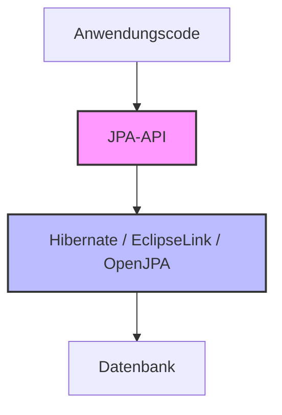
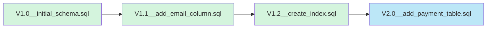
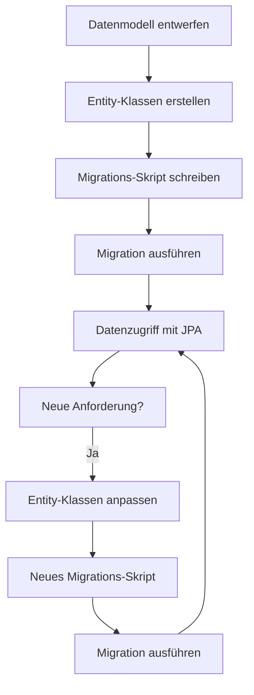

# ORM in der Java-Welt

Nachdem wir die grundlegenden Konzepte von ORM und ihre Vor- und Nachteile betrachtet haben, wollen wir uns mit einem der wichtigsten ORM-Ökosysteme befassen: der Java Persistence API (JPA) und ihrer populärsten Implementierung Hibernate. Dieses Beispiel veranschaulicht die Kernkonzepte von ORM in der Praxis.

## Java Persistence API (JPA) und Hibernate

Die Java Persistence API (JPA) ist eine Spezifikation, die einen Standard für ORM in Java definiert. Hibernate ist eine konkrete Implementierung dieser Spezifikation - eine der ältesten und am weitesten verbreiteten ORM-Lösungen im Java-Ökosystem.



Der grosse Vorteil dieser Architektur liegt in der Abstraktion: Dein Code interagiert mit der standardisierten JPA-API, während die konkrete Implementierung (z.B. Hibernate) darunter austauschbar ist.

## Der Kern von JPA: Entity-Klassen

Der Kern von JPA sind die Entity-Klassen - Java-Klassen, die Datenbanktabellen repräsentieren. Mithilfe von Annotationen werden diesen Klassen und ihren Eigenschaften Metadaten hinzugefügt, die das ORM-Framework interpretieren kann.

**Grundlegende Struktur einer Entity-Klasse:**

```java
@Entity
@Table(name = "mitglieder")
public class Mitglied {
    @Id
    private Long id;
    
    @Column(name = "nachname")
    private String nachname;
    
    // Beziehungen zu anderen Entitäten
    @ManyToOne
    private Verein verein;
}
```

### Wichtige JPA-Konzepte

- **Entities**: Java-Klassen, die Datenbanktabellen darstellen
- **Annotationen**: Metadaten, die dem Framework mitteilen, wie das Mapping erfolgen soll
- **Beziehungen**: Definiert durch spezielle Annotationen (OneToMany, ManyToOne, etc.)
- **EntityManager**: Hauptkomponente für den Zugriff auf die Datenbank

## Grundlegende Operationen mit JPA

Der EntityManager ist das zentrale Objekt in JPA, das für die Verwaltung von Entitäten zuständig ist. Mit ihm führt man die grundlegenden CRUD-Operationen (Create, Read, Update, Delete) durch.

**Beispiel für grundlegende Datenbankoperationen:**

```java
// Entität erstellen (Create)
em.getTransaction().begin();
Verein verein = new Verein("Schachclub Zürich");
em.persist(verein);
em.getTransaction().commit();

// Entität lesen (Read)
Mitglied mitglied = em.find(Mitglied.class, 1L);

// Entität aktualisieren (Update)
em.getTransaction().begin();
mitglied.setNachname("Müller");
em.getTransaction().commit();  // Änderungen werden automatisch erkannt

// Entität löschen (Delete)
em.getTransaction().begin();
em.remove(mitglied);
em.getTransaction().commit();
```

## Schemaevolution in ORM-basierten Anwendungen

Eines der kritischsten Themen in datenbankbasierten Anwendungen ist die Evolution des Datenbankschemas über die Zeit. Bei der Verwendung von ORM-Frameworks wie Hibernate gibt es verschiedene Ansätze:

1. **Automatische Schemaerzeugung**: Das ORM-Framework erzeugt das Schema basierend auf den Entity-Klassen
   - Einfach für Entwicklung und Prototyping
   - Problematisch für Produktionsumgebungen

2. **Dedizierte Schema-Migrations-Tools**: Tools wie Flyway oder Liquibase
   - Versionierte, SQL-basierte Migrationen
   - Kontrolle und Nachvollziehbarkeit aller Schemaänderungen
   - Integration mit Versionskontrollsystemen



## Best Practices: ORM und Schemaversionierung

Die Best Practices für die Verwendung von JPA/Hibernate in professionellen Umgebungen kombinieren die Stärken von ORM und separaten Schema-Migrations-Tools:



### Vorteile dieser Trennung

- **Kontrolle**: Jede Schemaänderung ist explizit als SQL-Skript definiert
- **Nachvollziehbarkeit**: Die Entwicklungsgeschichte des Schemas ist dokumentiert
- **Wiederholbarkeit**: Migration kann in verschiedenen Umgebungen reproduziert werden
- **Stabilität**: Keine unerwarteten Schemaänderungen durch ORM-Automatismen

## Fazit

Die Java Persistence API (JPA) mit ihrer populärsten Implementierung Hibernate zeigt exemplarisch, wie ORM-Frameworks in der Praxis eingesetzt werden. Die vorgestellten Konzepte - Entity-Klassen, Beziehungs-Mapping, Transaktionsmanagement und die Trennung von Datenzugriff und Schemamigration - sind nicht auf Java beschränkt, sondern stellen allgemeine Best Practices dar, die auch in anderen Programmiersprachen und Frameworks Anwendung finden.

Im nächsten Kapitel werden wir betrachten, wie ähnliche Konzepte in anderen Programmiersprachen umgesetzt werden.
