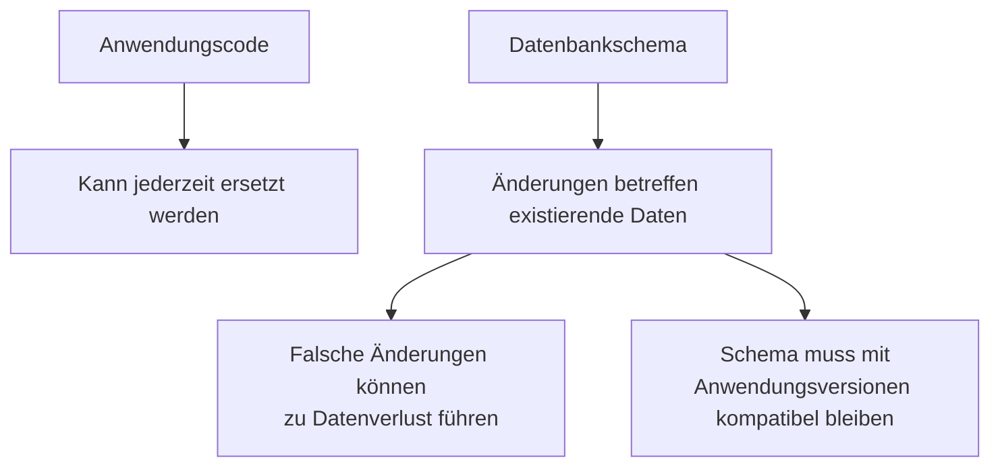
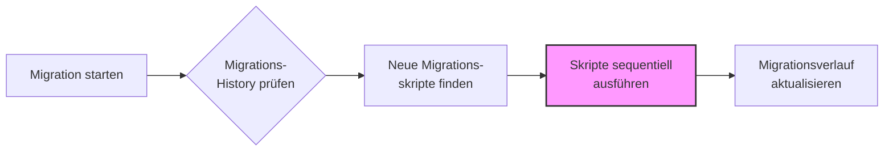
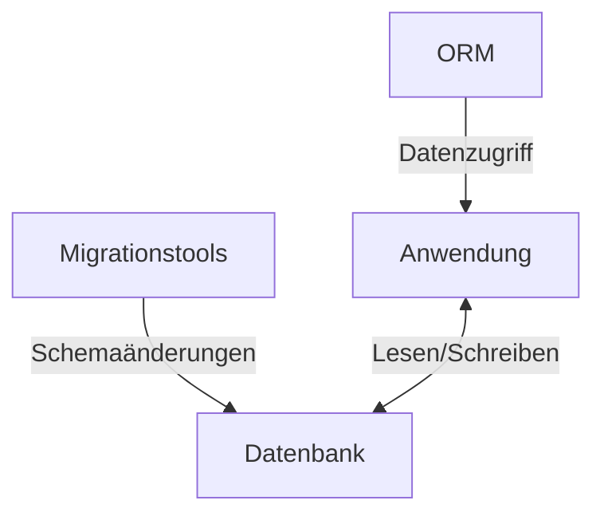

# Schemaversionierung in Datenbankprojekten

In den vorherigen Kapiteln haben wir gesehen, wie ORM-Frameworks den Datenzugriff vereinfachen können. Ein kritischer Aspekt, der in ORM-Diskussionen oft zu kurz kommt, ist die Verwaltung und Versionierung des Datenbankschemas. In diesem Kapitel betrachten wir, warum eine kontrollierte Schema-Versionierung in professionellen Umgebungen unverzichtbar ist.

## Die Bedeutung der Schemaversionierung

Das Datenbankschema ist ein fundamentaler Teil jeder Anwendung, der sorgfältig verwaltet werden muss. Im Gegensatz zum Anwendungscode haben Änderungen am Schema direkte und oft irreversible Auswirkungen auf die gespeicherten Daten.



Die Versionierung des Datenbankschemas bietet entscheidende Vorteile:

1. **Nachvollziehbarkeit**: Die Geschichte aller Schemaänderungen wird dokumentiert
2. **Reproduzierbarkeit**: Die Datenbank kann in verschiedenen Umgebungen identisch aufgebaut werden
3. **Teamarbeit**: Mehrere Entwickler können koordiniert am Schema arbeiten
4. **Rollback-Möglichkeit**: Bei Problemen kann auf frühere Versionen zurückgegriffen werden
5. **Umgebungskonsistenz**: Entwicklungs-, Test- und Produktionsumgebungen bleiben synchronisiert

## Herausforderungen der automatischen Schema-Generierung durch ORMs

Die meisten ORM-Frameworks bieten Funktionen zur automatischen Schema-Generierung. Diese Funktionalität erscheint zunächst praktisch, birgt jedoch erhebliche Risiken in professionellen Umgebungen:

1. **Unkontrollierte Änderungen**: Kleine Codeänderungen können unbeabsichtigte Schemaänderungen auslösen
2. **Eingeschränkte Möglichkeiten**: Nur einfache Änderungen werden unterstützt, komplexe Migrationen (z.B. Datentransformationen) sind nicht möglich
3. **Fehlende Sicherheitsnetze**: Potentiell gefährliche Operationen werden ohne Warnungen ausgeführt
4. **Keine Nachvollziehbarkeit**: Die Geschichte der Schemaentwicklung geht verloren
5. **Konsistenzprobleme**: Bei umfangreichen Änderungen kann es zu inkonsistenten Datenbankzuständen kommen

## Schemamigrationstools: Konzept und Funktionsweise

Zur Lösung dieser Probleme wurden spezielle Schemamigrationstools entwickelt, die einen kontrollierten und nachvollziehbaren Ansatz zur Entwicklung von Datenbankschemas bieten. Tools wie Flyway, Liquibase, Alembic (Python) oder Active Record Migrations (Ruby) folgen ähnlichen Grundprinzipien:

### Der Grundansatz der strukturierten Schemamigration

1. **Versionierte Migrations-Skripte**: Jede Schema-Änderung wird als eigenständiges, versioniertes Skript definiert
2. **Metadaten-Tracking**: Eine spezielle Tabelle in der Datenbank verfolgt, welche Migrationen bereits angewendet wurden
3. **Sequentielle Ausführung**: Migrationen werden in strikt definierter Reihenfolge ausgeführt
4. **Unveränderlichkeit**: Einmal angewendete Migrationen werden nie mehr verändert

Der typische Ablauf einer Schemamigration:



### Schema-Evolution durch versionierte Skripte

Migrationen werden typischerweise als SQL-Skripte mit aussagekräftigen Namen definiert:

```
V1.0.0__initial_schema.sql
V1.0.1__add_email_column.sql
V1.1.0__create_payment_table.sql
```

Diese sequentiellen, unveränderlichen Migrationen bilden zusammen die vollständige Geschichte der Datenbankentwicklung. Jede Änderung - von der initialen Schemaerstellung bis hin zur kleinsten Indizierung - wird dokumentiert und versioniert.

## Best Practices für die Schemaversionierung

Für eine erfolgreiche Schemaversionierung in professionellen Projekten sollten folgende Prinzipien beachtet werden:

### 1. Unveränderlichkeit der Migrations-Historie

Migrationen sind nach ihrer Anwendung unveränderlich. Fehler werden durch neue Migrationen korrigiert, nicht durch Änderung bestehender Skripte.

### 2. Idempotenz anstreben

Wenn möglich, sollten Migrationen idempotent sein - mehrfache Ausführungen sollten keinen Schaden anrichten.

### 3. Transaktionssicherheit gewährleisten

Migrationen sollten nach Möglichkeit in Transaktionen ausgeführt werden, um die Datenintegrität zu wahren.

### 4. Klare Versionierungsstrategie definieren

Eine einheitliche Versionierungsstrategie verbessert die Nachvollziehbarkeit:
- Semantic Versioning (MAJOR.MINOR.PATCH)
- Datumsbasierte Versionierung (YYYY.MM.DD.seq)

## Zusammenfassung: Dedizierte Migrationswerkzeuge vs. automatische ORM-Schemaverwaltung

Die wichtigsten Unterschiede zwischen der automatischen Schema-Generierung durch ORMs und der Verwendung dedizierter Migrationswerkzeuge:

| Aspekt | Dedizierte Migrationswerkzeuge | Automatische ORM-Schemaverwaltung |
|--------|--------------------------------|-----------------------------------|
| Kontrolle | Vollständige Kontrolle über Änderungen | Begrenzte Kontrolle, automatisiert |
| Versionierung | Explizite Versionierung mit History | Meist keine Versionierung |
| Komplexität | Unterstützt beliebig komplexe Migrationen | Nur einfache Schema-Änderungen |
| Datenmigration | Vollständige Kontrolle | Eingeschränkt oder nicht möglich |
| Teamarbeit | Unterstützt koordinierte Entwicklung | Problematisch bei mehreren Entwicklern |
| Empfohlen für | Produktionsumgebungen | Prototyping, Entwicklungsumgebungen |

## Integration von ORM und Schemamigration

Der ideale Workflow in professionellen Umgebungen kombiniert die Stärken beider Ansätze:



Diese Trennung der Zuständigkeiten bietet:
- Produktivität: ORM für effizienten objektorientierten Datenzugriff
- Sicherheit: Kontrollierte Schemaevolution durch dedizierte Migrationstools
- Nachvollziehbarkeit: Vollständige Dokumentation der Schemaentwicklung

## Fazit

Die Schemaversionierung ist ein kritischer Aspekt in datenbankbasierten Anwendungen. Während ORMs die Entwicklung durch vereinfachten Datenzugriff beschleunigen, sollte die Schema-Evolution durch spezialisierte Migrationstools verwaltet werden.

Diese Trennung von Zuständigkeiten - ORM für den Datenzugriff, Migrationstools für die Schemaevolution - hat sich in der professionellen Softwareentwicklung bewährt. Sie kombiniert die Produktivitätsvorteile von ORMs mit der Sicherheit und Kontrolle einer expliziten Schemaversionierung.
