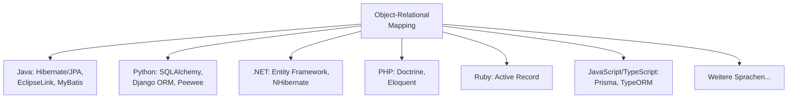
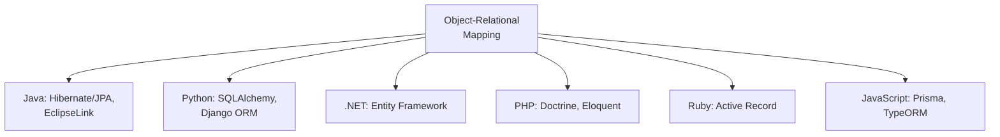
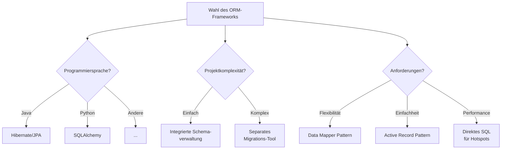

# ORM-Lösungen im Überblick

Das Konzept des Object-Relational Mappings ist nicht auf eine bestimmte Programmiersprache beschränkt, sondern ein universelles Paradigma in der Softwareentwicklung. In diesem Kapitel betrachten wir die gemeinsamen Konzepte und Muster, die in ORM-Frameworks verschiedener Programmiersprachen zu finden sind.

## Überblick über ORM-Lösungen

Nahezu jede moderne Programmiersprache verfügt über mindestens ein populäres ORM-Framework:



### Gemeinsame Konzepte

Obwohl die Implementierungen variieren, teilen die meisten ORM-Frameworks gemeinsame Grundkonzepte:

1. **Entity-Mapping**: Abbildung von Objekten auf Datenbanktabellen
2. **Beziehungsmanagement**: Verwaltung von Beziehungen zwischen Entitäten
3. **Abfragesprache**: Eine objektorientierte Methode zur Formulierung von Abfragen
4. **Session/Unit-of-Work**: Verwaltung des Objektlebenszyklus und der Transaktionen
5. **Lazy Loading/Eager Loading**: Strategien zum Laden von Beziehungen

## ORM-Frameworks in verschiedenen Programmiersprachen

Jede moderne Programmiersprache hat ein oder mehrere ORM-Frameworks, die die gleichen grundlegenden Probleme lösen:



### ORM in Python: SQLAlchemy

SQLAlchemy ist eines der mächtigsten ORM-Frameworks für Python und folgt dem Data Mapper-Pattern:

```python
class Mitglied(Base):
    __tablename__ = 'mitglieder'
    
    id = Column(Integer, primary_key=True)
    nachname = Column(String, nullable=False)
    verein_id = Column(Integer, ForeignKey('vereine.id'))
    
    # Beziehungsdefinition
    verein = relationship("Verein", back_populates="mitglieder")
```

Die grundlegenden CRUD-Operationen werden über eine Session ausgeführt:

```python
# Erstellen und Lesen
session.add(verein)
session.commit()
mitglieder = session.query(Mitglied).filter(Mitglied.verein_id == 1).all()
```

## Gemeinsame Konzepte und Design-Muster

Trotz unterschiedlicher Syntax teilen ORM-Frameworks in allen Programmiersprachen grundlegende Konzepte:

### Architekturmuster

1. **Entity-Mapping**: Die Abbildung von Klassen auf Datenbanktabellen
2. **Active Record vs. Data Mapper Pattern**
   - **Active Record**: Entitätsklassen enthalten auch die Datenbankoperationen (Ruby on Rails)
   - **Data Mapper**: Trennung von Entitätsklassen und Datenbankoperationen (Hibernate, SQLAlchemy)

### Konzepte zur Datenpersistenz

1. **Unit of Work**: Verfolgung von Änderungen an Objekten und deren synchronisierte Persistierung
2. **Identity Map**: Gewährleistet, dass jede Entität nur einmal geladen wird
3. **Lazy/Eager Loading**: Strategien zum Laden von Beziehungen

### Schemaverwaltung

Alle ORM-Ökosysteme haben ähnliche Ansätze zur Schemaversionierung entwickelt:

- **Java**: Flyway, Liquibase
- **Python**: Alembic
- **Ruby**: Active Record Migrations
- **PHP**: Doctrine Migrations

Die Grundprinzipien sind universell:
1. Schrittweise, versionierte Änderungen
2. Nachverfolgung des aktuellen Datenbankzustands
3. Reproduzierbarkeit in verschiedenen Umgebungen

## Entscheidungshilfe für die ORM-Auswahl



## Fazit

Die verschiedenen ORM-Frameworks in unterschiedlichen Programmiersprachen lösen dieselben grundlegenden Probleme, was die universelle Natur des Object-Relational Impedance Mismatch unterstreicht. Obwohl sich die Syntax und die spezifischen Implementierungen unterscheiden, sind die zugrunde liegenden Konzepte und Best Practices weitgehend übertragbar:

1. **Einheitliches Programmiermodell**: ORMs bieten eine konsistente objektorientierte Schnittstelle zur Datenbank
2. **Trennung von Zuständigkeiten**: Datenzugriff wird von der Schemaverwaltung getrennt
3. **Pragmatischer Ansatz**: Die meisten erfolgreichen Projekte nutzen ORMs für Standardoperationen und direktes SQL für komplexe oder performance-kritische Abfragen

Diese universellen Prinzipien gelten unabhängig von der gewählten Programmiersprache und dem spezifischen ORM-Framework.

Im nächsten Kapitel werden wir die Grenzen von ORMs untersuchen und Situationen betrachten, in denen direktes SQL vorzuziehen ist.
