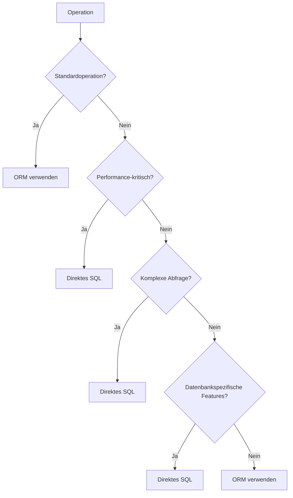

# Grenzen von ORMs und Anwendungsfälle für direktes SQL

In den vorherigen Kapiteln haben wir die Vorteile und vielfältigen Einsatzmöglichkeiten von Object-Relational Mapping Frameworks betrachtet. Jedoch ist es wichtig zu verstehen, dass ORMs, wie alle Abstraktionen, Grenzen und Einschränkungen haben. In diesem Kapitel werden wir untersuchen, wann ORMs an ihre Grenzen stossen und in welchen Situationen direktes SQL die bessere Wahl sein kann.

## Die inhärenten Einschränkungen der ORM-Abstraktion

ORMs bieten eine Abstraktionsschicht, die die Lücke zwischen objektorientierter Programmierung und relationalen Datenbanken überbrückt. Diese Abstraktion bringt jedoch bestimmte Einschränkungen mit sich:


### 1. Komplexe SQL-Funktionen und datenbankspezifische Features

Viele Datenbanksysteme bieten spezielle Funktionen und Erweiterungen, die über den SQL-Standard hinausgehen und in ORMs nicht oder nur eingeschränkt nutzbar sind:

- **Analytische Funktionen**: Window-Funktionen, CUBE, ROLLUP
- **Räumliche Erweiterungen**: PostGIS in PostgreSQL
- **JSON/XML-Funktionen**: Komplexe Abfragen auf JSON-Daten
- **Full-Text-Suche**: Spezialisierte Suchfunktionalitäten
- **Rekursive Abfragen**: Common Table Expressions (CTEs) mit rekursiven Operationen
- **Materialisierte Views**: Vorberechnete Abfrageergebnisse für bessere Performance

Bei komplexen analytischen Abfragen mit Window-Funktionen, Common Table Expressions (CTEs) und komplexen Gruppierungen stossen ORM-Frameworks schnell an ihre Grenzen. Datenbankspezifische Features wie räumliche Erweiterungen (PostGIS), JSON-Funktionalitäten oder materialisierte Views sind in den meisten ORM-Abstraktion nur eingeschränkt oder gar nicht nutzbar.

### 2. Performance-kritische Operationen

Bei besonders performance-kritischen Anwendungen kann der Overhead eines ORM zu erheblichen Leistungseinbussen führen:

#### Performance-kritische Operationen

In performance-kritischen Szenarien ist direktes SQL oft die bessere Wahl:

1. **Massendatenoperationen**: Ein einfaches `UPDATE` oder `DELETE` mit einer Bedingung ist in SQL direkt ausführbar, während ein ORM oft alle betroffenen Objekte laden, im Speicher ändern und einzeln zurückschreiben würde.

2. **Selektive Feldauswahl**: SQL ermöglicht es, nur genau die benötigten Spalten zu selektieren, während ORMs tendenziell vollständige Entitäten laden.

#### Das N+1-Problem

Das N+1-Problem ist ein klassisches Performance-Problem bei ORMs:

```java
// Ineffizienter Code mit N+1-Problem
List<Verein> vereine = entityManager.createQuery("SELECT v FROM Verein v", Verein.class).getResultList();
for (Verein verein : vereine) {
    // Löst für jeden Verein eine separate SQL-Abfrage aus!
    System.out.println(verein.getName() + " hat " + verein.getMitglieder().size() + " Mitglieder");
}
```

In SQL kann dies mit einer einzigen Abfrage gelöst werden:

```sql
SELECT v.name, COUNT(m.id) AS mitglieder_anzahl
FROM vereine v
LEFT JOIN mitglieder m ON v.id = m.verein_id
GROUP BY v.id, v.name;
```

### Datenbankwartung und Administrationsaufgaben

Für Datenbankwartung und Administrationsaufgaben sind direkte SQL-Befehle unverzichtbar:

- Tabellenpartitionierung
- Index-Optimierung
- Statistische Analysen
- Daten-Archivierung
- Schema-Änderungen mit komplexen Anforderungen

Diese Operationen erfordern oft datenbankspezifische Features, die in ORMs nicht oder nur unzureichend abgebildet sind.

## Hybride Ansätze: Das Beste aus beiden Welten

In den meisten realen Anwendungen ist ein hybrider Ansatz am effektivsten: ORM für Standardoperationen und direktes SQL für komplexe oder performance-kritische Teile.

### Native SQL in ORM-Frameworks

Nahezu alle ORM-Frameworks bieten die Möglichkeit, natives SQL auszuführen:

```java
// Native SQL in JPA/Hibernate
Query nativeQuery = entityManager.createNativeQuery(
    "SELECT m.id, m.nachname, v.name AS verein_name " +
    "FROM mitglieder m JOIN vereine v ON m.verein_id = v.id " +
    "WHERE v.gruendungsjahr > 2000");

List<Object[]> results = nativeQuery.getResultList();
```

```python
# Native SQL in SQLAlchemy
from sqlalchemy import text
result = session.execute(text("SELECT id, name FROM vereine"))
```

### Weitere Hybride Ansätze

ORM-Frameworks und direktes SQL lassen sich auch auf andere Weise kombinieren:

1. **Datenbank-Views**: Komplexe SQL-Abfragen können als Views definiert und dann über das ORM wie reguläre Tabellen angesprochen werden

2. **Stored Procedures**: Für komplexe oder performance-kritische Operationen können Stored Procedures verwendet werden, die dann vom ORM aufgerufen werden

3. **Datenbank-Funktionen**: Datenbankspezifische Funktionen können SQL-Abfragen vereinfachen und von ORMs mitgenutzt werden

## Entscheidungshilfen: ORM oder direktes SQL?

Die Entscheidung zwischen ORM und direktem SQL hängt von verschiedenen Faktoren ab. Hier sind einige Leitlinien:



### Wann ORM bevorzugen?

1. **CRUD-Operationen**: Für einfache Create, Read, Update, Delete-Operationen
2. **Objektorientierte Domäne**: Wenn der Code stark objektorientiert ist und die Datenbank hauptsächlich als Persistenzschicht dient
3. **Schnelle Entwicklung**: Für schnelles Prototyping und agile Entwicklung
4. **Typ- und Nullsicherheit**: Wenn statische Typsicherheit wichtig ist

### Wann direktes SQL bevorzugen?

1. **Komplexe Abfragen**: Für analytische Abfragen, Window-Funktionen, rekursive CTEs
2. **Performance-kritische Operationen**: Bei Massenoperationen oder in leistungskritischen Pfaden
3. **Datenbankspezifische Features**: Bei Verwendung von speziellen Datenbankfunktionen
4. **Datenmigration und -wartung**: Für Schema- und Datenmigrationen auf Datenbankebene

## Best Practices für den hybriden Ansatz

Für den effektiven Einsatz von ORM und direktem SQL gelten folgende Best Practices:

1. **Repository-Pattern einsetzen**:
   - CRUD-Operationen mit ORM implementieren
   - Komplexe Abfragen als SQL-Methoden im Repository kapseln
   - Klare Schnittstelle zur Domänenschicht definieren

2. **SQL-Abfragen organisieren**:
   - SQL-Abfragen in separate Dateien auslagern
   - Diese Dateien unter Versionskontrolle stellen
   - Zentrale Verwaltung komplexer Abfragen

3. **DTOs für Abfrageergebnisse**:
   - Data Transfer Objects für Resultate komplexer Abfragen definieren
   - Klare Trennung zwischen Entitäten und projektionsspezifischen Datencontainern

## Fazit

ORMs sind leistungsfähige Werkzeuge, die die Entwicklung beschleunigen und den Code vereinfachen können. Sie haben jedoch auch Grenzen, besonders bei komplexen Abfragen, performance-kritischen Operationen und bei der Nutzung datenbankspezifischer Features.

Die wichtigsten Erkenntnisse:

1. **Kenntnisse kombinieren**: Ein tiefgreifendes Verständnis von SQL bleibt auch beim Einsatz von ORMs unverzichtbar
2. **Pragmatisch entscheiden**: Die Wahl zwischen ORM und direktem SQL sollte anwendungsfallbezogen getroffen werden
3. **Hybride Strategien nutzen**: In professionellen Anwendungen ist eine Kombination von ORM und direktem SQL oft der beste Ansatz
4. **Performancebewusstsein entwickeln**: Die Auswirkungen von ORM-generierten Datenbankzugriffen auf die Systemleistung sollten überwacht und optimiert werden

Durch ein tiefes Verständnis beider Ansätze – ORM und direktes SQL – können Entwickler robuste, effiziente und wartbare datenbankgestützte Anwendungen erstellen.
