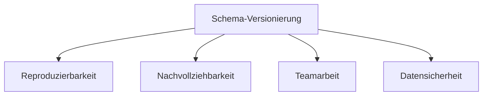

# Zusammenfassung

In diesem Kapitel haben wir einen umfassenden Überblick über Object-Relational Mapping (ORM) gegeben - eine Technologie, die die konzeptionelle Lücke zwischen objektorientierter Programmierung und relationalen Datenbanken überbrückt. Wir haben verschiedene Aspekte von ORMs untersucht, von den grundlegenden Konzepten bis hin zu fortgeschrittenen Anwendungsfällen und Grenzen.

## Rückblick auf die wichtigsten Erkenntnisse

### Grundkonzepte und Funktionsweise von ORMs

ORMs ermöglichen es Entwicklern, mit Datenbankobjekten in Form von Programmobjekten zu arbeiten, wodurch die manuelle Abbildung zwischen diesen beiden Paradigmen entfällt. Die Kernkonzepte umfassen Entity-Mapping, Beziehungsmanagement, verschiedene Ladestrategien (Lazy/Eager Loading) und Lebenszyklus-Management von Entitäten.

### Vor- und Nachteile von ORMs

ORMs bieten erhebliche Vorteile wie höhere Produktivität, objektorientierter Zugriff auf Daten, und verbesserte Wartbarkeit. Jedoch bringen sie auch Nachteile mit sich, darunter potenzielle Leistungseinbussen, Lernkurve und Komplexität, sowie eingeschränkte Kontrolle über die genaue SQL-Ausführung.

Die wichtigste Erkenntnis ist, dass ORMs nicht für alle Anwendungsfälle gleichermassen geeignet sind. Sie sind besonders wertvoll für CRUD-lastige Anwendungen, Projekte mit klarem Domänenmodell und Anwendungen mit moderaten Leistungsanforderungen.

### Hibernate/JPA als Beispiel-Framework

An Hibernate/JPA haben wir gesehen, wie ein konkretes ORM-Framework in der Praxis funktioniert. Wir haben gelernt, wie Entitäten definiert, Beziehungen abgebildet und grundlegende CRUD-Operationen ausgeführt werden. Besonders wichtig war dabei die Darstellung, wie JPA als Spezifikation von verschiedenen Implementierungen (wie Hibernate) umgesetzt werden kann.

### Schemaversionierung als kritischer Aspekt

Ein Schwerpunkt unserer Betrachtung war die Schemaversionierung - ein Aspekt, der in vielen ORM-Diskussionen zu kurz kommt. Wir haben gesehen, warum die automatische Schema-Generierung durch ORMs in Produktionsumgebungen problematisch ist und wie spezialisierte Tools wie Flyway eine sichere und kontrollierte Evolution des Datenbankschemas ermöglichen.

### Alternative ORM-Lösungen in verschiedenen Programmiersprachen

Wir haben gesehen, dass das Konzept des ORM nicht auf Java beschränkt ist, sondern in praktisch allen modernen Programmiersprachen implementiert wurde. Frameworks wie SQLAlchemy (Python), Prisma (TypeScript/JavaScript) und Entity Framework Core (.NET) folgen ähnlichen Grundprinzipien, bieten aber jeweils eigene Ansätze und Funktionen.

### Grenzen von ORMs und hybride Ansätze

Schliesslich haben wir die Grenzen von ORMs untersucht und festgestellt, dass es Situationen gibt, in denen direktes SQL die bessere Wahl ist. Dazu gehören komplexe analytische Abfragen, hochperformante Operationen und datenbankspezifische Funktionen. In der Praxis hat sich ein hybrider Ansatz bewährt: ORM für Standardoperationen und direktes SQL für komplexe oder leistungskritische Teile.

## Kernbotschaften

Zum Abschluss möchten wir die wichtigsten Erkenntnisse aus diesem Kapitel zusammenfassen:

1. **ORMs als Produktivitätswerkzeuge**: Object-Relational Mapper können die Entwicklung erheblich beschleunigen und den Code vereinfachen, indem sie die repetitive Arbeit der Objekt-Relational-Abbildung automatisieren.

2. **Nicht alles muss über ORMs laufen**: Für komplexe Abfragen, Massenoperationen oder datenbankspezifische Funktionen ist direktes SQL oft die bessere Wahl. Ein guter Entwickler sollte sowohl ORM als auch SQL beherrschen.

3. **Trennung von Datenzugriff und Schemaverwaltung**: In professionellen Umgebungen sollte die Schema-Evolution von spezialisierten Migrations-Tools verwaltet werden, während ORMs für den Datenzugriff verwendet werden.

4. **ORM-Entscheidung basiert auf Kontext**: Die Wahl des richtigen ORM-Frameworks hängt von Faktoren wie Programmiersprache, Projektanforderungen und Teamexpertise ab.

5. **Bewusstsein für Performance-Implikationen**: ORMs können zu Leistungsproblemen wie dem N+1-Problem führen. Ein gutes Verständnis der Funktionsweise des ORM ist entscheidend, um solche Probleme zu vermeiden.

## Ausblick und weiterführende Themen

Das Thema ORM ist breit und entwickelt sich ständig weiter. Einige Bereiche, die für weiterführende Studien interessant sein könnten, umfassen:

- **NoSQL-Integration**: Viele moderne ORMs unterstützen auch nicht-relationale Datenbanken
- **Reaktive Programmierung**: Neuere ORM-Versionen bieten Unterstützung für reaktive Programmiermuster
- **GraphQL-Integration**: Die Verbindung von GraphQL-APIs mit ORM-basierten Datenquellen
- **Polyglot Persistence**: Die Verwendung verschiedener Datenspeicher für verschiedene Teile einer Anwendung und wie ORMs damit umgehen können

## Fazit

Object-Relational Mapping ist ein mächtiges Konzept, das die Entwicklung datenbankgestützter Anwendungen erheblich vereinfachen kann. Wie bei jeder Abstraktion ist es jedoch wichtig, ihre Stärken und Schwächen zu verstehen, um sie effektiv einzusetzen.

Die beste Herangehensweise ist ein pragmatischer Ansatz: ORMs dort einsetzen, wo sie Mehrwert bieten, und auf direktes SQL zurückgreifen, wo es sinnvoll ist. Zusammen mit einer robusten Schemaversionierung bildet dieser hybride Ansatz eine solide Grundlage für die Entwicklung moderner, datenbankgestützter Anwendungen.
