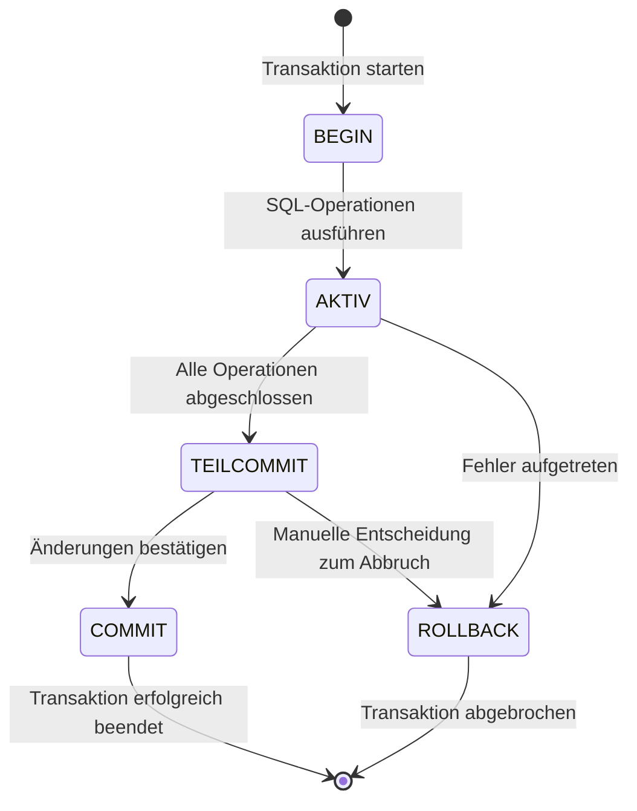

<!-- _class: lead -->

<div class="header-box">
  <p class="fachbereich">Informatik</p>
  <h1>ACID und Transaktionen</h1>
  <p class="date-author">März 2025 | Autor: Simon Erhardt</p>
</div>

---
# Inhaltsverzeichnis
<!--
- Hilft den Studierenden beim Überblick
- Folgende Punkte kurz ansprechen
-->
1. Motivation: Warum brauchen wir zuverlässige Transaktionen?  
2. Ursprünge und Entwicklung des ACID-Paradigmas  
3. Die ACID-Eigenschaften im Detail  
4. Transaktionen in der Praxis  
5. Isolationsebenen und Auswirkungen  
6. Nebenläufigkeitskontrolle  
7. Herausforderungen und Lösungen  
8. Zusammenfassung  

---
# Warum benötigen wir zuverlässige Transaktionen?
<!--
- Mit konkretem Beispiel eröffnen, um die Relevanz zu verdeutlichen
- Bezug zur Praxis herstellen
-->
- Moderne Anwendungen: gleichzeitige Zugriffe zahlreicher Nutzer  
- Kritische Geschäftsprozesse (Banküberweisung, Ticketbuchung)  
- Systemabstürze dürfen nicht zu Datenverlusten führen  
- Konkrete Probleme ohne Transaktionssicherheit:  
  - Teilweise durchgeführte Operationen (Geld verschwindet)  
  - Inkonsistente Zustände (negative Lagerbestände)  
  - Verlust von Änderungen bei gleichzeitigen Zugriffen  

---
# Ursprünge des ACID-Paradigmas
<!--
- Historischen Kontext erklären
- Erwähnen, dass ACID als Begriff erst später geprägt wurde
-->
- Frühe 1970er: Wachsende Bedeutung zuverlässiger Datenverarbeitung  
- Jim Gray: Pionierarbeit zur Transaktionsverarbeitung (1976)  
- 1983: Theo Härder & Andreas Reuter prägen den Begriff "ACID"  
- Entwickelt als Antwort auf grundlegende Probleme:  
  - Dirty Reads (Lesen nicht-festgeschriebener Änderungen)  
  - Lost Updates (Überschreiben von Änderungen)  
  - Phantom Reads (Inkonsistente Ergebnisse bei wiederholten Abfragen)  

---
# Die ACID-Eigenschaften im Überblick
<!--
- Kurze Erklärung der vier Eigenschaften
- Betonung der Zusammenarbeit der Eigenschaften
-->

- Atomarität: Ganz oder gar nicht - keine teilweisen Änderungen  
- Konsistenz: Datenbank bleibt in validem, regelkonformem Zustand  
- Isolation: Transaktionen beeinflussen einander nicht  
- Dauerhaftigkeit: Einmal gespeicherte Änderungen bleiben erhalten  

---
# Atomarität (Atomicity)
<!--
- Konkretes Beispiel einer Banküberweisung verwenden
- Technische Umsetzung kurz ansprechen (Logging)
-->
- Transaktion = unteilbare Einheit von Operationen  
- Entweder alle Operationen erfolgen oder keine  
- Beispiel: Banküberweisung  
  - Geld vom Senderkonto abbuchen  
  - Geld dem Empfängerkonto gutschreiben  
  - Bei Fehlern müssen beide Operationen zurückgesetzt werden  
- Umsetzung durch:  
  - Transaktionslog: Aufzeichnung aller Änderungen  
  - Rollback-Mechanismen: Rückgängigmachen bei Fehlern  

---
# Konsistenz (Consistency)
<!--
- Erklären, dass die Verantwortung für Konsistenz nicht nur beim DBMS, sondern auch beim Entwickler liegt
- Verschiedene Arten von Integritätsbedingungen nennen
-->
- Transaktion überführt DB von einem validen Zustand in einen anderen  
- Berücksichtigt alle definierten Regeln, z.B.:  
  - Integritätsbedingungen (Primärschlüssel, Fremdschlüssel)  
  - Geschäftsregeln (z.B. "Kontostand darf nicht negativ sein")  
  - Wertebereichsbeschränkungen (z.B. "Alter > 0")  
- Gemeinsame Verantwortung:  
  - Datenbankentwickler: Definition der Constraints  
  - Anwendungsentwickler: Korrekte Transaktionslogik  
  - DBMS: Durchsetzung der definierten Regeln  

---
# Isolation (Isolation)
<!--
- Die Probleme bei fehlender Isolation anhand von Beispielen verdeutlichen
- Kurz auf Sperrmechanismen eingehen
-->
- Gleichzeitig laufende Transaktionen beeinflussen sich nicht  
- Jede Transaktion "sieht" die Datenbank so, als ob sie allein arbeitet  
- Verhindert Anomalien bei gleichzeitigen Zugriffen:  
  - Dirty Reads: Lesen von nicht-festgeschriebenen Änderungen  
  - Non-repeatable Reads: Unterschiedliche Ergebnisse bei wiederholtem Lesen  
  - Phantom Reads: "Erscheinende" oder "verschwindende" Datensätze  
- Implementierung durch:  
  - Sperren (Locking): Exklusiver Zugriff auf Daten  
  - MVCC: Mehrere Versionen eines Datensatzes  

---
# Dauerhaftigkeit (Durability)
<!--
- Auf die Mechanismen zur Sicherstellung der Dauerhaftigkeit eingehen
- Recovery-Prozess bei Systemabstürzen kurz erklären
-->
- Einmal festgeschriebene (committed) Änderungen sind permanent  
- Selbst bei Systemabstürzen oder Hardwarefehlern gesichert  
- Wesentlich für das Vertrauen in das Datenbanksystem  
- Technische Umsetzung:  
  - Write-Ahead Logging (WAL): Änderungen zuerst ins Log schreiben  
  - Checkpoints: Regelmässiges Sichern konsistenter Zustände  
  - Backup & Recovery-Strategien: Wiederherstellung nach Ausfällen  

---
# Transaktionen in der Praxis: SQL
<!--
- SQL-Befehle zur Transaktionssteuerung vorstellen
- Praktische Anwendung zeigen
-->
- Grundlegende Befehle zur Transaktionssteuerung:  
```sql
-- Transaktion starten
BEGIN TRANSACTION;

-- Operationen durchführen
UPDATE Konten SET Kontostand = Kontostand - 100 WHERE KontoID = 1;
UPDATE Konten SET Kontostand = Kontostand + 100 WHERE KontoID = 2;

-- Bei Erfolg festschreiben
COMMIT;

-- Oder bei Problemen zurückrollen
-- ROLLBACK;
```
- Weitere Steuerungsmöglichkeiten:  
  - SAVEPOINT: Setzt Wiederherstellungspunkte innerhalb einer Transaktion  
  - ROLLBACK TO SAVEPOINT: Partielles Zurückrollen  

---
# Isolationsebenen: Kompromiss zwischen Konsistenz und Performance
<!--
- Die vier Standard-Isolationsebenen und ihre Eigenschaften
- Trade-off zwischen Konsistenz und Performance erklären
-->

- Höhere Isolation = bessere Konsistenz, aber niedrigere Performance  
- PostgreSQL Default: READ COMMITTED (guter Kompromiss)  

---
# Isolationsebenen: Anomalien
<!--
- Tabelle mit den Anomalien und welche Isolationsebene sie verhindert
- Praxisbeispiele für die Wahl der richtigen Ebene
-->
| Isolationsebene | Dirty Read | Non-repeatable Read | Phantom Read |
|-----------------|------------|---------------------|--------------|
| READ UNCOMMITTED | Möglich | Möglich | Möglich |
| READ COMMITTED | Verhindert | Möglich | Möglich |
| REPEATABLE READ | Verhindert | Verhindert | Möglich |
| SERIALIZABLE | Verhindert | Verhindert | Verhindert |

- Wahl der Isolationsebene nach Anwendungsfall:  
  - Unkritische Berichte: READ COMMITTED  
  - Konsistente Analysen: REPEATABLE READ  
  - Finanztransaktionen: SERIALIZABLE  

---
# Lebenszyklus einer Transaktion
<!--
- Die einzelnen Phasen einer Transaktion erklären
- Zustandsübergänge verdeutlichen
-->

- Typische Fehlerquellen:  
  - Vergessen des COMMIT/ROLLBACK  
  - Fehlende Fehlerbehandlung  
  - Zu lange Transaktionen (Sperren!)  

---
# Nebenläufigkeitskontrolle
<!--
- Unterschied zwischen pessimistischer und optimistischer Nebenläufigkeitskontrolle
- Vor- und Nachteile der Ansätze
-->
- **Pessimistisch (Sperren):**  
  - Daten werden vor Zugriff gesperrt (Lese-/Schreibsperren)  
  - Vorteil: Garantierte Konsistenz  
  - Nachteil: Höhere Blockierungsgefahr, potenzielle Deadlocks  

- **Optimistisch (MVCC):**  
  - Mehrere Versionen der Daten, keine Sperren für Leser  
  - Konflikte erst bei Commit-Versuch erkannt  
  - Vorteil: Hoher Durchsatz, besonders bei vielen Lesezugriffen  
  - Nachteil: Höherer Speicherverbrauch, Konfliktauflösung bei Commit  

- PostgreSQL: Hybridansatz mit MVCC als Hauptmechanismus  

---
# Deadlocks erkennen und vermeiden
<!--
- Deadlock-Situation mit einem einfachen Beispiel erklären
- Strategien zur Vermeidung und Erkennung vorstellen
-->
- **Deadlock**: Zirkuläres Warten auf Ressourcen  
  - Transaktion A hat Sperre auf Ressource 1, wartet auf Ressource 2  
  - Transaktion B hat Sperre auf Ressource 2, wartet auf Ressource 1  

- **Strategien:**  
  - Deadlock-Erkennung: System identifiziert und löst Deadlocks auf  
  - Timeouts: Transaktionen werden nach Wartezeit abgebrochen  
  - Ordnungsbasierter Zugriff: Ressourcen in definierter Reihenfolge sperren  
  - Rückschritt: Eine Transaktion zur Lösung des Deadlocks abbrechen  

---
# Herausforderungen in verteilten Systemen
<!--
- Probleme und Lösungsansätze in verteilten Datenbanken kurz ansprechen
- Auf die Schwierigkeit der Umsetzung von ACID in verteilten Systemen eingehen
-->
- **Verteilte Transaktionen**:  
  - Transaktionen über mehrere Datenbank-Knoten  
  - Zusätzliche Komplexität durch Netzwerkkommunikation  

- **Lösungsansätze**:  
  - Two-Phase Commit (2PC): Koordinierter Commit-Prozess  
  - Saga Pattern: Aufteilung in kompensierbare Teiltransaktionen  
  - CAP-Theorem: Kompromiss zwischen Consistency, Availability, Partition Tolerance  

- **Alternative Modelle**:  
  - BASE statt ACID: Basically Available, Soft state, Eventually consistent  
  - NoSQL-Systeme: Oft Verzicht auf volle ACID-Garantien zugunsten Skalierbarkeit  

---
# Wann wird ACID besonders wichtig?
<!--
- Anwendungsbeispiele für ACID-Transaktionen
- Typische Einsatzszenarien für unterschiedliche Isolationsebenen
-->
- **Kritische Geschäftsanwendungen:**  
  - Finanzwesen: Überweisungen, Buchungen, Zahlungen  
  - E-Commerce: Bestellprozesse, Lagerverwaltung  
  - Gesundheitswesen: Patientendaten, Medikamentenverwaltung  

- **Einsatz der Isolationsebenen nach Szenario:**  
  - Berichterstellung/Analysen: READ COMMITTED / REPEATABLE READ  
  - Ticket-/Hotelbuchungen: SERIALIZABLE  
  - Parallele Bearbeitung von Dokumenten: REPEATABLE READ  
  - Inventarmanagement: Je nach Kritikalität READ COMMITTED / SERIALIZABLE  

---
# Zusammenfassung
<!--
- Wichtigste Punkte zusammenfassen
- Praktische Relevanz nochmals hervorheben
-->
- ACID-Eigenschaften sichern Zuverlässigkeit und Integrität von Daten  
- Atomarität, Konsistenz, Isolation und Dauerhaftigkeit als Fundament  
- Verschiedene Isolationsebenen ermöglichen Kompromiss zwischen Konsistenz und Performance  
- Nebenläufigkeitskontrolle essentiell für parallele Ausführung  
- PostgreSQL bietet umfassende Unterstützung für ACID-Transaktionen  
- Ohne ACID-Garantien keine zuverlässigen Geschäftsanwendungen möglich  
- Jeder Datenbankentwickler muss transaktionales Verhalten verstehen und korrekt implementieren
