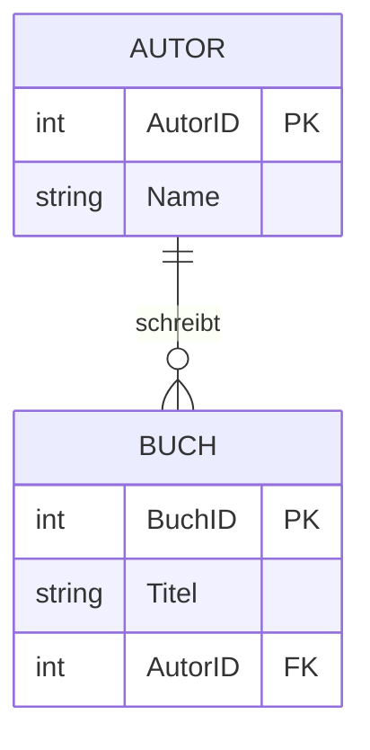
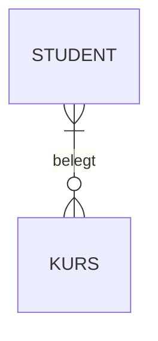
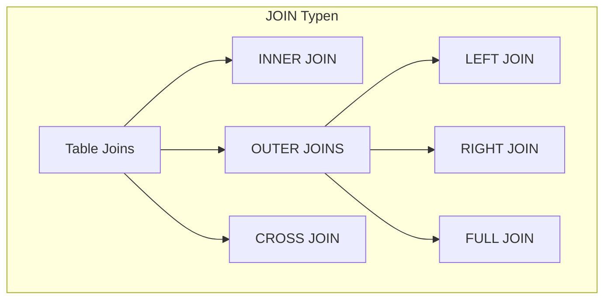
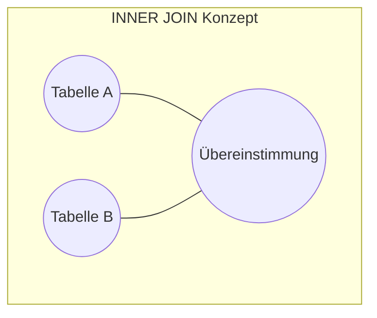
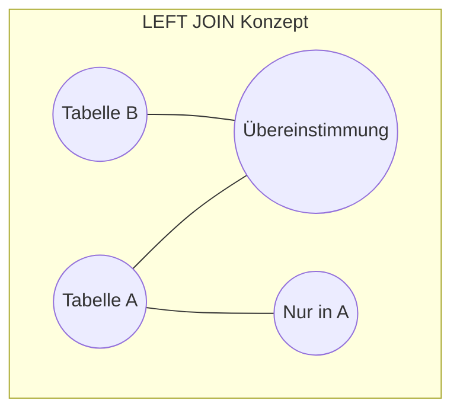
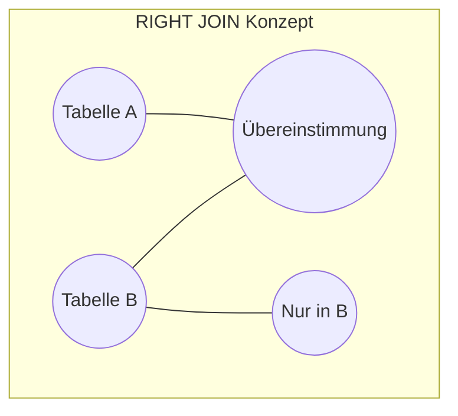
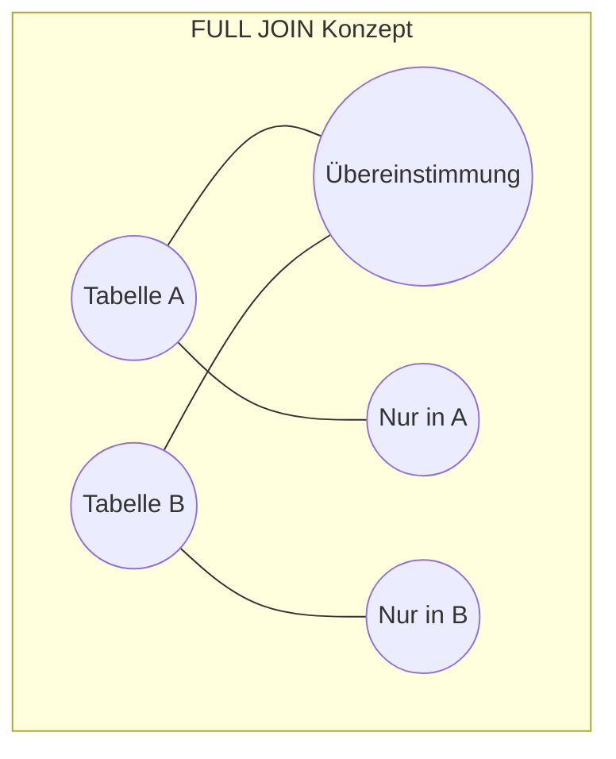
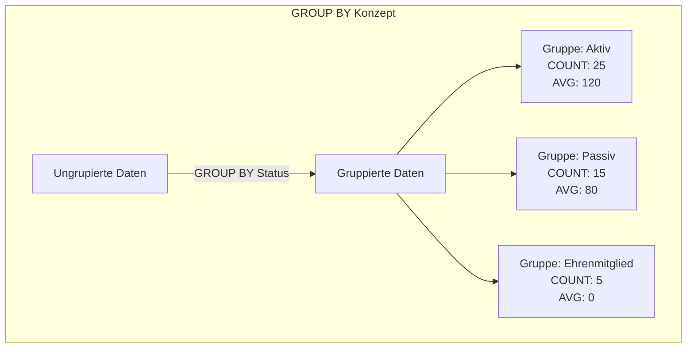

# Fortgeschrittenes SQL

### Data Definition Language, Table Joins, Aggregation und Gruppierung

---

# Agenda

1. **Data Definition Language (DDL)**
   - CREATE, ALTER und DROP
   - Constraints für Datenintegrität
   - Umsetzung von ER-Diagrammen

2. **Table Joins**
   - INNER, LEFT, RIGHT und FULL JOIN
   - Kombination mehrerer Tabellen

3. **Aggregatfunktionen und Gruppierung**
   - GROUP BY und Aggregatfunktionen
   - Filterung mit HAVING

---

# Data Definition Language (DDL)

## Warum brauchen wir DDL?

- Überführung von konzeptionellen Modellen (ER) in physische Datenbankstrukturen
- Definition von Tabellen, Constraints und Beziehungen
- Anpassung und Erweiterung bestehender Datenbankstrukturen
- Sicherstellung der Datenintegrität

---

# Grundlegende DDL-Befehle

```sql
-- Tabelle erstellen
CREATE TABLE Person (
    PersID      SERIAL PRIMARY KEY,
    Name        VARCHAR(50) NOT NULL,
    Vorname     VARCHAR(50) NOT NULL,
    Geburtsdatum DATE,
    Email       VARCHAR(100) UNIQUE
);

-- Tabelle ändern
ALTER TABLE Person ADD COLUMN Telefon VARCHAR(20);

-- Tabelle löschen
DROP TABLE Person;
```

---

# Wichtige Datentypen in PostgreSQL

| Datentyp | Beschreibung | Beispiel |
|----------|--------------|----------|
| INTEGER | Ganzzahl | 42 |
| SERIAL | Auto-inkrementierender Integer | 1, 2, 3, ... |
| VARCHAR(n) | Text mit variabler Länge | 'Hallo' |
| TEXT | Text ohne Längenbegrenzung | 'Langer Text...' |
| DATE | Datum | '2023-04-01' |
| BOOLEAN | Wahrheitswert | TRUE, FALSE |
| NUMERIC(p,s) | Dezimalzahl | 123.45 |
| UUID | Universally Unique Identifier | 'a0eebc99-9c0b-4ef8-bb6d-6bb9bd380a11' |

---

# SERIAL - Auto-incrementierende Schlüssel

```sql
-- SERIAL erstellt automatisch eine Sequenz
CREATE TABLE Kunde (
    KundenID SERIAL PRIMARY KEY,
    Name VARCHAR(100) NOT NULL
);

-- Im Hintergrund passiert:
-- 1. Sequenz erstellen
-- 2. KundenID als INTEGER NOT NULL mit DEFAULT nextval('sequenz')
```

- **Vorteil**: Automatische ID-Generierung ohne manuelle Verwaltung
- Bei INSERT Statements muss die ID-Spalte nicht angegeben werden

```sql
INSERT INTO Kunde (Name) VALUES ('Muster GmbH');
-- KundenID wird automatisch als 1, 2, 3, ... vergeben
```

---

# Constraints für Datenintegrität

```sql
CREATE TABLE Student (
    StudentID   SERIAL PRIMARY KEY,
    Name        VARCHAR(50) NOT NULL,
    Email       VARCHAR(100) UNIQUE,
    Alter       INTEGER CHECK (Alter >= 16),
    Status      CHAR(1) DEFAULT 'A',
    FakultaetID INTEGER REFERENCES Fakultaet(FakultaetID)
);
```

- **PRIMARY KEY**: Eindeutige Identifikation (NOT NULL + UNIQUE)
- **FOREIGN KEY**: Referentielle Integrität zu anderen Tabellen
- **NOT NULL**: Wert muss angegeben werden
- **UNIQUE**: Wert muss eindeutig sein
- **CHECK**: Benutzerdefinierte Bedingung
- **DEFAULT**: Standardwert, wenn nichts angegeben

---

# Umsetzung von ER-Diagrammen



```sql
CREATE TABLE Autor (
    AutorID     SERIAL PRIMARY KEY,
    Name        VARCHAR(100) NOT NULL
);

CREATE TABLE Buch (
    BuchID      SERIAL PRIMARY KEY,
    Titel       VARCHAR(200) NOT NULL,
    AutorID     INTEGER REFERENCES Autor(AutorID)
);
```

---

# Beziehungstypen in SQL implementieren

| Beziehungstyp | Implementierung |
|---------------|----------------|
| 1:1 | Foreign Key mit UNIQUE-Constraint |
| 1:n | Foreign Key in der "n"-Tabelle |
| n:m | Zwischentabelle mit zwei Foreign Keys |

---

# N:M-Beziehung implementieren



```sql
CREATE TABLE Student (
    StudentID   SERIAL PRIMARY KEY,
    Name        VARCHAR(100) NOT NULL
);

CREATE TABLE Kurs (
    KursID      SERIAL PRIMARY KEY,
    Titel       VARCHAR(100) NOT NULL
);

CREATE TABLE Student_Kurs (
    StudentID   INTEGER REFERENCES Student(StudentID),
    KursID      INTEGER REFERENCES Kurs(KursID),
    PRIMARY KEY (StudentID, KursID)
);
```

---

# Table Joins - Motivation

- Daten sind in normalisierten Datenbanken auf mehrere Tabellen verteilt
- Für Auswertungen müssen Daten zusammengeführt werden
- Join-Operationen verbinden Zeilen aus verschiedenen Tabellen basierend auf Beziehungen

```sql
-- Ohne Join: Separate Abfragen und manuelles Zusammenführen
SELECT * FROM Student WHERE StudentID = 1;
SELECT * FROM Kurs WHERE KursID IN (SELECT KursID FROM Student_Kurs WHERE StudentID = 1);

-- Mit Join: Eine Abfrage liefert die verbundenen Daten
SELECT s.Name, k.Titel 
FROM Student s
JOIN Student_Kurs sk ON s.StudentID = sk.StudentID
JOIN Kurs k ON sk.KursID = k.KursID
WHERE s.StudentID = 1;
```

---

# JOIN-Typen Überblick



---

# INNER JOIN

Gibt nur die Zeilen zurück, bei denen es in **beiden** Tabellen übereinstimmende Werte gibt.



```sql
SELECT s.Name, k.Titel
FROM Student s
INNER JOIN Student_Kurs sk ON s.StudentID = sk.StudentID
INNER JOIN Kurs k ON sk.KursID = k.KursID;
```

- Studenten ohne Kurse und Kurse ohne Studenten werden **nicht** angezeigt
- Am häufigsten verwendeter Join-Typ

---

# LEFT JOIN

Gibt alle Zeilen aus der linken Tabelle und die übereinstimmenden Zeilen aus der rechten Tabelle zurück.



```sql
SELECT s.Name, k.Titel
FROM Student s
LEFT JOIN Student_Kurs sk ON s.StudentID = sk.StudentID
LEFT JOIN Kurs k ON sk.KursID = k.KursID;
```

- Alle Studenten werden angezeigt, auch solche ohne Kurse
- Bei Studenten ohne Kurse sind die Kurs-Spalten NULL

---

# RIGHT JOIN

Gibt alle Zeilen aus der rechten Tabelle und die übereinstimmenden Zeilen aus der linken Tabelle zurück.



```sql
SELECT s.Name, k.Titel
FROM Student s
RIGHT JOIN Student_Kurs sk ON s.StudentID = sk.StudentID
RIGHT JOIN Kurs k ON sk.KursID = k.KursID;
```

- Alle Kurse werden angezeigt, auch solche ohne Studenten
- Bei Kursen ohne Studenten sind die Studenten-Spalten NULL
- RIGHT JOIN wird seltener verwendet (oft durch LEFT JOIN ersetzbar)

---

# FULL JOIN

Gibt alle Zeilen zurück, unabhängig davon, ob es eine Übereinstimmung gibt.



```sql
SELECT s.Name, k.Titel
FROM Student s
FULL JOIN Student_Kurs sk ON s.StudentID = sk.StudentID
FULL JOIN Kurs k ON sk.KursID = k.KursID;
```

- Alle Studenten und alle Kurse werden angezeigt
- Fehlende Werte werden mit NULL gefüllt

---

# Selbst-Join

Verbindung einer Tabelle mit sich selbst, nützlich für hierarchische Daten.

```sql
CREATE TABLE Mitarbeiter (
    MitarbeiterID   SERIAL PRIMARY KEY,
    Name            VARCHAR(100) NOT NULL,
    VorgesetzterID  INTEGER REFERENCES Mitarbeiter(MitarbeiterID)
);

-- Alle Mitarbeiter mit ihren Vorgesetzten anzeigen
SELECT m.Name AS Mitarbeiter, v.Name AS Vorgesetzter
FROM Mitarbeiter m
LEFT JOIN Mitarbeiter v ON m.VorgesetzterID = v.MitarbeiterID;
```

---

# Komplexe Joins mit mehreren Tabellen

```sql
-- Verein-Datenbank: Anlässe mit Organisator und Teilnehmern
SELECT 
    a.Bezeichner AS Anlass,
    a.Datum,
    o.Name AS OrganisatorName,
    p.Name AS TeilnehmerName
FROM 
    Anlass a
JOIN 
    Person o ON a.OrgID = o.PersID -- Organisator
JOIN 
    Teilnehmer t ON a.AnlaID = t.AnlaID
JOIN 
    Person p ON t.PersID = p.PersID -- Teilnehmer
ORDER BY 
    a.Datum DESC, p.Name;
```

---

# Aggregatfunktionen - Überblick

Aggregatfunktionen führen Berechnungen auf einer Menge von Werten durch und geben einen einzelnen Wert zurück.

| Funktion | Beschreibung | Beispiel |
|----------|--------------|----------|
| COUNT() | Zählt die Anzahl der Zeilen oder Nicht-NULL-Werte | `COUNT(*)`, `COUNT(spalte)` |
| SUM() | Berechnet die Summe der Werte | `SUM(Betrag)` |
| AVG() | Berechnet den Durchschnitt der Werte | `AVG(Alter)` |
| MIN() | Findet den kleinsten Wert | `MIN(Geburtsdatum)` |
| MAX() | Findet den grössten Wert | `MAX(Punktzahl)` |

---

# Einfache Aggregationen

```sql
-- Wie viele Personen sind im System?
SELECT COUNT(*) AS Personenanzahl FROM Person;

-- Höchster, niedrigster und durchschnittlicher Spendenbetrag
SELECT 
    MAX(Betrag) AS Höchster_Betrag,
    MIN(Betrag) AS Niedrigster_Betrag,
    AVG(Betrag) AS Durchschnittlicher_Betrag,
    SUM(Betrag) AS Gesamtbetrag
FROM Spende;
```

---

# GROUP BY - Konzept und Anwendung

`GROUP BY` gruppiert Zeilen, die dieselben Werte in bestimmten Spalten haben, und wendet Aggregatfunktionen auf jede Gruppe an.



---

# GROUP BY Beispiele

```sql
-- Anzahl der Personen pro Status
SELECT 
    s.Bezeichner AS StatusBezeichnung,
    COUNT(p.PersID) AS Personenanzahl
FROM 
    Person p
JOIN 
    Status s ON p.StatID = s.StatID
GROUP BY 
    s.Bezeichner
ORDER BY 
    Personenanzahl DESC;

-- Anzahl der Anlässe pro Jahr
SELECT 
    EXTRACT(YEAR FROM Datum) AS Jahr,
    COUNT(*) AS AnzahlAnlaesse
FROM 
    Anlass
GROUP BY 
    EXTRACT(YEAR FROM Datum)
ORDER BY 
    Jahr;
```

---

# Mehrfachgruppierung

```sql
-- Personen pro Status und Ort
SELECT 
    s.Bezeichner AS Status,
    p.Ort,
    COUNT(*) AS Anzahl
FROM 
    Person p
JOIN 
    Status s ON p.StatID = s.StatID
GROUP BY 
    s.Bezeichner, p.Ort
ORDER BY 
    s.Bezeichner, Anzahl DESC;
```

- Gruppierung erfolgt nach allen in GROUP BY angegebenen Spalten
- Jede einzigartige Kombination von Status und Ort bildet eine Gruppe
- Ausnahme: Spalten mit Funktionsabhängigkeiten (z.B. Primärschlüssel)

---

# HAVING - Filterung von Gruppen

```mermaid
graph TD
    subgraph "Filterung mit WHERE vs. HAVING"
        D[Alle Daten] --> |WHERE Status = 'Aktiv'| E[Gefilterte Daten]
        E --> |GROUP BY Ort| F[Gruppierte Daten]
        F --> |HAVING COUNT(*) > 5| G[Gefilterte Gruppen]
        G --> G1[Gruppe: Zürich<br>COUNT: 8]
        G --> G2[Gruppe: Bern<br>COUNT: 7]
    end
```

- **WHERE**: Filtert Zeilen VOR der Gruppierung
- **HAVING**: Filtert Gruppen NACH der Gruppierung
- In HAVING können Aggregatfunktionen verwendet werden, in WHERE nicht

---

# HAVING Beispiele

```sql
-- Orte mit mehr als 3 Personen
SELECT 
    Ort,
    COUNT(*) AS Personenanzahl
FROM 
    Person
GROUP BY 
    Ort
HAVING 
    COUNT(*) > 3
ORDER BY 
    Personenanzahl DESC;

-- Sponsoren mit mehr als 2 Spenden
SELECT 
    s.Name AS Sponsor,
    COUNT(sp.SpenID) AS AnzahlSpenden,
    SUM(sp.Betrag) AS Gesamtbetrag
FROM 
    Sponsor s
JOIN 
    Spende sp ON s.SponID = sp.SponID
GROUP BY 
    s.Name
HAVING 
    COUNT(sp.SpenID) > 2
ORDER BY 
    AnzahlSpenden DESC;
```

---

# Komplexe Abfragen mit Joins und Aggregation

```sql
-- Anlässe mit Teilnehmerzahl und Organisator
SELECT 
    a.Bezeichner AS Anlass,
    a.Datum,
    p.Name AS Organisator,
    COUNT(t.PersID) AS Teilnehmeranzahl
FROM 
    Anlass a
JOIN 
    Person p ON a.OrgID = p.PersID
LEFT JOIN 
    Teilnehmer t ON a.AnlaID = t.AnlaID
GROUP BY 
    a.AnlaID, a.Bezeichner, a.Datum, p.Name
ORDER BY 
    a.Datum DESC;
```

---

# Wichtige SQL-Grundsätze

1. Die Reihenfolge der Klauseln ist festgelegt:
   ```
   SELECT → FROM → JOIN → WHERE → GROUP BY → HAVING → ORDER BY
   ```

2. Die logische Verarbeitungsreihenfolge ist:
   ```
   FROM → JOIN → WHERE → GROUP BY → Aggregationen → 
   HAVING → SELECT → ORDER BY
   ```

3. Bei GROUP BY müssen alle nicht-aggregierten Spalten in der SELECT-Liste auch in der GROUP BY-Klausel stehen

4. Für komplexe Abfragen können Common Table Expressions (WITH) die Lesbarkeit verbessern

---

# Übungsaufgaben

- **Arbeitsblatt 1**: Data Definition Language
  * Erstellung von Tabellen mit Constraints
  * Implementierung eines ER-Diagramms

- **Arbeitsblatt 2**: Join-Operationen
  * Verschiedene Join-Typen anwenden
  * Komplexe Abfragen über mehrere Tabellen

- **Arbeitsblatt 3**: Aggregation und Gruppierung
  * Aggregatfunktionen und GROUP BY
  * Filterung mit HAVING-Klauseln
  * Kombination von Joins mit Aggregation

---

# Zusammenfassung

- **Data Definition Language (DDL)**
  * CREATE TABLE, ALTER TABLE, DROP TABLE
  * Constraints: PRIMARY KEY, FOREIGN KEY, UNIQUE, CHECK, ...
  * Implementierung von Beziehungen aus ER-Diagrammen

- **Table Joins**
  * INNER JOIN: Nur übereinstimmende Datensätze
  * LEFT/RIGHT/FULL JOIN: Verschiedene Arten von äusseren Joins
  * Selbst-Joins und Mehrfach-Joins

- **Aggregation und Gruppierung**
  * Aggregatfunktionen: COUNT, SUM, AVG, MIN, MAX
  * GROUP BY zur Gruppierung von Daten
  * HAVING zur Filterung von Gruppen
