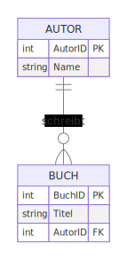

<!-- _class: lead -->

<div class="header-box">
  <p class="fachbereich">Informatik</p>
  <h1>Data Definition Language (DDL)</h1>
  <p class="date-author">März 2025 | Autor: Simon Erhardt</p>
</div>

---

# Agenda

1. **Warum brauchen wir DDL?**
2. **Grundlegende DDL-Befehle**
   - CREATE, ALTER und DROP
3. **Datentypen**
4. **Auto-incrementierende Schlüssel**
5. **Constraints**
   - PRIMARY KEY, FOREIGN KEY, UNIQUE, CHECK, DEFAULT
6. **Umsetzung von ER-Diagrammen**
   - Implementierung von Beziehungstypen

---

# Warum brauchen wir DDL?

- Überführung von konzeptionellen Modellen (ER) in physische Datenbankstrukturen
- Definition von Tabellen, Constraints und Beziehungen
- Anpassung und Erweiterung bestehender Datenbankstrukturen
- Sicherstellung der Datenintegrität

---

# Grundlegende DDL-Befehle

```sql
-- Tabelle erstellen
CREATE TABLE Person (
    PersID      SERIAL PRIMARY KEY,
    Name        VARCHAR(50) NOT NULL,
    Vorname     VARCHAR(50) NOT NULL,
    Geburtsdatum DATE,
    Email       VARCHAR(100) UNIQUE
);

-- Tabelle ändern
ALTER TABLE Person ADD COLUMN Telefon VARCHAR(20);

-- Tabelle löschen
DROP TABLE Person;
```

---

# Wichtige Datentypen in PostgreSQL

| Datentyp | Beschreibung | Beispiel |
|----------|--------------|----------|
| INTEGER | Ganzzahl | 42 |
| SERIAL | Auto-inkrementierender Integer | 1, 2, 3, ... |
| VARCHAR(n) | Text mit variabler Länge | 'Hallo' |
| TEXT | Text ohne Längenbegrenzung | 'Langer Text...' |
| DATE | Datum | '2023-04-01' |
| BOOLEAN | Wahrheitswert | TRUE, FALSE |
| NUMERIC(p,s) | Dezimalzahl | 123.45 |
| UUID | Universally Unique Identifier | 'a0eebc99-9c0b-4ef8-bb6d-6bb9bd380a11' |

---

# SERIAL - Auto-incrementierende Schlüssel

```sql
-- SERIAL erstellt automatisch eine Sequenz
CREATE TABLE Kunde (
    KundenID SERIAL PRIMARY KEY,
    Name VARCHAR(100) NOT NULL
);

-- Im Hintergrund passiert:
-- 1. Sequenz erstellen
-- 2. KundenID als INTEGER NOT NULL mit DEFAULT nextval('sequenz')
```

- **Vorteil**: Automatische ID-Generierung ohne manuelle Verwaltung
- Bei INSERT Statements muss die ID-Spalte nicht angegeben werden

```sql
INSERT INTO Kunde (Name) VALUES ('Muster GmbH');
-- KundenID wird automatisch als 1, 2, 3, ... vergeben
```

---

# Constraints für Datenintegrität

```sql
CREATE TABLE Student (
    StudentID   SERIAL PRIMARY KEY,
    Name        VARCHAR(50) NOT NULL,
    Email       VARCHAR(100) UNIQUE,
    Alter       INTEGER CHECK (Alter >= 16),
    Status      CHAR(1) DEFAULT 'A',
    FakultaetID INTEGER REFERENCES Fakultaet(FakultaetID)
);
```

- **PRIMARY KEY**: Eindeutige Identifikation (NOT NULL + UNIQUE)
- **FOREIGN KEY**: Referentielle Integrität zu anderen Tabellen
- **NOT NULL**: Wert muss angegeben werden
- **UNIQUE**: Wert muss eindeutig sein
- **CHECK**: Benutzerdefinierte Bedingung
- **DEFAULT**: Standardwert, wenn nichts angegeben

---

# Umsetzung von ER-Diagrammen

<table>
<tr>
<td class="half">
<div>



</div>
</td>
<td class="half">

```sql
CREATE TABLE Autor (
    AutorID     SERIAL PRIMARY KEY,
    Name        VARCHAR(100) NOT NULL
);

CREATE TABLE Buch (
    BuchID      SERIAL PRIMARY KEY,
    Titel       VARCHAR(200) NOT NULL,
    AutorID     INTEGER REFERENCES Autor(AutorID)
);
```

</td>
</tr>
</table>

---

# Beziehungstypen in SQL implementieren

| Beziehungstyp | Implementierung |
|---------------|----------------|
| 1:1 | Foreign Key mit UNIQUE-Constraint |
| 1:n | Foreign Key in der "n"-Tabelle |
| n:m | Zwischentabelle mit zwei Foreign Keys |

---

# N:M-Beziehung implementieren

<table>
<tr>
<td class="half">
<div>


</div>
</td>
<td class="half">

```sql
CREATE TABLE Student (
    StudentID   SERIAL PRIMARY KEY,
    Name        VARCHAR(100) NOT NULL
);

CREATE TABLE Kurs (
    KursID      SERIAL PRIMARY KEY,
    Titel       VARCHAR(100) NOT NULL
);

CREATE TABLE Student_Kurs (
    StudentID   INTEGER REFERENCES Student(StudentID),
    KursID      INTEGER REFERENCES Kurs(KursID),
    PRIMARY KEY (StudentID, KursID)
);
```

</td>
</tr>
</table>

---

# Zusammenfassung: Data Definition Language

- Mit DDL werden Datenbankstrukturen definiert, geändert und gelöscht
- Wichtige DDL-Befehle: CREATE, ALTER, DROP
- Constraints sorgen für Datenintegrität:
  * PRIMARY KEY, FOREIGN KEY
  * NOT NULL, UNIQUE, CHECK, DEFAULT
- SERIAL erzeugt auto-incrementierende Schlüssel
- Beziehungstypen werden durch Foreign Keys implementiert
  * 1:1 → Foreign Key mit UNIQUE
  * 1:n → Foreign Key in "n"-Tabelle
  * n:m → Zwischentabelle mit zwei Foreign Keys
