<!-- _class: lead -->

<div class="header-box">
  <p class="fachbereich">Informatik</p>
  <h1>Table Joins</h1>
  <p class="date-author">März 2025 | Autor: Simon Erhardt</p>
</div>

---

# Agenda

1. **Motivation für Joins**
2. **Typen von Joins**
   - INNER JOIN
   - LEFT JOIN / RIGHT JOIN 
   - FULL JOIN
3. **Visuelle Darstellung von Joins**
4. **Selbst-Joins**
5. **Mehrfach-Joins über mehrere Tabellen**
6. **Typische Anwendungsfälle**

---

# Motivation für Joins

- Daten sind in normalisierten Datenbanken auf mehrere Tabellen verteilt
- Für Auswertungen müssen Daten zusammengeführt werden
- Join-Operationen verbinden Zeilen aus verschiedenen Tabellen basierend auf Beziehungen

```sql
-- Ohne Join: Separate Abfragen und manuelles Zusammenführen
SELECT * FROM Student WHERE StudentID = 1;
SELECT * FROM Kurs WHERE KursID IN (SELECT KursID FROM Student_Kurs WHERE StudentID = 1);

-- Mit Join: Eine Abfrage liefert die verbundenen Daten
SELECT s.Name, k.Titel 
FROM Student s
JOIN Student_Kurs sk ON s.StudentID = sk.StudentID
JOIN Kurs k ON sk.KursID = k.KursID
WHERE s.StudentID = 1;
```

---

# JOIN-Typen Überblick


---

# INNER JOIN

Gibt nur die Zeilen zurück, bei denen es in **beiden** Tabellen übereinstimmende Werte gibt.


<table>
<tr>
<td class="half">
<div>


</div>
</td>
<td class="half">

```sql
SELECT s.Name, k.Titel
FROM Student s
INNER JOIN Student_Kurs sk ON s.StudentID = sk.StudentID
INNER JOIN Kurs k ON sk.KursID = k.KursID;
```

- Studenten ohne Kurse und Kurse ohne Studenten werden **nicht** angezeigt
- Am häufigsten verwendeter Join-Typ

</td>
</tr>
</table>

---

# LEFT JOIN

Gibt alle Zeilen aus der linken Tabelle und die übereinstimmenden Zeilen aus der rechten Tabelle zurück.

<table>
<tr>
<td class="half">
<div>


</div>
</td>
<td class="half">

```sql
SELECT s.Name, k.Titel
FROM Student s
LEFT JOIN Student_Kurs sk ON s.StudentID = sk.StudentID
LEFT JOIN Kurs k ON sk.KursID = k.KursID;
```

- Alle Studenten werden angezeigt, auch solche ohne Kurse
- Bei Studenten ohne Kurse sind die Kurs-Spalten NULL

</td>
</tr>
</table>

---

# RIGHT JOIN

Gibt alle Zeilen aus der rechten Tabelle und die übereinstimmenden Zeilen aus der linken Tabelle zurück.

<table>
<tr>
<td class="half">
<div>



</div>
</td>
<td class="half">

```sql
SELECT s.Name, k.Titel
FROM Student s
RIGHT JOIN Student_Kurs sk ON s.StudentID = sk.StudentID
RIGHT JOIN Kurs k ON sk.KursID = k.KursID;
```

- Alle Kurse werden angezeigt, auch solche ohne Studenten
- Bei Kursen ohne Studenten sind die Studenten-Spalten NULL
- RIGHT JOIN wird seltener verwendet (oft durch LEFT JOIN ersetzbar)

</td>
</tr>
</table>

---

# FULL JOIN

Gibt alle Zeilen zurück, unabhängig davon, ob es eine Übereinstimmung gibt.

<table>
<tr>
<td class="half">
<div>


</div>
</td>
<td class="half">

```sql
SELECT s.Name, k.Titel
FROM Student s
FULL JOIN Student_Kurs sk ON s.StudentID = sk.StudentID
FULL JOIN Kurs k ON sk.KursID = k.KursID;
```

- Alle Studenten und alle Kurse werden angezeigt
- Fehlende Werte werden mit NULL gefüllt

</td>
</tr>
</table>

---

# Vergleich der verschiedenen JOIN-Typen

- **INNER JOIN**: Nur gemeinsame Datensätze
- **LEFT JOIN**: Alle aus A + passende aus B
- **RIGHT JOIN**: Alle aus B + passende aus A
- **FULL JOIN**: Alle aus A und B

---

# Selbst-Join

Verbindung einer Tabelle mit sich selbst, nützlich für hierarchische Daten.

```sql
CREATE TABLE Mitarbeiter (
    MitarbeiterID   SERIAL PRIMARY KEY,
    Name            VARCHAR(100) NOT NULL,
    VorgesetzterID  INTEGER REFERENCES Mitarbeiter(MitarbeiterID)
);

-- Alle Mitarbeiter mit ihren Vorgesetzten anzeigen
SELECT m.Name AS Mitarbeiter, v.Name AS Vorgesetzter
FROM Mitarbeiter m
LEFT JOIN Mitarbeiter v ON m.VorgesetzterID = v.MitarbeiterID;
```

- Gleiche Tabelle wird zweimal referenziert (mit unterschiedlichen Aliasnamen)
- Wichtig für hierarchische Daten (Vorgesetzte, Mentoren, Kategorien, ...)

---

# Komplexe Joins mit mehreren Tabellen

<table>
<tr>
<td class="half">


```sql
-- Verein-Datenbank: Anlässe mit Organisator und Teilnehmern
SELECT 
    a.Bezeichner AS Anlass,
    a.Datum,
    o.Name AS OrganisatorName,
    p.Name AS TeilnehmerName
FROM 
    Anlass a
JOIN 
    Person o ON a.OrgID = o.PersID -- Organisator
JOIN 
    Teilnehmer t ON a.AnlaID = t.AnlaID
JOIN 
    Person p ON t.PersID = p.PersID -- Teilnehmer
ORDER BY 
    a.Datum DESC, p.Name;
```

</td>
<td class="half">

- Mehrere Tabellen können in einer Abfrage verknüpft werden
- Tabelle kann mehrfach mit unterschiedlichen Aliasnamen verwendet werden
- Reihenfolge und Richtung der Joins ist wichtig für das Ergebnis

</td>
</tr>
</table>

---

# Tipps zur Verwendung von Joins

1. **Tabellenaliase** verwenden, besonders bei komplexen Abfragen:
   ```sql
   FROM Person p JOIN Status s ON p.StatID = s.StatID
   ```

2. **JOIN-Bedingungen** sorgfältig formulieren:
   - Auf passende Datentypen achten
   - Bei mehreren Fremdschlüsseln korrekte Spalten verknüpfen

3. **Vorteile von LEFT JOIN** nutzen:
   - Um "optional" verknüpfte Daten zu finden (z.B. Mitglieder ohne Funktionen)
   - Um NULL-Werte zu identifizieren (fehlerhafte oder unvollständige Daten)

4. **JOIN vs. WHERE-Bedingung**:
   - `ON` definiert die Join-Bedingung
   - `WHERE` filtert das Join-Ergebnis

---

# Typische JOIN-Anwendungsfälle

- **Masterdata-Joins**: 
  * Anreicherung mit Stammdaten (z.B. Artikel mit Kategorie)
  * Auflösen von Codes zu beschreibenden Texten

- **Transaktions-Joins**:
  * Verknüpfung von Kopf- und Positionstabellen (z.B. Bestellung und Bestellpositionen)
  * Auswertung über mehrere verknüpfte Transaktionen

- **Hierarchie-Joins**:
  * Verknüpfung von Eltern-Kind-Beziehungen (z.B. Kategorien)
  * Organisationsstrukturen (Mitarbeiter und Vorgesetzte)

- **N:M-Beziehungen**:
  * Verknüpfung über Zwischentabellen (z.B. Studenten und Kurse)

---

# Zusammenfassung: Table Joins

- Joins kombinieren Daten aus verschiedenen Tabellen
- INNER JOIN: Nur übereinstimmende Datensätze
- LEFT/RIGHT JOIN: Alle Datensätze einer Tabelle + übereinstimmende der anderen
- FULL JOIN: Alle Datensätze beider Tabellen
- Selbst-Joins werden für hierarchische Daten verwendet
- Komplexe Abfragen können mehrere Tabellen und mehrere Joins kombinieren
- Aliase und sorgfältig formulierte JOIN-Bedingungen verbessern Lesbarkeit und Korrektheit
