<!-- _class: lead -->

<div class="header-box">
  <p class="fachbereich">Informatik</p>
  <h1>Aggregatfunktionen / Gruppierung</h1>
  <p class="date-author">März 2025 | Autor: Simon Erhardt</p>
</div>

---

# Agenda

1. **Aggregatfunktionen - Überblick und Anwendung**
   - COUNT, SUM, AVG, MIN, MAX
2. **Gruppierung mit GROUP BY**
   - Konzept und Anwendung
   - Mehrfachgruppierung
3. **Filterung von Gruppen mit HAVING**
4. **Komplexe Abfragen mit Joins und Aggregation**
5. **Praxisbeispiele mit der Verein-Datenbank**

---

# Aggregatfunktionen - Überblick

Aggregatfunktionen führen Berechnungen auf einer Menge von Werten durch und geben einen einzelnen Wert zurück.

| Funktion | Beschreibung | Beispiel |
|----------|--------------|----------|
| COUNT() | Zählt die Anzahl der Zeilen oder Nicht-NULL-Werte | `COUNT(*)`, `COUNT(spalte)` |
| SUM() | Berechnet die Summe der Werte | `SUM(Betrag)` |
| AVG() | Berechnet den Durchschnitt der Werte | `AVG(Alter)` |
| MIN() | Findet den kleinsten Wert | `MIN(Geburtsdatum)` |
| MAX() | Findet den grössten Wert | `MAX(Punktzahl)` |

---

# Einfache Aggregationen

```sql
-- Wie viele Personen sind im System?
SELECT COUNT(*) AS Personenanzahl FROM Person;

-- Höchster, niedrigster und durchschnittlicher Spendenbetrag
SELECT 
    MAX(Betrag) AS Höchster_Betrag,
    MIN(Betrag) AS Niedrigster_Betrag,
    AVG(Betrag) AS Durchschnittlicher_Betrag,
    SUM(Betrag) AS Gesamtbetrag
FROM Spende;
```

- Ohne GROUP BY wird das Ergebnis auf eine Zeile reduziert
- Kombinieren verschiedener Aggregatfunktionen ist möglich
- `COUNT(*)` vs. `COUNT(spalte)`: Unterschied in Behandlung von NULL-Werten

---

# NULL-Werte in Aggregatfunktionen

```sql
-- Unterschied zwischen COUNT(*) und COUNT(spalte)
SELECT 
    COUNT(*) AS Anzahl_Personen,
    COUNT(Austritt) AS Personen_mit_Austritt,
    COUNT(*) - COUNT(Austritt) AS Personen_ohne_Austritt
FROM Person;
```

- COUNT(*) zählt alle Zeilen
- COUNT(spalte) ignoriert NULL-Werte
- SUM(), AVG(), MIN(), MAX() ignorieren ebenfalls NULL-Werte
- NULL ist nicht gleich 0 oder ein leerer String!

---

# GROUP BY - Konzept und Anwendung

`GROUP BY` gruppiert Zeilen, die dieselben Werte in bestimmten Spalten haben, und wendet Aggregatfunktionen auf jede Gruppe an.

<table>
<tr>
<td class="half">



</td>
<td class="half">

- Zeilen mit gleichen Werten in den GROUP BY-Spalten werden zusammengefasst
- Aggregatfunktionen werden auf jede Gruppe separat angewendet
- Jede Gruppe erscheint als eine Zeile im Ergebnis

</td>
</tr>
</table>

---

# GROUP BY Beispiele

<table>
<tr>
<td class="half">

```sql
-- Anzahl der Personen pro Status
SELECT 
    s.Bezeichner AS StatusBezeichnung,
    COUNT(p.PersID) AS Personenanzahl
FROM 
    Person p
JOIN 
    Status s ON p.StatID = s.StatID
GROUP BY 
    s.Bezeichner
ORDER BY 
    Personenanzahl DESC;
```

</td>
<td class="half">

```sql
-- Anzahl der Anlässe pro Jahr
SELECT 
    EXTRACT(YEAR FROM Datum) AS Jahr,
    COUNT(*) AS AnzahlAnlaesse
FROM 
    Anlass
GROUP BY 
    EXTRACT(YEAR FROM Datum)
ORDER BY 
    Jahr;
```

</td>
</tr>
</table>

---

# Mehrfachgruppierung

<table>
<tr>
<td class="half">

```sql
-- Personen pro Status und Ort
SELECT 
    s.Bezeichner AS Status,
    p.Ort,
    COUNT(*) AS Anzahl
FROM 
    Person p
JOIN 
    Status s ON p.StatID = s.StatID
GROUP BY 
    s.Bezeichner, p.Ort
ORDER BY 
    s.Bezeichner, Anzahl DESC;
```

</td>
<td class="half">

- Gruppierung erfolgt nach allen in GROUP BY angegebenen Spalten
- Jede einzigartige Kombination von Status und Ort bildet eine Gruppe
- Alle nicht-aggregierten Spalten im SELECT müssen im GROUP BY erscheinen
  (Ausnahme: Spalten mit Funktionsabhängigkeiten, z.B. Primärschlüssel)

</td>
</tr>
</table>

---

# HAVING - Filterung von Gruppen

<table>
<tr>
<td class="half">



</td>
<td class="half">

- **WHERE**: Filtert Zeilen VOR der Gruppierung
- **HAVING**: Filtert Gruppen NACH der Gruppierung
- In HAVING können Aggregatfunktionen verwendet werden, in WHERE nicht

</td>
</tr>
</table>

---

# HAVING Beispiele

<table>
<tr>
<td class="half">

```sql
-- Orte mit mehr als 3 Personen
SELECT 
    Ort,
    COUNT(*) AS Personenanzahl
FROM 
    Person
GROUP BY 
    Ort
HAVING 
    COUNT(*) > 3
ORDER BY 
    Personenanzahl DESC;
```

</td>
<td class="half">

```sql
-- Sponsoren mit mehr als 2 Spenden
SELECT 
    s.Name AS Sponsor,
    COUNT(sp.SpenID) AS AnzahlSpenden,
    SUM(sp.Betrag) AS Gesamtbetrag
FROM 
    Sponsor s
JOIN 
    Spende sp ON s.SponID = sp.SponID
GROUP BY 
    s.Name
HAVING 
    COUNT(sp.SpenID) > 2
ORDER BY 
    AnzahlSpenden DESC;
```

</td>
</tr>
</table>

---

# Komplexe Abfragen mit Joins und Aggregation

<table>
<tr>
<td class="half">

```sql
-- Anlässe mit Teilnehmerzahl und Organisator
SELECT 
    a.Bezeichner AS Anlass,
    a.Datum,
    p.Name AS Organisator,
    COUNT(t.PersID) AS Teilnehmeranzahl
FROM 
    Anlass a
JOIN 
    Person p ON a.OrgID = p.PersID
LEFT JOIN 
    Teilnehmer t ON a.AnlaID = t.AnlaID
GROUP BY 
    a.AnlaID, a.Bezeichner, a.Datum, p.Name
ORDER BY 
    a.Datum DESC;
```

</td>
<td class="half">

- Kombination von Joins und Aggregationen in einer Abfrage
- GROUP BY muss alle nicht-aggregierten Spalten aus dem SELECT enthalten
- LEFT JOIN damit Anlässe ohne Teilnehmer auch erscheinen

</td>
</tr>
</table>

---

# Logische Verarbeitungsreihenfolge in SQL

<table>
<tr>
<td class="half">

1. FROM: Tabellen verbinden (inkl. JOINs)
2. WHERE: Zeilen filtern
3. GROUP BY: Zeilen gruppieren
4. HAVING: Gruppen filtern
5. SELECT: Spalten auswählen
6. ORDER BY: Sortieren

</td>
<td class="half">

```sql
SELECT    spalten, aggregatfunktionen
FROM      tabellen
JOIN      andere_tabellen ON bedingungen
WHERE     filter_vor_gruppierung
GROUP BY  gruppierungsspalten
HAVING    filter_nach_gruppierung
ORDER BY  sortierspalten;
```

</td>
</tr>
</table>


---

# Praxisbeispiele

### Sponsorenanalyse
```sql
-- Detaillierte Sponsorenanalyse
SELECT 
    s.Name AS Sponsor,
    COUNT(sp.SpenID) AS Anzahl_Spenden,
    SUM(sp.Betrag) AS Gesamtsumme,
    AVG(sp.Betrag) AS Durchschnitt,
    MIN(sp.Datum) AS Erste_Spende,
    MAX(sp.Datum) AS Letzte_Spende
FROM 
    Sponsor s
LEFT JOIN 
    Spende sp ON s.SponID = sp.SponID
GROUP BY 
    s.SponID, s.Name
ORDER BY 
    Gesamtsumme DESC;
```

---

# Prozentwerte und statistische Berechnungen

<table>
<tr>
<td class="half">

```sql
-- Prozentualer Anteil jeder Status-Kategorie
SELECT 
    s.Bezeichner,
    COUNT(*) AS Anzahl,
    ROUND(COUNT(*) * 100.0 / (SELECT COUNT(*) FROM Person), 1) AS Prozent
FROM 
    Person p
JOIN 
    Status s ON p.StatID = s.StatID
GROUP BY 
    s.Bezeichner
ORDER BY 
    Anzahl DESC;
```

</td>
<td class="half">

- Unterabfragen können für Berechnungen verwendet werden
- Typumwandlung (`100.0` statt `100`) für Dezimalzahlen
- ROUND() zur kontrollierten Rundung

</td>
</tr>
</table>

---

# Wichtige SQL-Grundsätze

1. Bei GROUP BY müssen alle nicht-aggregierten Spalten in der SELECT-Liste auch in der GROUP BY-Klausel stehen
2. Aggregatfunktionen können nicht verschachtelt werden (aber Window-Funktionen können helfen)
3. Die logische Verarbeitungsreihenfolge beachten (FROM → WHERE → GROUP BY → HAVING → SELECT → ORDER BY)
4. Für komplexe Abfragen können Common Table Expressions (WITH) die Lesbarkeit verbessern

---

# Zusammenfassung: Aggregation und Gruppierung

- Aggregatfunktionen (COUNT, SUM, AVG, MIN, MAX) verdichten mehrere Zeilen zu einem Ergebniswert
- GROUP BY gruppiert Zeilen mit gleichen Werten und wendet Aggregatfunktionen auf jede Gruppe an
- HAVING filtert Gruppen nach der Aggregation (im Gegensatz zu WHERE, das vor der Gruppierung filtert)
- Die Kombination von Joins, Gruppierungen und Aggregation ermöglicht komplexe Datenanalysen
- Korrekte Reihenfolge und Syntax sind entscheidend für aussagekräftige Ergebnisse
