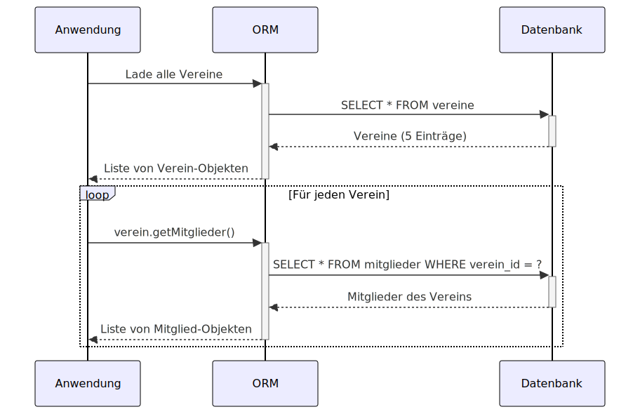

<!-- _class: lead -->

  
Informatik

  <h1>Object-Relational Mapping (ORM)</h1>
  
Mai 2025 | Autor: Simon Erhardt

---
# Inhaltsverzeichnis

1. Das "Object-Relational Impedance Mismatch"
2. Grundkonzept von ORM
3. Architektur und Kernkomponenten
4. Vor- und Nachteile 
5. ORM-Lösungen im Überblick
6. Schemaversionierung
7. Grenzen und Alternativen
8. Best Practices
9. Zusammenfassung

---
# Das Object-Relational Impedance Mismatch

- Fundamentale Diskrepanz zwischen zwei Paradigmen:
  - Objektorientierte Programmierung: Klassen, Vererbung, Polymorphismus
  - Relationale Datenbanken: Tabellen, Zeilen, Fremdschlüssel

- Zentrale Herausforderungen:
  - Strukturelle Unterschiede (hierarchisch vs. flach)
  - Unterschiedliche Identitätskonzepte
  - Verschiedene Beziehungsdarstellungen (Referenzen vs. Fremdschlüssel)
  - Inkompatible Typsysteme
  - Verhaltensmodellierung (Methoden vs. nur Daten)

---
# Das Object-Relational Impedance Mismatch

<table>
<tr>
<td class="half">

</td>
<td class="half">

Diese Lücke zu überbrücken ist die zentrale Herausforderung!

</td>
</tr>
</table>

---
# Was ist ORM?

- **O**bject-**R**elational **M**apping: Überbrückt die Lücke zwischen OOP und RDBMS
- Abstraktionsschicht zwischen Anwendungscode und relationaler Datenbank
- Ermöglicht Arbeit mit Daten in Form von Objekten statt SQL-Abfragen
- Automatisiert:
  - Umwandlung von Objekten in Datenbankeinträge (und umgekehrt)
  - Beziehungsmanagement
  - Änderungsverfolgung und -persistierung
  - Query-Generierung

---
# Was ist ORM?

<table>
<tr>
<td class="half">

</td>
<td class="half">

- ORM überbrückt den "Impedance Mismatch" zwischen Objekten und Tabellen
- Zwei grundlegende Architekturmuster:
  - **Active Record**: Entitätsklassen enthalten auch Datenbankoperationen
  - **Data Mapper**: Trennung von Entitätsklassen und Datenbankoperationen

</td>
</tr>
</table>

---
# Architektur und Kernkomponenten

- **Entity-Mapping**: Abbildung von Klassen auf Tabellen
  - Definiert durch Konfiguration (Annotationen, XML, etc.)
  - Legt Spalten, Typen und Constraints fest

- **Beziehungs-Mapping**: Abbildung von Objektbeziehungen
  - One-to-One, One-to-Many, Many-to-Many
  - Lazy Loading vs. Eager Loading
  - Kaskadierungsregeln

- **Abfragesprachen**: Objektorientierte Abfragen statt SQL
  - JPQL, HQL, LINQ, Criteria API, etc.

---
# Architektur: Lebenszyklus von Entitäten

<table>
<tr>
<td class="half">

</td>
<td class="half">

- **Transient**: Neu erstelltes Objekt, nicht mit Datenbank verbunden
- **Persistent**: Vom ORM verwaltetes, mit Datenbank synchronisiertes Objekt
- **Detached**: Nicht mehr vom ORM verwaltetes Objekt
- **Removed**: Zum Löschen markiertes Objekt

</td>
</tr>
</table>

---
# Vorteile von ORMs

- **Produktivitätssteigerung**
  - Reduktion von Boilerplate-Code für CRUD-Operationen
  - Weniger fehleranfällig als händisches SQL
  - Bessere Lesbarkeit und Wartbarkeit

- **Abstraktion der Datenbank**
  - Datenbankportabilität (Wechsel zwischen DBMS-Systemen)
  - Fokus auf Geschäftslogik statt Datenbankdetails

- **Objektorientierter Zugriff**
  - Navigation durch Objektreferenzen statt JOINs
  - Natürlicheres Programmiermodell

---
# Vorteile von ORMs (Fortsetzung)

- **Caching und Optimierung**
  - First-Level-Cache (Session/Transaction)
  - Second-Level-Cache (zwischen Sessions)
  - Batching und Prefetching-Strategien

- **Automatische Änderungsverfolgung**
  - Dirty-Tracking erkennt geänderte Objekte
  - Nur tatsächlich geänderte Daten werden aktualisiert

- **Transaktionsmanagement**
  - Integration mit dem Transaktionsmanagement der Datenbank
  - Unit-of-Work-Pattern für konsistente Datenbank-Updates

---
# Nachteile und Herausforderungen

- **Leistungseinbussen**
  - Overhead durch Objektmapping
  - Ineffiziente Abfragen bei komplexen Operationen
  - Das N+1-Problem bei Lazy Loading

- **Lernkurve und Komplexität**
  - Steile Lernkurve für fortgeschrittene Features
  - Konfigurationskomplexität
  - "Magisches" Verhalten und Debugging-Schwierigkeiten

- **Mangelnde Kontrolle**
  - Eingeschränkte Kontrolle über die genaue SQL-Ausführung
  - Schwieriger Zugriff auf datenbankspezifische Funktionen

---
# Das N+1-Problem

<table>
<tr>
<td class="half">

</td>
<td class="half">

Problem: 1 Abfrage für Vereine + N Abfragen für Mitglieder = N+1 Abfragen!

</td>
</tr>
</table>

---
# Schema-Evolution und Versionierung

<table>
<tr>
<td class="half">

- **Problem der automatischen Schema-Generierung**
  - Praktisch für Entwicklung, riskant für Produktion
  - Kleine Codeänderungen können unbeabsichtigte Schemaänderungen auslösen
  - Mangelnde Versionierung und Kontrolle

</td>
<td class="half">

</td>
</tr>
</table>

---
# Dedizierte Schema-Migrations-Tools

- **Spezialisierte Tools für Schemaevolution**
  - Flyway, Liquibase, Alembic, etc.
  - Versionierte, sequentielle Migrations-Skripte
  - Tracking der angewendeten Migrationen

- **Vorteile**: Nachvollziehbarkeit, Reproduzierbarkeit, Teamarbeit, Rollback-Möglichkeit

---
# ORM-Lösungen im Überblick

- Trotz unterschiedlicher Sprachen: **Gemeinsame Grundprinzipien**
- Verschiedene Philosophien und Herangehensweisen
- Datenbank-Dialekte werden abstrahiert

---
# Grenzen von ORMs

<table>
<tr>
<td class="half">

- **Komplexe SQL-Funktionen**
  - Analytische Funktionen (Window Functions, etc.)
  - Spezielle Datenbankfeatures (PostGIS, JSON-Funktionen)
  - Rekursive Abfragen und CTEs

- **Performance-kritische Operationen**
  - Massenoperationen (Bulk Updates/Deletes)
  - Hochperformante Systeme mit extremen Anforderungen
  - Reporting und analytische Abfragen

</td>
<td class="half">

- **Datenbankadministration**
  - Indexverwaltung und -optimierung
  - Tabellenpartitionierung
  - Backup- und Recovery-Operationen

</td>
</tr>
</table>

---
# Hybrider Ansatz: Wann ORM, wann SQL?

---
# Best Practices

<table>
<tr>
<td class="half">

- **Hybrider Ansatz**
  - ORM für CRUD-Operationen und einfache Abfragen
  - Natives SQL für komplexe oder performance-kritische Abfragen

- **Trennung von Zuständigkeiten**
  - ORM für Datenzugriff
  - Dedizierte Migrations-Tools für Schemaevolution

</td>
<td class="half">

- **Repository-Pattern**
  - Abstraktion der Datenzugriffsschicht
  - Kombinierter Einsatz von ORM und direktem SQL

- **Performance-Monitoring**
  - Überwachung generierter SQL-Abfragen
  - Optimierung von Ladestrategien (Fetching)

</td>
</tr>
</table>

---
# Idealer Workflow: ORM und Schemamigration

<table>
<tr>
<td class="half">

</td>
<td class="half">

- **ORM**: Abstrahiert Datenbankzugriff für den Anwendungscode
- **Migrations-Tool**: Verwaltet kontrolliert die Evolution des Datenbankschemas
- Klare Trennung der Verantwortlichkeiten für maximale Sicherheit und Effizienz

</td>
</tr>
</table>

---
# Zusammenfassung

- ORMs überbrücken die Lücke zwischen objektorientierter Programmierung und relationalen Datenbanken
- Hauptvorteile: Produktivitätssteigerung, Abstraktion, objektorientierter Zugriff
- Herausforderungen: Performance, Lernkurve, Kontrollverlust
- Schema-Evolution sollte über dedizierte Migrations-Tools erfolgen
- Hybrider Ansatz in der Praxis am effektivsten:
  - ORM für Standardoperationen
  - Direktes SQL für komplexe/performancekritische Operationen
- Bewusster Einsatz von ORMs mit Verständnis ihrer Grenzen führt zu optimalen Ergebnissen
